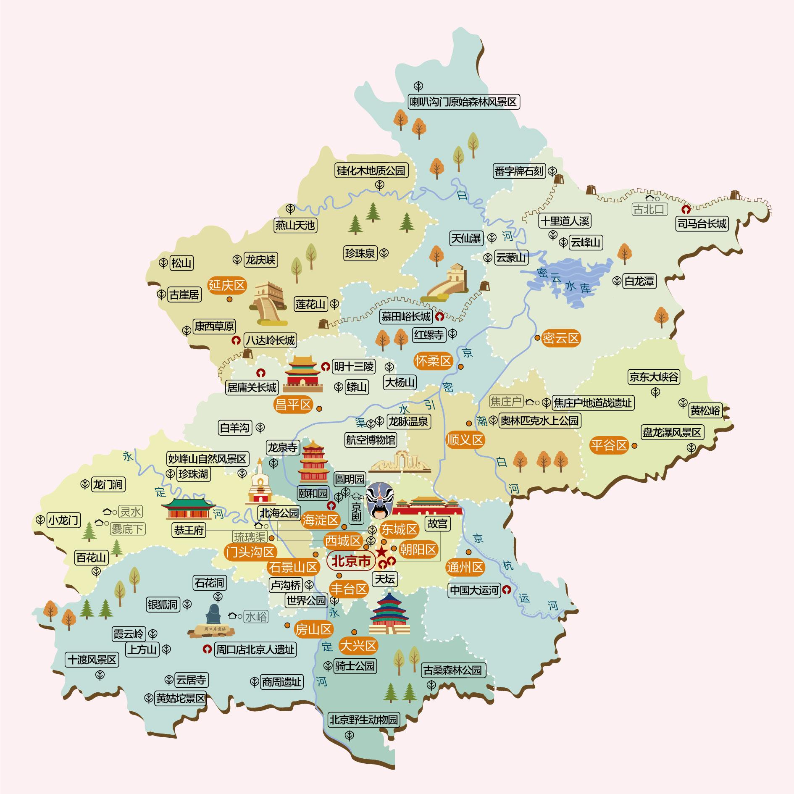
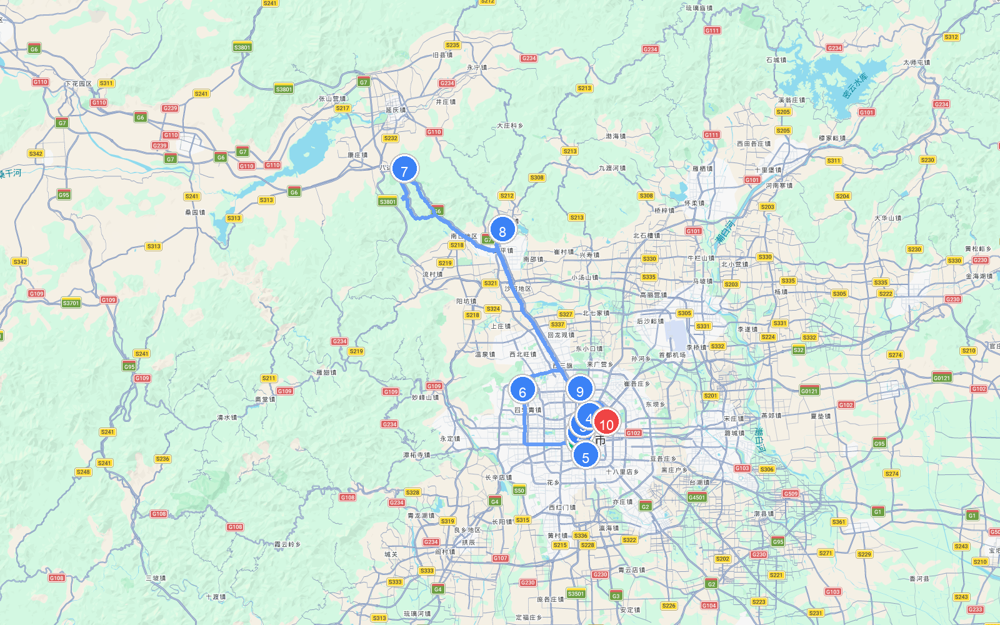
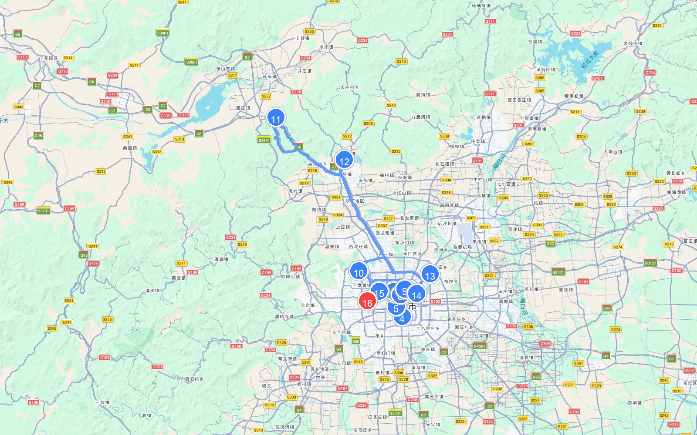
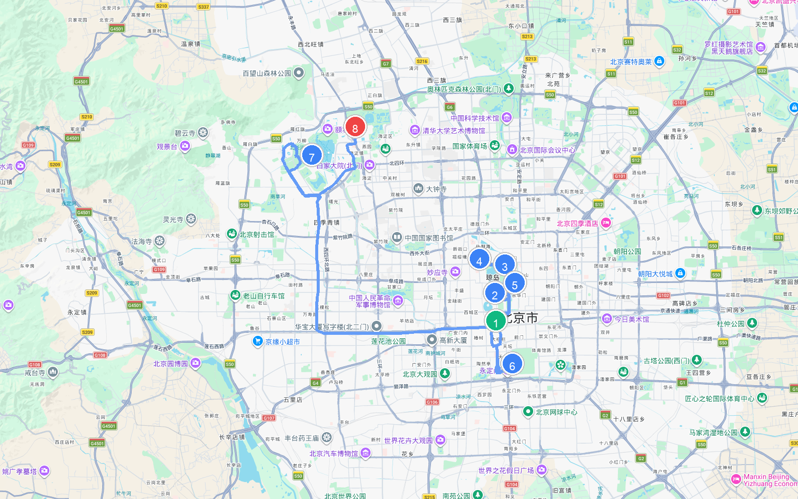
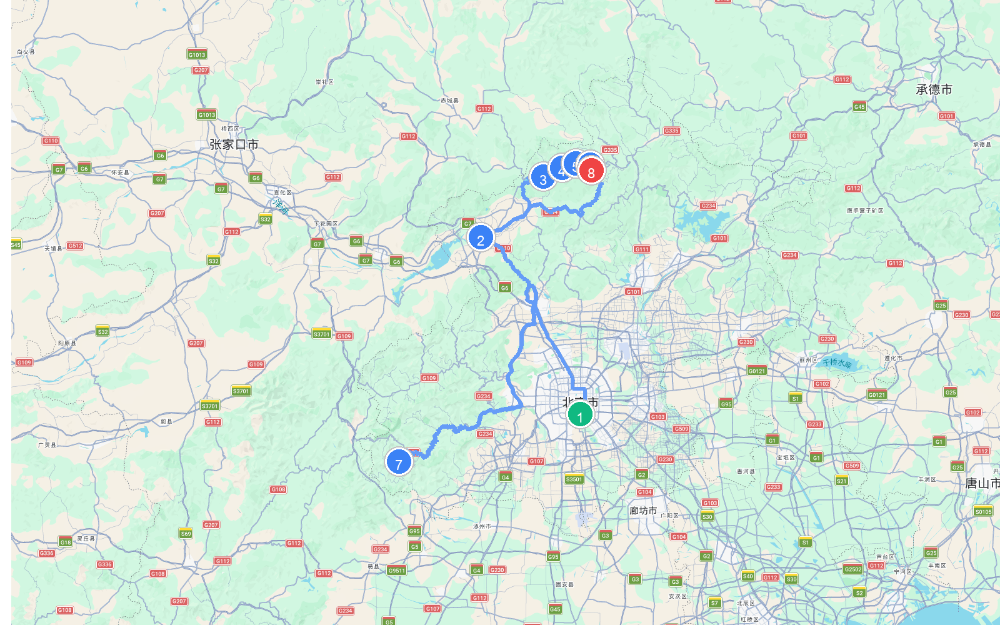

# 章节01 - 北京市自驾游与人文地图指南

## 北京市人文地图

## **北京市内推荐线路**

#### 北京5天4夜游路线

* **自驾线路**：天安门广场 → 故宫博物院 → 南锣鼓巷 → 雍和宫 → 天坛公园 → 颐和园 → 八达岭长城 → 明十三陵 → 国家体育场 → 三里屯太古里
* **路线路段距离与地图**
  | 起点 | 终点 | 距离 |
  | :--- | :--- | :--- |
  | (1) 天安门广场 | (2) 故宫博物院 | 4.3 公里 |
  | (2) 故宫博物院 | (3) 南锣鼓巷 | 3.0 公里 |
  | (3) 南锣鼓巷 | (4) 雍和宫 | 4.3 公里 |
  | (4) 雍和宫 | (5) 天坛公园 | 10.7 公里 |
  | (5) 天坛公园 | (6) 颐和园 | 28.2 公里 |
  | (6) 颐和园 | (7) 八达岭长城 | 68.4 公里 |
  | (7) 八达岭长城 | (8) 明十三陵 | 39.4 公里 |
  | (8) 明十三陵 | (9) 国家体育场 | 36.0 公里 |
  | (9) 国家体育场 | (10) 三里屯太古里 | 12.5 公里 |
  | **总里程** | | **206.8 公里** |
  
  
  
* **路线规划**：
  * Day1：天安门→毛主席纪念堂→故宫→什刹海→南锣鼓巷；  
  * Day2：孔庙国子监→雍和宫→簋街→天坛；  
  * Day3：清华/北京大学→颐和园→圆明园(夏)/香山公园(秋)；  
  * Day4：八达岭长城→明十三陵→鸟巢→水立方；  
  * Day5：国家大剧院→中国国家博物馆→三里屯太古里。
* **预算**：人均花费1300元左右。  
* **特点**：这是一条专为初次游玩京城的旅客规划的经典打卡路线。您将亲历庄严的天安门广场升旗仪式，参观世界规模最大、保存最完好的木结构宫殿故宫博物院；漫步于历史悠久的什刹海和极具老北京胡同风情的南锣鼓巷，享受市井慢生活；登临八达岭长城眺望群山，并在清华/北大校门口拍照留念，最后游览天坛祈年殿与颐和园皇家园林，堪称世纪经典的京城首选之旅。

#### 北京深度游最佳路线

* **自驾线路**：天安门广场 → 故宫博物院 → 景山公园 → 天坛公园 → 国家大剧院 → 恭王府 → 后海 → 南锣鼓巷 → 雍和宫 → 颐和园 → 八达岭长城 → 明十三陵 → 798艺术区 → 三里屯太古里 → 北京动物园 → 中央广播电视塔
* **路线路段距离与地图**
  | 起点 | 终点 | 距离 |
  | :--- | :--- | :--- |
  | (1) 天安门广场 | (2) 故宫博物院 | 4.3 公里 |
  | (2) 故宫博物院 | (3) 景山公园 | 2.5 公里 |
  | (3) 景山公园 | (4) 天坛公园 | 8.0 公里 |
  | (4) 天坛公园 | (5) 国家大剧院 | 4.9 公里 |
  | (5) 国家大剧院 | (6) 恭王府 | 5.2 公里 |
  | (6) 恭王府 | (7) 后海 | 2.4 公里 |
  | (7) 后海 | (8) 南锣鼓巷 | 4.2 公里 |
  | (8) 南锣鼓巷 | (9) 雍和宫 | 3.9 公里 |
  | (9) 雍和宫 | (10) 颐和园 | 21.6 公里 |
  | (10) 颐和园 | (11) 八达岭长城 | 68.4 公里 |
  | (11) 八达岭长城 | (12) 明十三陵 | 39.4 公里 |
  | (12) 明十三陵 | (13) 798艺术区 | 47.5 公里 |
  | (13) 798艺术区 | (14) 三里屯太古里 | 8.3 公里 |
  | (14) 三里屯太古里 | (15) 北京动物园 | 14.2 公里 |
  | (15) 北京动物园 | (16) 中央广播电视塔 | 7.9 公里 |
  | **总里程** | | **242.7 公里** |
  
  
  
* **路线规划**：
  * Day1：天安门→毛主席纪念堂→人民大会堂→故宫→景山公园→王府井；  
  * Day2：天坛→中国国家博物馆→国家大剧院；  
  * Day3：北海公园→恭王府→后海；  
  * Day4：什刹海→鼓楼→南锣鼓巷；  
  * Day5：孔庙国子监→雍和宫→五道营胡同→簋街；  
  * Day6：奥林匹克公园→颐和园；  
  * Day7：清华大学/北京大学→圆明园(夏)/香山公园(秋)；  
  * Day8：八达岭长城→明十三陵；  
  * Day9：北京798→三里屯；  
  * Day10：北京动物园→玉渊潭公园→中央电视塔。
* **预算**：人均花费2500元左右。  
* **特点**：这是一条专为时间充裕的游客设计的10天深度文化自驾探索之旅。从故宫、天坛、颐和园等世界文化遗产的皇家风貌，到北海公园、恭王府、什刹海老胡同的市井风情；既能体验鸟巢、水立方与中央电视塔的现代都市繁华，又能领略798艺术区和三里屯的创意前沿与时尚风暴，最后自驾游览京郊八达岭长城与明十三陵，多视角探寻这座千年古都的灵魂。

## **北京经典自驾线路推荐**

#### 古都文化游

* **自驾线路**：天安门广场→北京故宫→南锣鼓巷→什刹海风景区→恭王府→王府井大街→天坛公园→颐和园→圆明园遗址公园。  
* **路线路段距离与地图**
  | 起点 | 终点 | 距离 |
  | :--- | :--- | :--- |
  | (1) 天安门广场 | (2) 北京故宫 | 4.3 公里 |
  | (2) 北京故宫 | (3) 南锣鼓巷 | 3.0 公里 |
  | (3) 南锣鼓巷 | (4) 恭王府 | 1.9 公里 |
  | (4) 恭王府 | (5) 王府井大街 | 4.2 公里 |
  | (5) 王府井大街 | (6) 天坛公园 | 7.6 公里 |
  | (6) 天坛公园 | (7) 颐和园 | 28.2 公里 |
  | (7) 颐和园 | (8) 圆明园遗址公园 | 9.8 公里 |
  | **总里程** | | **59.0 公里** |
  
  
  
  
  
  
  
  
  
  
  
  
  
* **特点**：这是一条饱览北京历史积淀与帝王遗风的古都精髓自驾线。您将瞻仰庄严的天安门广场，进入红墙金瓦的故宫博物院探索明清皇家内廷；在南锣鼓巷与什刹海畔漫步，感受老北京四合院与青砖黛瓦的恭王府胡同烟火；最后在天坛祈年殿与颐和园万寿山，体悟中国古典祭天礼仪与皇家园林美学的巅峰魅力。

#### 百里山水画廊之旅

* **自驾线路**：北京市→延庆区→百里山水画廊→延庆世界地质公园→朝阳寺→硅化木国家地质公园→乌龙峡谷→龙王庙→滴水壶景区。  
* **路线路段距离与地图**
  | 起点 | 终点 | 距离 |
  | :--- | :--- | :--- |
  | (1) 北京天安门 | (2) 延庆区 | 92.4 公里 |
  | (2) 延庆区 | (3) 百里山水画廊 | 50.6 公里 |
  | (3) 百里山水画廊 | (4) 朝阳寺 | 13.6 公里 |
  | (4) 朝阳寺 | (5) 硅化木国家地质公园 | 6.1 公里 |
  | (5) 硅化木国家地质公园 | (6) 乌龙峡谷 | 17.2 公里 |
  | (6) 乌龙峡谷 | (7) 龙王庙 | 253.7 公里 |
  | (7) 龙王庙 | (8) 滴水壶景区 | 251.9 公里 |
  | **总里程** | | **685.5 公里** |
  
  
  
  
  
  
  
  
  
  
  
  
  
* **特点**：这是一条穿行于绿水青山与亿年地质遗迹间的京郊最美生态自驾线。沿途经过浩瀚的燕山天池，高峡平湖，微风拂面；在硅化木国家地质公园，您能亲手抚摸恐龙时代的木化石痕迹；深入幽深的乌龙峡谷，怪石嶙峋，溪流奔涌；在滴水壶飞瀑前，清凉的景致如画，是夏日消暑与山水摄影的梦幻天堂。

#### 长城自驾游路线

* **自驾线路**：北京市→居庸关长城→八达岭水关长城→八达岭长城→八达岭野生动物世界→慕田峪长城→黄花城水长城→古北水镇→司马台长城。  
* **路线路段距离与地图**
  | 起点 | 终点 | 距离 |
  | :--- | :--- | :--- |
  | (1) 北京天安门 | (2) 居庸关长城 | 67.9 公里 |
  | (2) 居庸关长城 | (3) 八达岭水关长城 | 8.7 公里 |
  | (3) 八达岭水关长城 | (4) 八达岭长城 | 12.0 公里 |
  | (4) 八达岭长城 | (5) 八达岭野生动物世界 | 11.2 公里 |
  | (5) 八达岭野生动物世界 | (6) 慕田峪长城 | 82.7 公里 |
  | (6) 慕田峪长城 | (7) 古北水镇 | 96.5 公里 |
  | (7) 古北水镇 | (8) 司马台长城 | 15.6 公里 |
  | **总里程** | | **294.6 公里** |
  
  
  
  
  
  
  
  
  
  
  
  
  
* **特点**：这是一条横跨长城雄关天险与京郊古镇风光的主题文化自驾线。从天险要道居庸关出发，攀登蜿蜒陡峭的八达岭长城，看中华民族的伟岸脊梁；随后前往树木葱郁、敌楼错落的慕田峪长城，领略其秀美防线；打卡水抱长城、长城入水的黄花城水长城奇观；最终在群山环抱、险峻陡峭的司马台长城脚下，夜宿古北水镇，沉醉在长城星空与江南水乡交融的梦幻夜景中。

