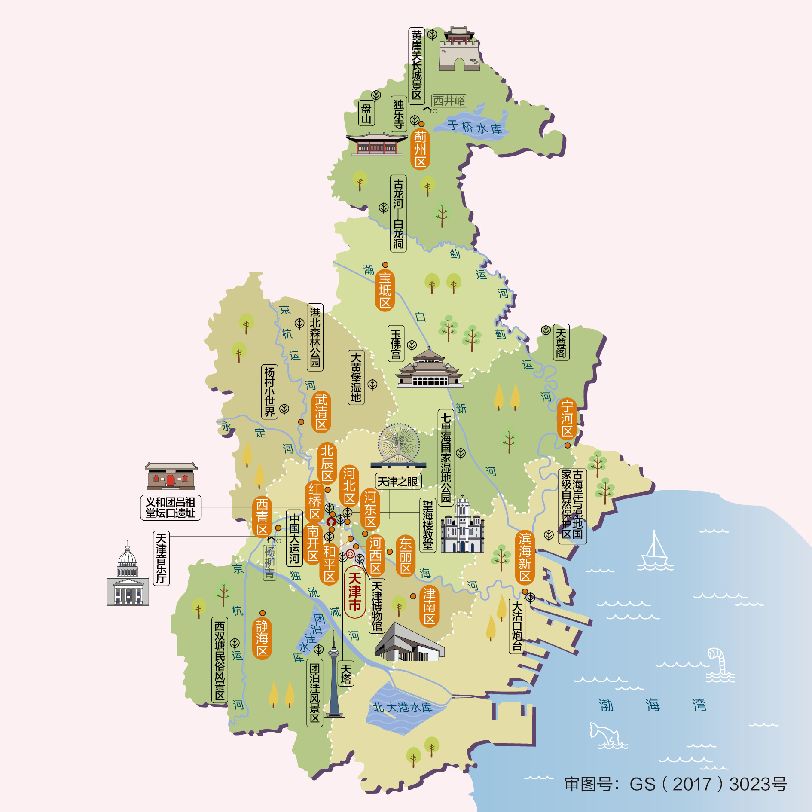
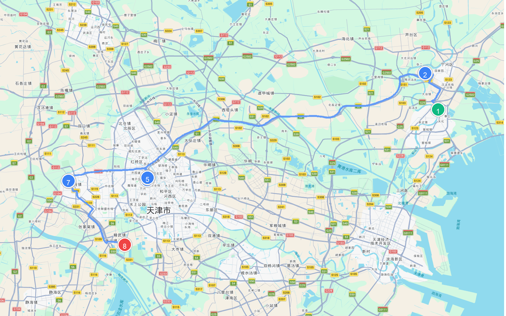
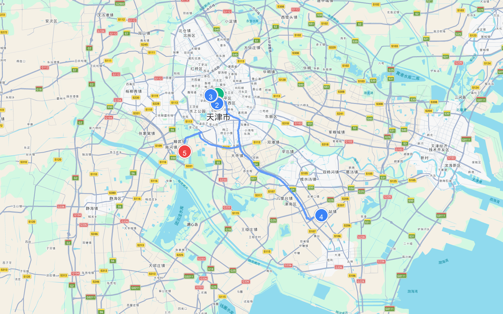
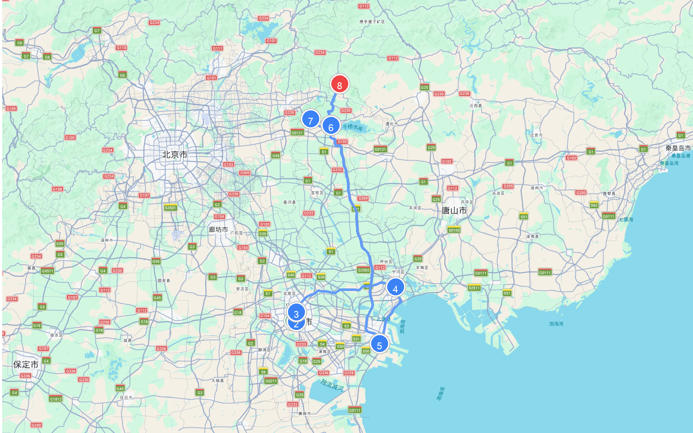

# 章节02 - 天津市自驾游与人文地图指南

## 天津市人文地图

## **天津自驾游经典线路推荐**

#### 天津文化风情游

* **自驾线路**：天津古文化街→天后宫→鼓楼→老城博物馆→广东会馆→石家大院→杨柳青古镇→精武门中华武林园→杨柳青木版年画博物馆→意大利风情旅游区。  
* **路线路段距离与地图**

    | 起点 | 终点 | 距离 |
    | :--- | :--- | :--- |
    | (1) 天津古文化街 | (2) 天后宫 | 11.9 公里 |
    | (2) 天后宫 | (3) 鼓楼 | 63.7 公里 |
    | (3) 鼓楼 | (4) 老城博物馆 | 0.8 公里 |
    | (4) 老城博物馆 | (5) 广东会馆 | 1.1 公里 |
    | (5) 广东会馆 | (6) 石家大院 | 18.4 公里 |
    | (6) 石家大院 | (7) 杨柳青古镇 | 2.0 公里 |
    | (7) 杨柳青古镇 | (8) 精武门中华武林园 | 20.0 公里 |
    | **总里程** | | **118.0 公里** |
  
  
  
  
  
  
  
  
  
  
  
  
  
* **特点**：这是一条深度体验津门百年市井民俗与传统年画文化的风情自驾线。在古文化街与天后宫，您可以聆听天妃娘娘的民间传说，品尝耳朵眼炸糕等津门传统风味，欣赏泥人张的彩塑艺术；在天津鼓楼与老城博物馆前，追寻老城厢的历史记忆；自驾前往杨柳青古镇与石家大院，领略华北第一豪宅的精致砖雕与杨柳青木版年画的浓郁乡土韵味；最后步入意大利风情旅游区，感受意式洋楼建筑群的异域风情与现代活力。

#### 近代历史文化自驾游

* **自驾线路**：和平区→五大道文化旅游区→静园→意大利风情旅游区→望海楼天主堂→大沽口炮台遗址→小站练兵园→精武门中华武林园。  
* **路线路段距离与地图**

    | 起点 | 终点 | 距离 |
    | :--- | :--- | :--- |
    | (1) 和平区 | (2) 五大道文化旅游区 | 2.7 公里 |
    | (2) 五大道文化旅游区 | (3) 静园 | 2.8 公里 |
    | (3) 静园 | (4) 小站练兵园 | 36.1 公里 |
    | (4) 小站练兵园 | (5) 精武门中华武林园 | 39.0 公里 |
    | **总里程** | | **80.5 公里** |
  
  
  
  
  
  
  
  
  
  
  
  
  
* **特点**：这是一条“百年历史看天津”的近代洋楼风情与军事历史遗迹探索线。漫步五大道万国建筑群，哥特式、巴洛克式洋楼交相辉映；走进静园，追寻末代皇帝溥仪旧居的历史风烟；一路东行自驾至渤海湾畔，在大沽口炮台遗址的古老铁炮前凭吊御侮历史的悲壮；在小站练兵园和精武门中华武术园中，探寻近代中国军事与强身报国的历史强音。

#### 津门十景自驾游路线

* **自驾线路**：天津水上公园→天塔湖→南市食品街→天津古文化街→海河风景线→大沽口炮台→独乐寺→盘山风景区→黄崖关长城。  
* **路线路段距离与地图**

    | 起点 | 终点 | 距离 |
    | :--- | :--- | :--- |
    | (1) 天津水上公园 | (2) 天塔湖 | 4.6 公里 |
    | (2) 天塔湖 | (3) 南市食品街 | 5.8 公里 |
    | (3) 南市食品街 | (4) 天津古文化街 | 64.3 公里 |
    | (4) 天津古文化街 | (5) 大沽口炮台 | 41.8 公里 |
    | (5) 大沽口炮台 | (6) 独乐寺 | 135.7 公里 |
    | (6) 独乐寺 | (7) 盘山风景区 | 15.1 公里 |
    | (7) 盘山风景区 | (8) 黄崖关长城 | 41.9 公里 |
    | **总里程** | | **309.2 公里** |
  
  
  
  
  
  
  
  
  
  
  
  
  
* **特点**：这是一条将天津都市地标、海河风景与郊野名山融为一体的全景风光自驾线。登临天塔湖畔高耸入云的“天塔旋云”俯瞰全城；沿着沽水流霞的海河风光线漫步解放桥；既能在市区品味古文化街的古韵与南市食品街的传统美味，又能驱车蓟州区，在独乐寺的千年观音像前领略辽代古建之美，在盘山的三盘暮雨中体悟乾隆“早知有盘山，何必下江南”的赞叹，最后打卡雄关天险黄崖关长城。

