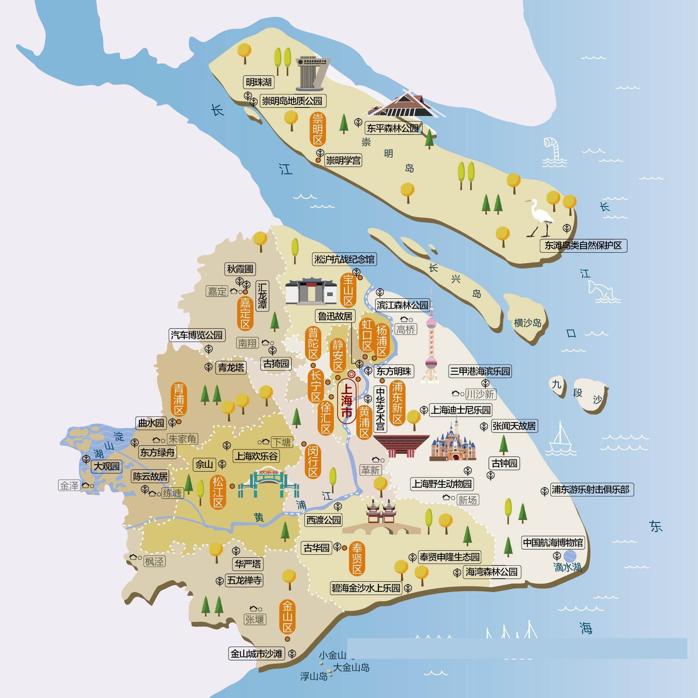

# Chapter 03 - 上海市自驾游与人文地图指南

## 上海市人文地图

### **上海自驾游经典线路推荐**

* **青浦古镇生态游**  
  * **自驾线路**：上海市区→朱家角古镇→东方绿舟→大观园→陈云故里·练塘古镇→太阳岛度假区。  
  * **特点**：这是一条饱览江南古镇韵味与水乡野趣的生态自驾放松线路。您可以信步在千年朱家角古镇，跨过放生桥，听摇橹船吱呀划过纵横河港；在东方绿舟的广阔绿茵中享受户外宿营的野趣；步入淀山湖畔的红楼梦主题大观园，赏梅探景；在练塘古镇追寻陈云故里的红色足迹，最后在太阳岛温泉的袅袅热气中彻底放松身心。
* **崇明岛自驾游路线**  
  * **自驾线路**：上海市区→崇明岛→崇明学宫→前卫生态村→东平国家森林公园→东滩湿地公园→紫海鹭缘浪漫庄园→明珠湖→西沙国家湿地公园。  
  * **特点**：这是一条穿越长江隧桥、奔向生态净土的崇明岛绿色休闲自驾线。在东平国家森林公园那遮天蔽日的杉林间骑行生态氧吧，感受大自然的洗礼；在东滩湿地公园迎着清晨第一缕阳光观赏候鸟翱翔与壮丽的海上日出；在西沙国家湿地公园，漫步在长长的木栈道上，欣赏大江东去、夕阳西下以及无边芦苇随风起舞的宁静画卷。
* **上海亲子自驾游路线**  
  * **自驾线路**：朱家角古镇→辰山植物园→锦江乐园→上海博物馆→上海野生动物园→上海迪士尼乐园→东方明珠塔→上海海洋水族馆→上海科技馆→东方绿舟。  
  * **特点**：这是一条融前沿科普、奇幻乐园与野趣探索为一体的上海全景亲子梦幻自驾线。在上海科技馆启迪科学智慧；在上海海洋水族馆穿越梦幻的海底隧道看企鹅与世界奇观；在上海野生动物园近距离喂食珍惜生灵；最后在迪士尼乐园的童话城堡前点亮心中奇梦，观赏梦幻震撼的夜光幻影秀。

