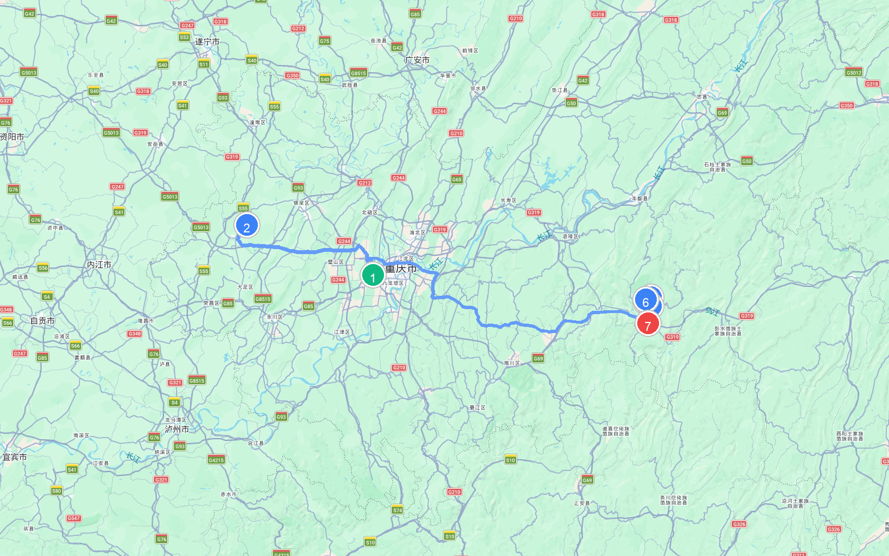
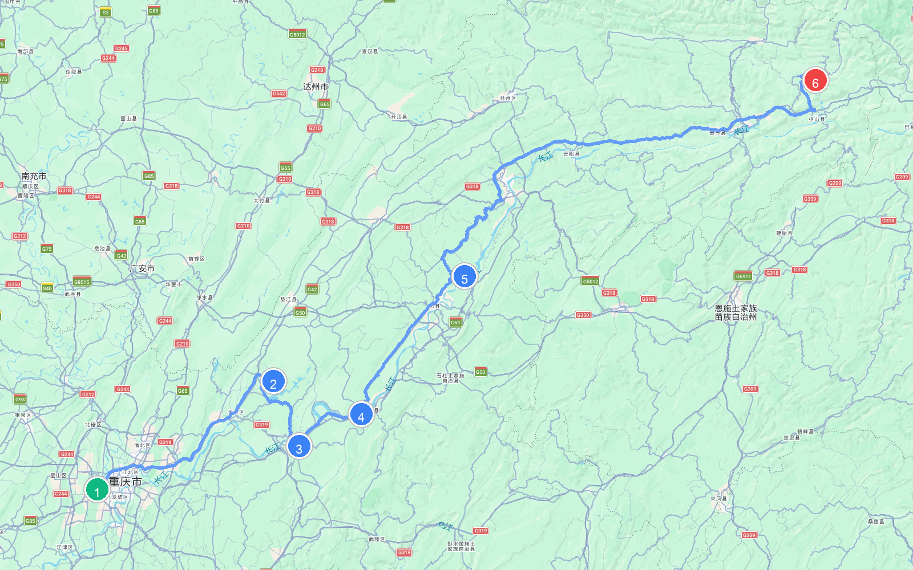
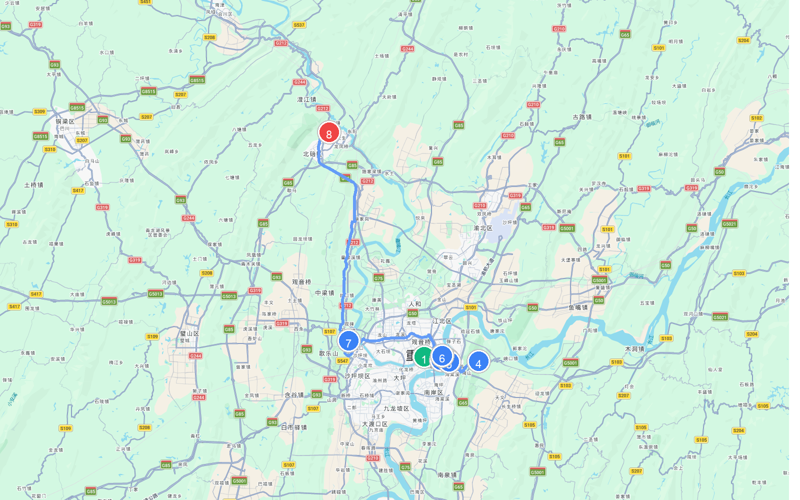

# 章节04 - 重庆市自驾游与人文地图指南

## 重庆市人文地图

## **重庆自驾游经典线路推荐**

#### 璀璨世遗之旅

* **自驾线路**：主城区→大足石刻→武隆喀斯特→天生三桥→龙水峡地缝→仙女山→芙蓉洞  
* **路线路段距离与地图**

    | 起点 | 终点 | 距离 |
    | :--- | :--- | :--- |
    | (1) 市中心 | (2) 大足石刻 | 97.8 公里 |
    | (2) 大足石刻 | (3) 武隆喀斯特 | 269.7 公里 |
    | (3) 武隆喀斯特 | (4) 天生三桥 | 3.7 公里 |
    | (4) 天生三桥 | (5) 龙水峡地缝 | 16.7 公里 |
    | (5) 龙水峡地缝 | (6) 仙女山 | 13.7 公里 |
    | (6) 仙女山 | (7) 芙蓉洞 | 22.7 公里 |
    | **总里程** | | **424.3 公里** |
  
  
  
  
  
  
  
  
  
  
  
* **特点**：这是一条将巴渝大地的自然造化与宗教石刻艺术融为一体的顶级自驾朝圣线。从重庆主城区出发，探秘世界文化遗产大足石刻，在宝顶山瞻仰气势磅礴的千手观音和释迦涅槃像，感悟千年石窟艺术精髓；随后前往武隆喀斯特景区，在天生三桥和龙水峡地缝俯瞰绝壁千仞与地质奇观，在仙女山高山草原感受微风拂面的野趣，最后探秘鬼斧神工的芙蓉洞溶洞奇观。

#### 长江山河画卷之旅

* **自驾线路**：主城区→长寿古镇→长寿湖→白鹤梁水下博物馆→丰都名山→石宝寨→张飞庙→奉节白帝城 瞿塘峡→奉节天坑地缝→巫山小三峡→小小三峡→巫山神女峰  
* **路线路段距离与地图**

    | 起点 | 终点 | 距离 |
    | :--- | :--- | :--- |
    | (1) 市中心 | (2) 长寿湖 | 131.3 公里 |
    | (2) 长寿湖 | (3) 白鹤梁水下博物馆 | 56.1 公里 |
    | (3) 白鹤梁水下博物馆 | (4) 丰都名山 | 47.0 公里 |
    | (4) 丰都名山 | (5) 石宝寨 | 107.0 公里 |
    | (5) 石宝寨 | (6) 小小三峡 | 294.0 公里 |
    | **总里程** | | **635.4 公里** |
  
  
  
  
  
  
  
  
  
  
  
* **特点**：这是一条饱览三峡荒野雄奇风光与长江古城历史的诗画自驾大廊道。沿着滚滚长江，在长寿古镇和长寿湖体验江南水乡的宁静；在涪陵白鹤梁水下博物馆探秘世界第一古代水文站；在丰都名山（鬼城）领略独特的阴曹地府神话；在万州大瀑布前飞渡天险；在奉节白帝城前眺望瞿塘峡夔门的险峻（10元人民币背景）；最后在巫山小三峡的幽深峡谷中，神女峰云雾缭绕，尽显诗仙李白“两岸猿声啼不住，轻舟已过万重山”的浩瀚意境。

#### 重庆主城区城市探索之旅

* **自驾线路**：人民大礼堂→湖广会馆→解放碑→南山植物园→长江索道→洪崖洞→鸿恩寺森林公园→歌乐山森林公园→歌乐山烈士陵园→磁器口古镇→北温泉  
* **路线路段距离与地图**

    | 起点 | 终点 | 距离 |
    | :--- | :--- | :--- |
    | (1) 人民大礼堂 | (2) 湖广会馆 | 4.3 公里 |
    | (2) 湖广会馆 | (3) 解放碑 | 2.4 公里 |
    | (3) 解放碑 | (4) 南山植物园 | 11.7 公里 |
    | (4) 南山植物园 | (5) 长江索道 | 14.6 公里 |
    | (5) 长江索道 | (6) 洪崖洞 | 4.9 公里 |
    | (6) 洪崖洞 | (7) 磁器口古镇 | 20.5 公里 |
    | (7) 磁器口古镇 | (8) 北温泉 | 34.6 公里 |
    | **总里程** | | **93.2 公里** |
  
  
  
  
  
  
  
  
  
  
  
* **特点**：这是一条穿梭于“赛博朋克”魔幻 8D 山城街巷中的都市网红探索线。在宏伟的重庆人民大礼堂和三峡博物馆追寻巴渝文化的根基；在湖广会馆探寻历史移民浪潮；乘长江空中索道横跨江面俯瞰两江交汇；入夜后，在洪崖洞高低错落的吊脚楼金黄色灯光里，感受现实版《千与千寻》的梦幻，最后在磁器口古镇品尝麻辣鲜香的火锅与传统名吃。

