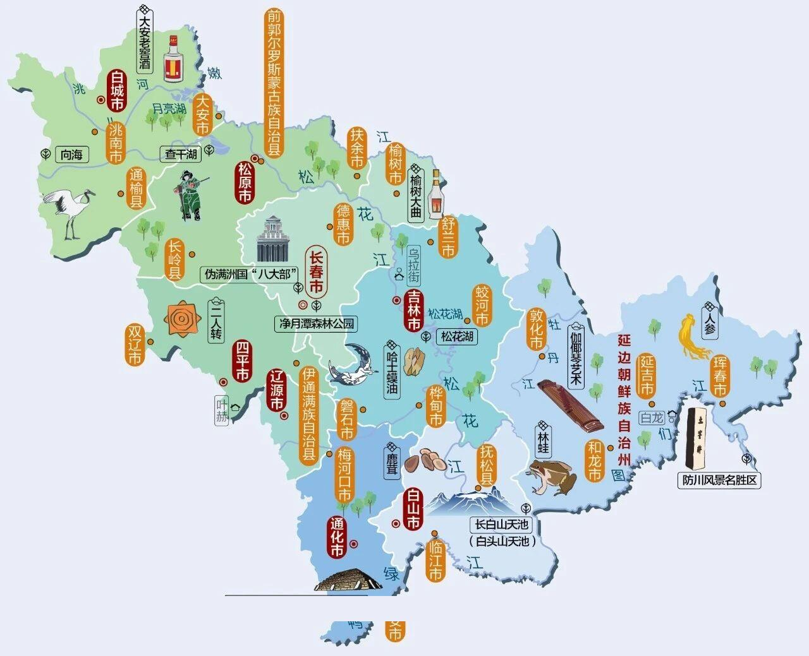
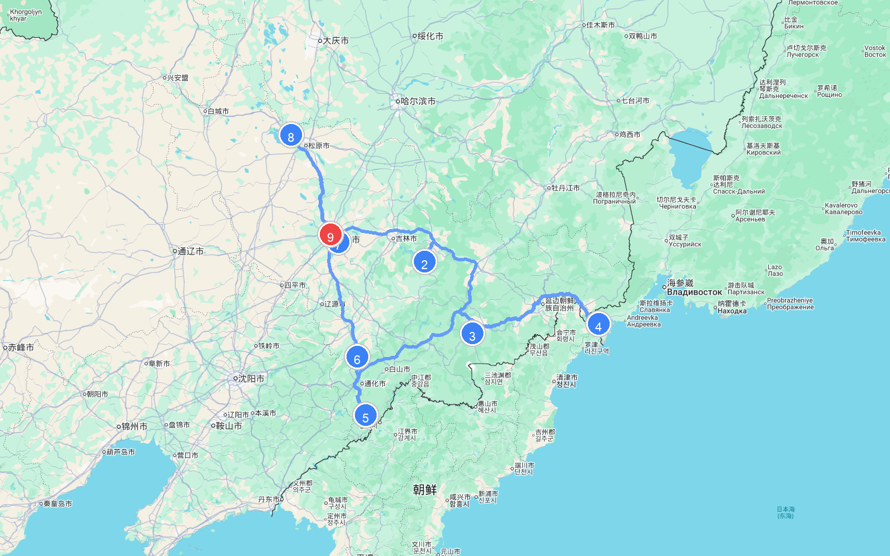
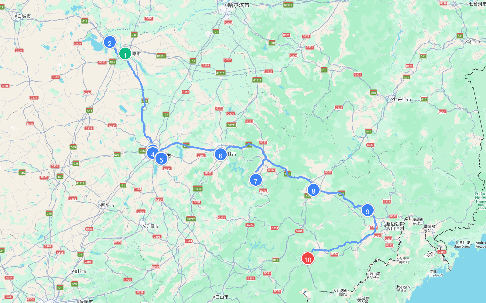
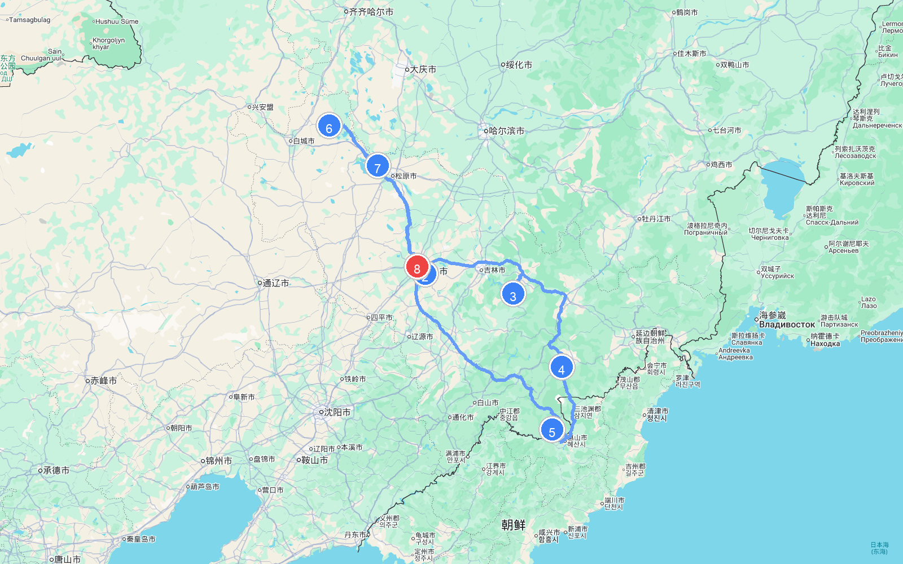

# 章节06 - 吉林自驾游与人文地图指南

## 吉林人文地图

## **吉林自驾旅行经典线路推荐**

#### 吉林环省自驾游路线

* **自驾线路**：长春市 → 松花湖 → 长白山 → 防川风景区 → 集安市 → 通化市 → 净月潭 → 查干湖 → 长春市
* **路线路段距离与地图**
  | 起点 | 终点 | 距离 |
  | :--- | :--- | :--- |
  | (1) 长春市 | (2) 松花湖 | 228.4 公里 |
  | (2) 松花湖 | (3) 长白山 | 273.1 公里 |
  | (3) 长白山 | (4) 防川风景区 | 287.6 公里 |
  | (4) 防川风景区 | (5) 集安市 | 615.4 公里 |
  | (5) 集安市 | (6) 通化市 | 152.3 公里 |
  | (6) 通化市 | (7) 净月潭 | 225.8 公里 |
  | (7) 净月潭 | (8) 查干湖 | 205.1 公里 |
  | (8) 查干湖 | (9) 长春市 | 186.4 公里 |
  | **总里程** | | **2174.1 公里** |
  
  
  
* **特点**：这是一条饱览吉林全境林海山色与湿地鹤舞的全景大环线。在东部，您可以登上长白山俯瞰神秘的天池；在中部，沿松花湖漫步，观赏净月潭森林公园的静谧风光；在西部，到向海湿地观赏仙鹤展翅，赴查干湖体验千年的冬捕鱼猎文化；更可在集安探访世界文化遗产高句丽王城，领略厚重的历史印记。

#### 冰天雪地 长白山冰雪温泉之旅

* **自驾线路**：松原市→查干湖→北湖湿地公园→长春市→长春南湖公园→世界雕塑公园→净月潭→韩屯雾凇岛→吉林市→松花湖→敦化市→延边→长白山  
* **路线路段距离与地图**
  | 起点 | 终点 | 距离 |
  | :--- | :--- | :--- |
  | (1) 松原市 | (2) 查干湖 | 38.7 公里 |
  | (2) 查干湖 | (3) 长春市 | 186.4 公里 |
  | (3) 长春市 | (4) 长春南湖公园 | 4.3 公里 |
  | (4) 长春南湖公园 | (5) 净月潭 | 20.0 公里 |
  | (5) 净月潭 | (6) 吉林市 | 116.0 公里 |
  | (6) 吉林市 | (7) 松花湖 | 130.9 公里 |
  | (7) 松花湖 | (8) 敦化市 | 138.8 公里 |
  | (8) 敦化市 | (9) 延边 | 106.6 公里 |
  | (9) 延边 | (10) 长白山 | 163.6 公里 |
  | **总里程** | | **905.1 公里** |
  
  
  
  
  
  
  
  
  
  
  
* **特点**：这是一条将北国冰雪运动与极地温泉养生完美结合的冬日童话自驾线。从松原查干湖冰湖腾鱼的震撼冬捕出发，漫步长春净月潭的水墨雪景，在吉林韩屯雾凇岛观赏“忽如一夜春风来，千树万树梨花开”的雾凇奇观，最后登临冰雪覆盖的长白山天池，在二道白河的火山地热温泉中体验“冰火两重天”的极佳养生享受。

#### 吉林最美赏秋自驾路线

* **自驾线路**：长春市→净月潭→松花湖→蛟河红叶谷→红叶岭森林公园→长白山→十五道沟→龙湾群森林公园→集安五女峰→向海自然保护区→莫莫格湿地→查干湖→长春市  
* **路线路段距离与地图**
  | 起点 | 终点 | 距离 |
  | :--- | :--- | :--- |
  | (1) 长春市 | (2) 净月潭 | 23.5 公里 |
  | (2) 净月潭 | (3) 松花湖 | 237.5 公里 |
  | (3) 松花湖 | (4) 长白山 | 273.1 公里 |
  | (4) 长白山 | (5) 十五道沟 | 237.4 公里 |
  | (5) 十五道沟 | (6) 莫莫格湿地 | 822.5 公里 |
  | (6) 莫莫格湿地 | (7) 查干湖 | 134.1 公里 |
  | (7) 查干湖 | (8) 长春市 | 186.4 公里 |
  | **总里程** | | **1914.4 公里** |
  
  
  
  
  
  
  
  
  
  
  
* **特点**：这是一条追逐东北金秋彩林与五花山色的摄影师朝圣之路。9月下旬，蛟河红叶谷的枫叶红如烈火，与白桦林的洁白交相辉映；行车于望天鹅景区（十五道沟），两旁火山柱状节理玄武岩与飞流叠瀑美不胜收；在五女峰和龙湾群国家森林公园，火山玛珥湖（三角龙湾）波光粼粼，层林尽染，倒映出最绚丽的秋天写意画。

