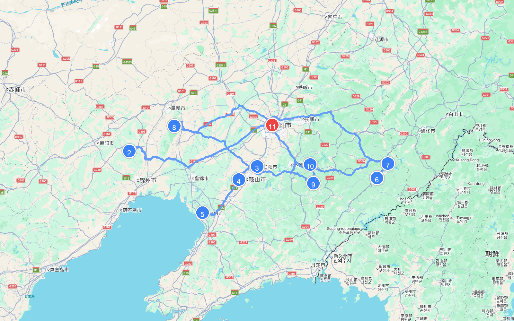
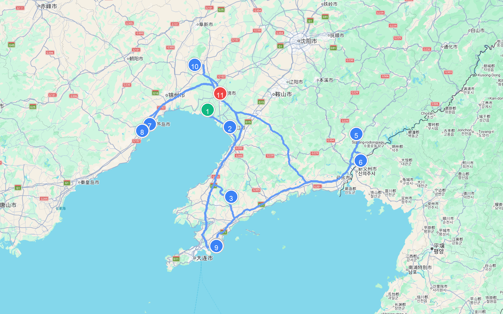
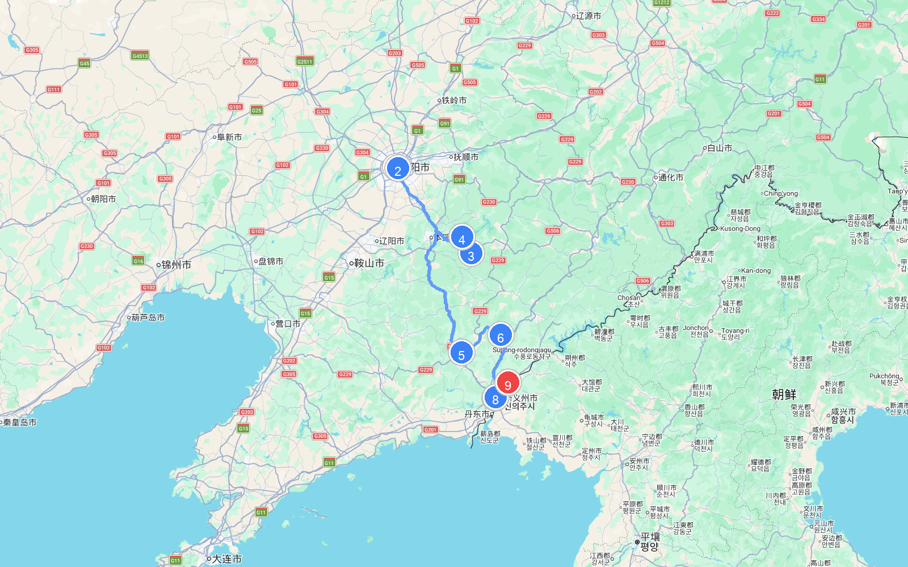

# 章节07 - 辽宁自驾游与人文地图指南

## 辽宁人文地图

## **辽宁自驾旅行经典线路推荐**

#### 辽宁省环线自驾线路

* **自驾线路**：沈阳市→棋盘山→辽阳→鞍山千山→盘锦红海滩→营口市→大连天门山→丹东银杏大道→丹东凤凰山→枫林谷森林公园→桓仁五女山→宽甸天桥沟→老边沟→关门山→本溪水洞→沈阳市  
* **路线路段距离与地图**
  | 起点 | 终点 | 距离 |
  | :--- | :--- | :--- |
  | (1) 沈阳市 | (2) 棋盘山 | 267.0 公里 |
  | (2) 棋盘山 | (3) 辽阳 | 245.4 公里 |
  | (3) 辽阳 | (4) 鞍山千山 | 46.1 公里 |
  | (4) 鞍山千山 | (5) 营口市 | 83.6 公里 |
  | (5) 营口市 | (6) 枫林谷森林公园 | 378.1 公里 |
  | (6) 枫林谷森林公园 | (7) 桓仁五女山 | 40.5 公里 |
  | (7) 桓仁五女山 | (8) 老边沟 | 387.2 公里 |
  | (8) 老边沟 | (9) 关门山 | 275.4 公里 |
  | (9) 关门山 | (10) 本溪水洞 | 39.1 公里 |
  | (10) 本溪水洞 | (11) 沈阳市 | 94.5 公里 |
  | **总里程** | | **1856.9 公里** |
  
  
  
  
  
  
  
  
  
* **特点**：这是一条打卡辽宁山海胜景、清代文化发祥地与边境风情的大环线。自驾沈阳棋盘山探寻自然野趣；登鞍山千山领略古刹松涛的武侠世界；在盘锦红海滩观赏神奇的红色织锦；在丹东凤凰山挑战惊险的玻璃栈道；最后在本溪水洞探秘神奇的地下暗河溶洞，全景领略关外山河的壮美。

#### 辽宁滨海大道自驾游

* **自驾线路**：红海滩→仙人岛白沙湾→营口市→旅顺口风景区→大连市→老虎滩海洋公园→金石滩→丹东市→鸭绿江风景区→虎山长城→葫芦岛市→兴城古城→葫芦山庄→锦州市→盘锦市  
* **路线路段距离与地图**
  | 起点 | 终点 | 距离 |
  | :--- | :--- | :--- |
  | (1) 红海滩 | (2) 营口市 | 51.8 公里 |
  | (2) 营口市 | (3) 大连市 | 143.2 公里 |
  | (3) 大连市 | (4) 金石滩 | 98.9 公里 |
  | (4) 金石滩 | (5) 丹东市 | 334.5 公里 |
  | (5) 丹东市 | (6) 虎山长城 | 79.4 公里 |
  | (6) 虎山长城 | (7) 葫芦岛市 | 442.2 公里 |
  | (7) 葫芦岛市 | (8) 兴城古城 | 17.6 公里 |
  | (8) 兴城古城 | (9) 葫芦山庄 | 434.7 公里 |
  | (9) 葫芦山庄 | (10) 锦州市 | 344.6 公里 |
  | (10) 锦州市 | (11) 盘锦市 | 70.4 公里 |
  | **总里程** | | **2017.2 公里** |
  
  
  
  
  
  
  
  
  
* **特点**：这是一条纵贯辽宁漫长海岸线、领略渤海黄海双重风光的黄金滨海公路自驾线。东起中朝边境丹东鸭绿江畔与万里长城最东端的虎山长城，西至辽西走廊的历史名城兴城古城。一路在蔚蓝的滨海公路上迎风奔驰，金石滩的奇石嶙峋、红海滩的红地毯与大连旅顺口的近代风云尽收眼底。

#### 辽宁最美赏秋自驾游路线

* **自驾线路**：主要沿着本桓公路、盘锦丹东线、丹东银杏大道等  
* **特点**：这是一条穿越辽宁红叶与杏黄大画卷的最美自驾景观路。本桓公路是闻名全国的“中华枫叶之路”，每到金秋，关门山、老边沟、洋湖沟红枫漫山遍野；盘锦的红海滩宛如巨大的红色地毯铺展在海滨；丹东银杏大道的落叶给城市铺上金黄缎带，带来视觉上的极致震撼。

#### 丹东异国风情自驾游路线

* **自驾线路**：沈阳市→沈阳故宫→本溪市→本溪水洞→凤城市→丹东市→鸭绿江断桥→鸭绿江风景名胜区→鸭绿江湿地观鸟园→虎山长城→宽甸河口景区  
* **路线路段距离与地图**
  | 起点 | 终点 | 距离 |
  | :--- | :--- | :--- |
  | (1) 沈阳市 | (2) 沈阳故宫 | 4.0 公里 |
  | (2) 沈阳故宫 | (3) 本溪市 | 104.6 公里 |
  | (3) 本溪市 | (4) 本溪水洞 | 22.8 公里 |
  | (4) 本溪水洞 | (5) 凤城市 | 154.7 公里 |
  | (5) 凤城市 | (6) 丹东市 | 56.5 公里 |
  | (6) 丹东市 | (7) 鸭绿江断桥 | 87.8 公里 |
  | (7) 鸭绿江断桥 | (8) 鸭绿江风景名胜区 | 3.9 公里 |
  | (8) 鸭绿江风景名胜区 | (9) 虎山长城 | 17.9 公里 |
  | **总里程** | | **452.2 公里** |
  
  
  
  
  
  
  
  
  
* **特点**：这是一条饱览中朝边境山水风光与抗美援朝历史的爱国主义主题自驾线。从沈阳故宫的红墙出发，探秘本溪水洞的地下奇观，行至鸭绿江断桥，在历史弹痕前凭吊英烈；登上虎山长城俯瞰鸭绿江两岸，最后抵达世外桃源般的宽甸绿江村，感受中朝界河的神奇风光。

## 沿途城市人文地图
本章节特别附带以下城市的详细人文地图，方便您在自驾游途中进行地市深度探索：

### 丹东人文地图

### 大连人文地图

### 抚顺人文地图

### 朝阳人文地图

### 本溪人文地图

### 沈阳人文地图

### 盘锦人文地图

### 营口人文地图

### 葫芦岛人文地图

### 辽阳人文地图

### 铁岭人文地图

### 锦州人文地图

### 阜新人文地图

### 鞍山人文地图

