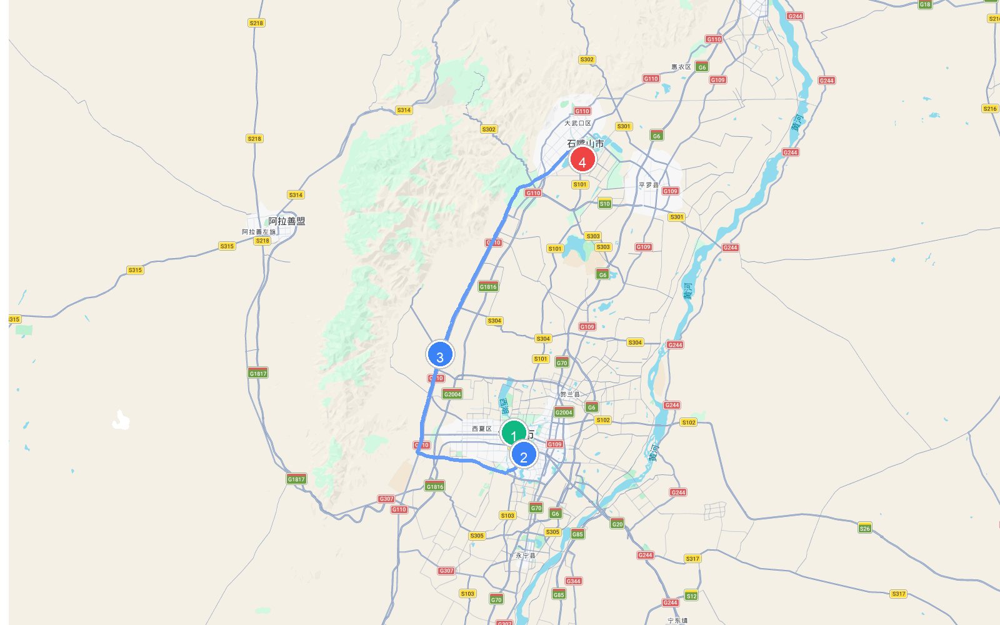

# 章节09 - 宁夏自驾游与人文地图指南

## 宁夏人文地图

### **宁夏自驾旅行经典线路推荐**

* **银川小环线**  
  * **自驾线路**：银川市→宝湖公园→三沙源生态度假区→永宁回乡文化园→惠台清真寺→西夏王陵风景区→滚钟口风景区→镇北堡→苏峪口国家森林公园→沙湖生态旅游区→石嘴山星海湖景区→贺兰山北武当地质公园→石嘴山惠农老刘家湾→惠农黄河大桥→黄沙古渡源旅游区→兵沟旅游区  
  * **路线路段距离与地图**
    | 起点 | 终点 | 距离 |
    | :--- | :--- | :--- |
    | (1) 银川市 | (2) 宝湖公园 | 6.7 公里 |
    | (2) 宝湖公园 | (3) 镇北堡 | 42.8 公里 |
    | (3) 镇北堡 | (4) 石嘴山星海湖景区 | 51.3 公里 |
    | **总里程** | | **100.8 公里** |
    
    
    
    
    
    
    
  * **特点**：这是一条聚焦宁夏银川周边、融合塞上江南风光与史前文化遗迹的短途自驾线。自驾穿行于沙湖生态旅游区的浩淼水沙奇观之间；在贺兰山下的镇北堡西部影城，重温《大话西游》经典；探秘西夏陵的“东方金字塔”遗址，最后在黄沙古渡和兵沟旅游区，看黄河流沙与大漠孤烟的壮丽风光。
* **宁夏大环线**  
  * **自驾线路**：银川市→镇北堡→苏峪口国家森林公园→沙湖风景区→黄沙古渡源风景区→水洞沟旅游区→罗山自然保护区→六盘山森林公园→泾源小蒜沟→火石寨森林公园→须弥山石窟→中宁县沙坡头→青铜峡市黄河楼景区→西夏王陵景区
  * **路线路段距离与地图**
    | 起点 | 终点 | 距离 |
    | :--- | :--- | :--- |
    | (1) 银川市 | (2) 镇北堡 | 31.1 公里 |
    | (2) 镇北堡 | (3) 须弥山石窟 | 306.4 公里 |
    | (3) 须弥山石窟 | (4) 中宁县沙坡头 | 205.0 公里 |
    | **总里程** | | **542.5 公里** |
    
    
    
    
    
    
    
  * **特点**：这是一条纵横塞上江南、饱览宁夏全境沙水交融与六盘名山的高全景自驾大环线。从银川镇北堡西部影城和沙湖出发，自驾穿越水洞沟的史前遗迹与藏兵洞奇观；在固原须弥山石窟瞻仰唐代摩崖石刻，翻越苍翠的六盘山；最终抵达中卫沙坡头，看黄河在沙漠旁划出完美弧线，在青铜峡黄河楼前，感悟“天下黄河富宁夏”的深厚气韵。

## 沿途城市人文地图
本章节特别附带以下城市的详细人文地图，方便您在自驾游途中进行地市深度探索：

### 中卫人文地图

### 吴忠人文地图

### 固原人文地图

### 银川人文地图

### 石嘴山人文地图

