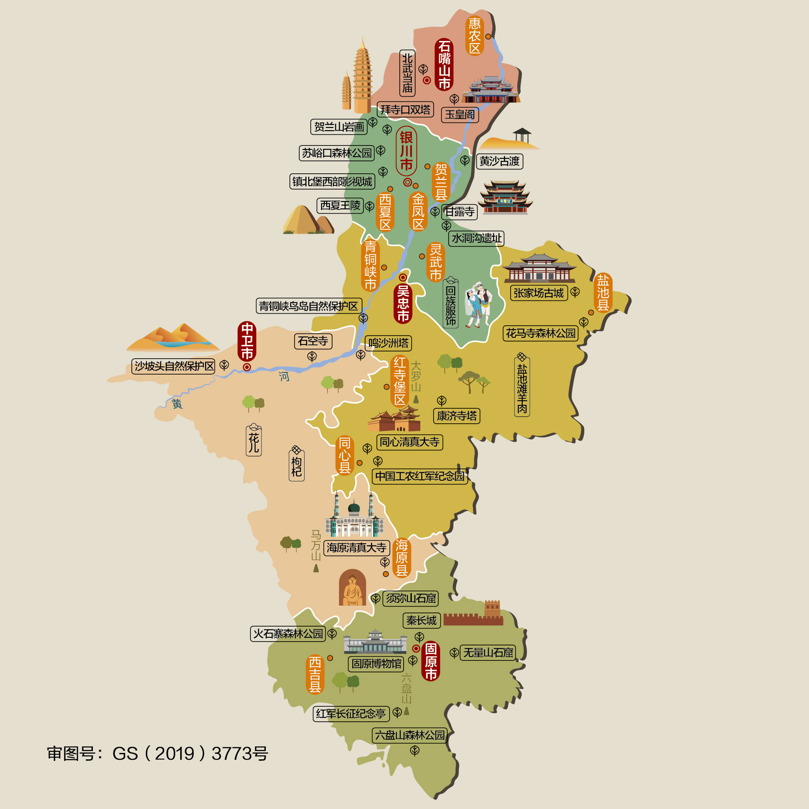
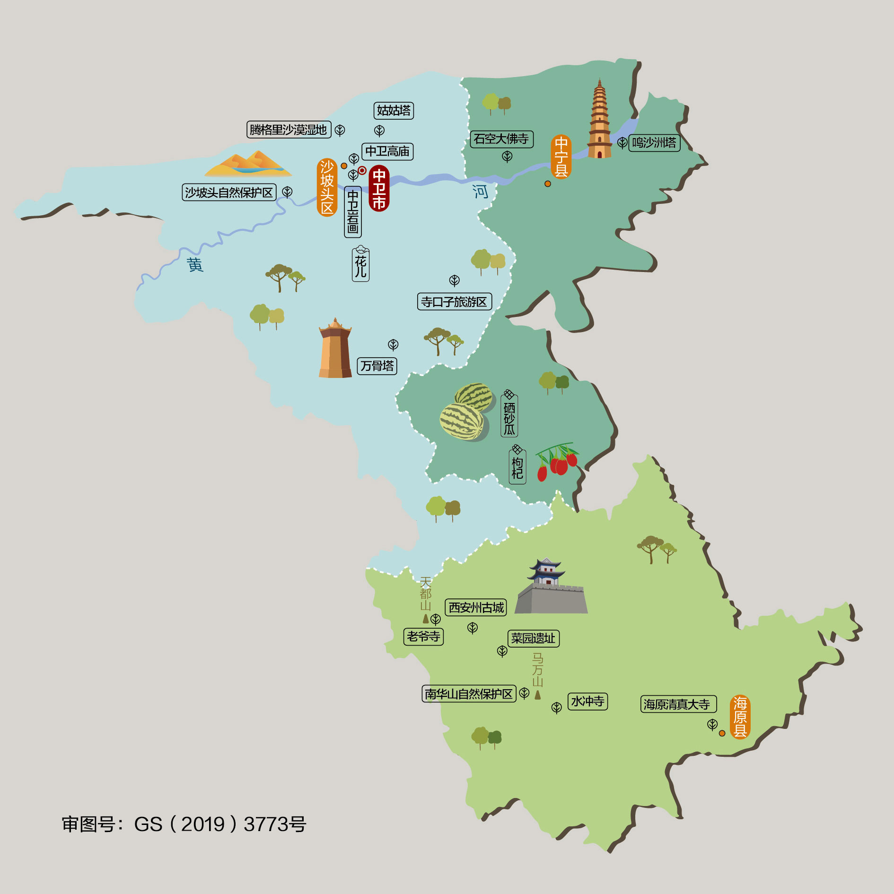
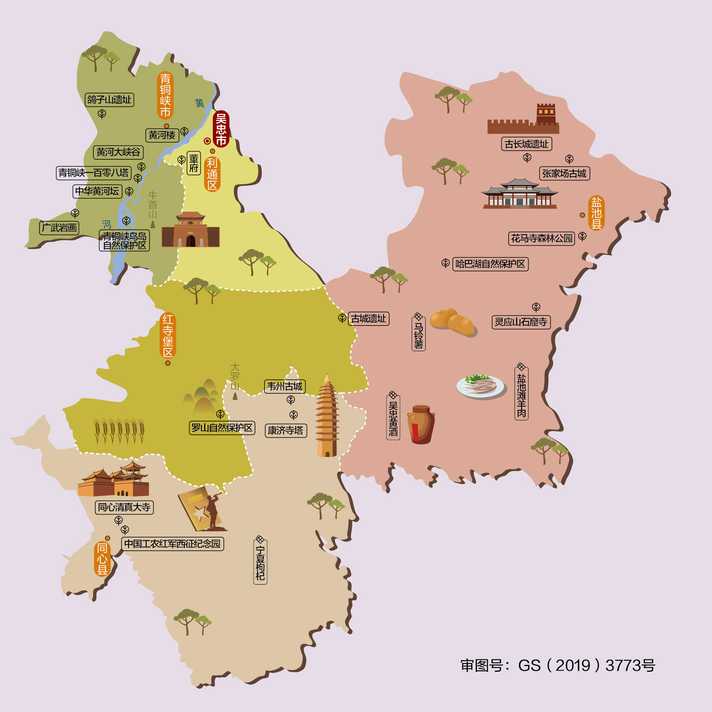
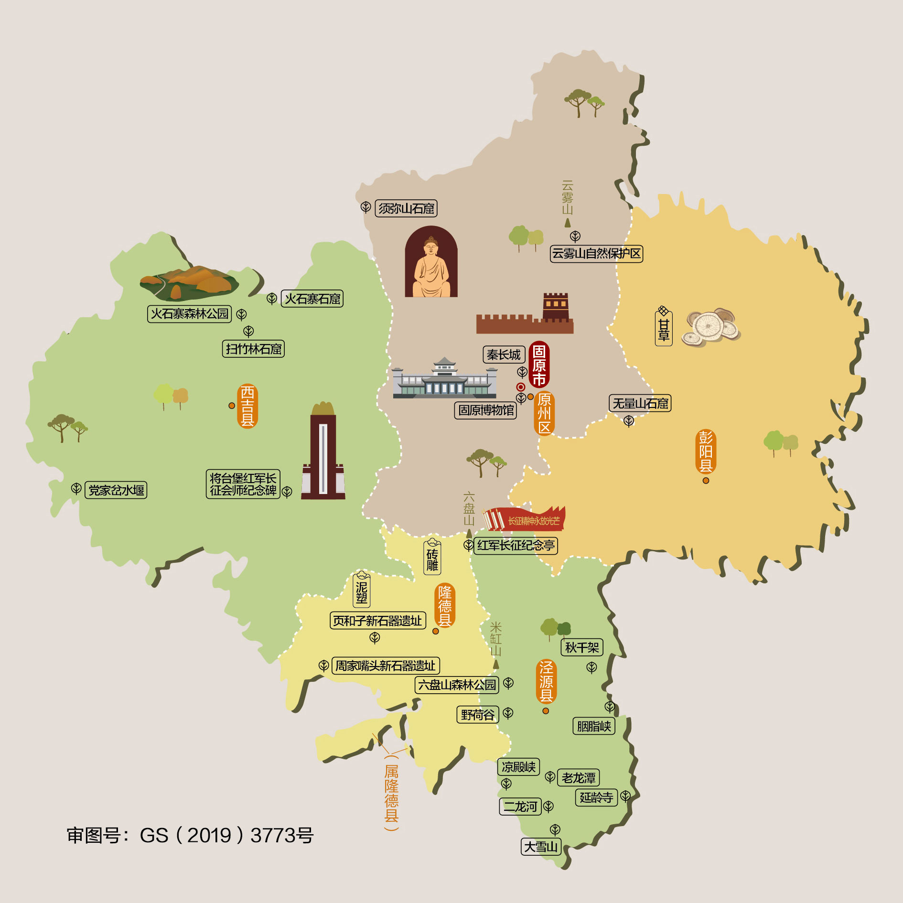
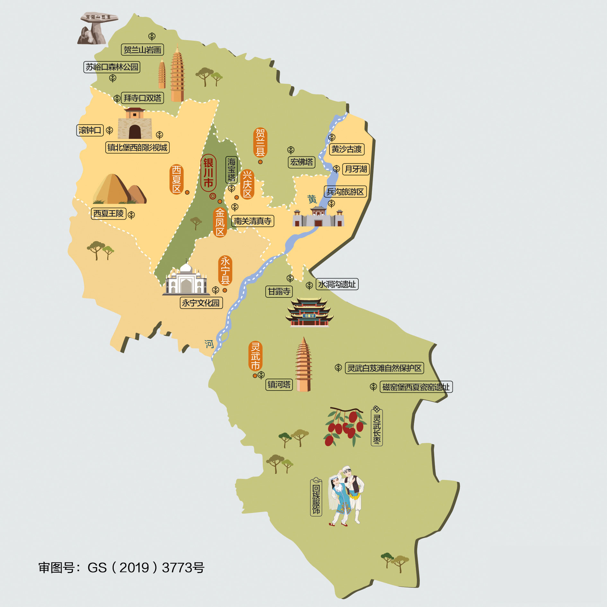
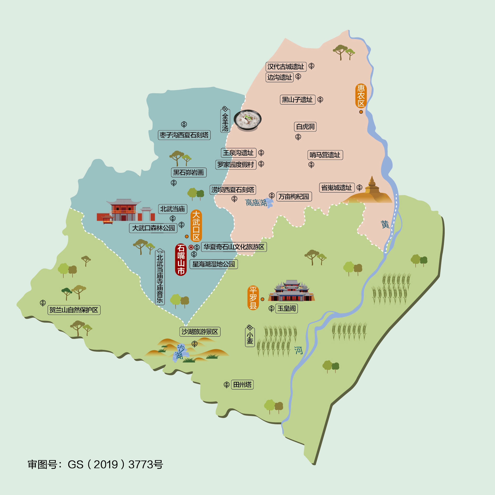

# Chapter 09 - 宁夏自驾游与人文地图指南

## 宁夏人文地图

### 经典旅游路线与自驾路线

#### 路线一：塞上江南经典自驾线
* **特点**：领略宁夏独有的黄沙与江南水乡交融奇观，感受西夏文化与贺兰雄风。
* **行车路线**：银川 → 水洞沟遗址 → 贺兰山岩画 → 西夏陵 → 镇北堡西部影城 → 石嘴山沙湖 → 中卫沙坡头（体验黄河羊皮筏子与沙漠滑沙） → 固原须弥山石窟 → 六盘山。

## 沿途城市人文地图
本章节特别附带以下城市的详细人文地图，方便您在自驾游途中进行地市深度探索：

### 中卫人文地图

### 吴忠人文地图

### 固原人文地图

### 银川人文地图

### 石嘴山人文地图

