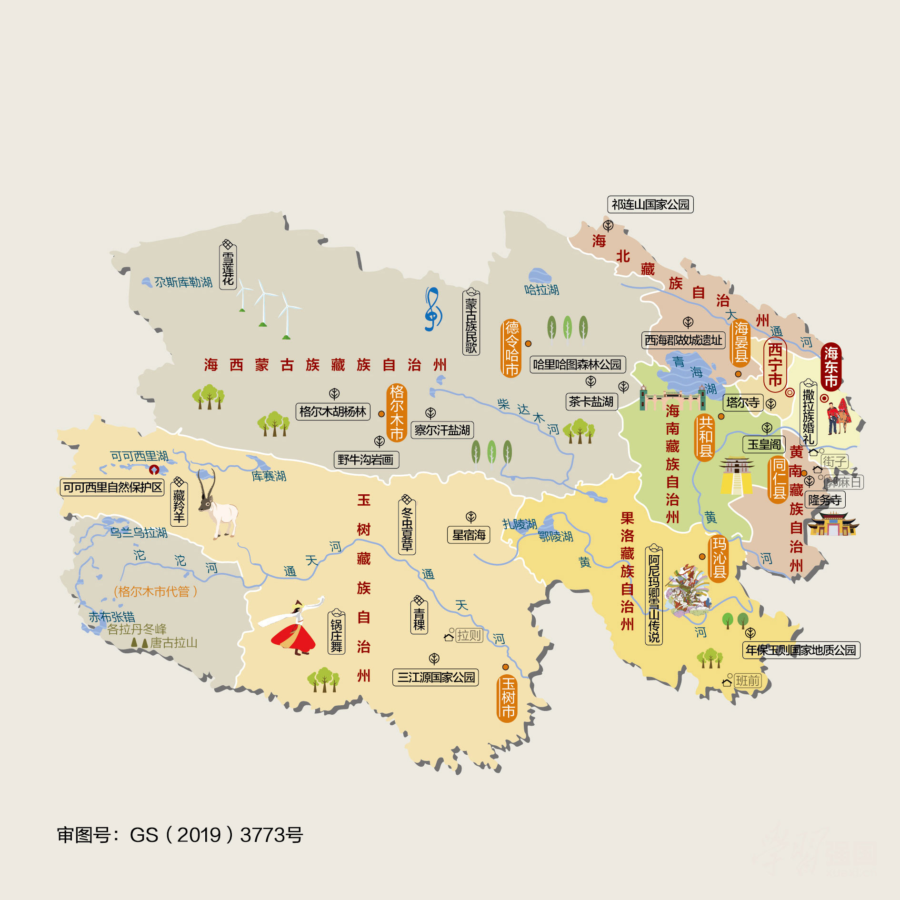
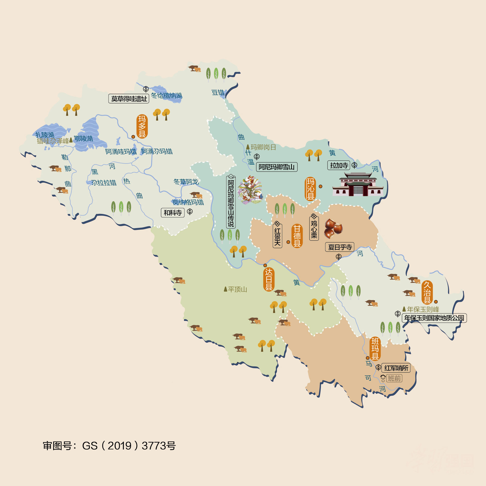
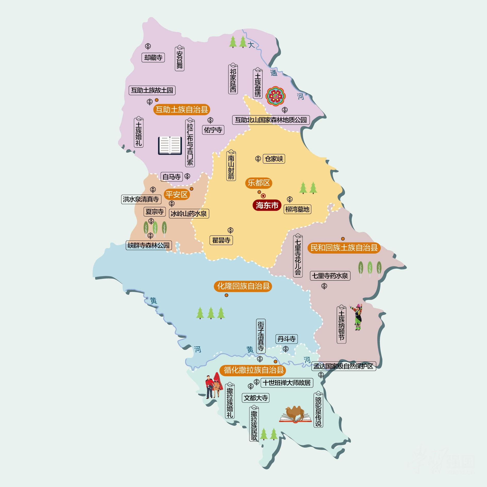
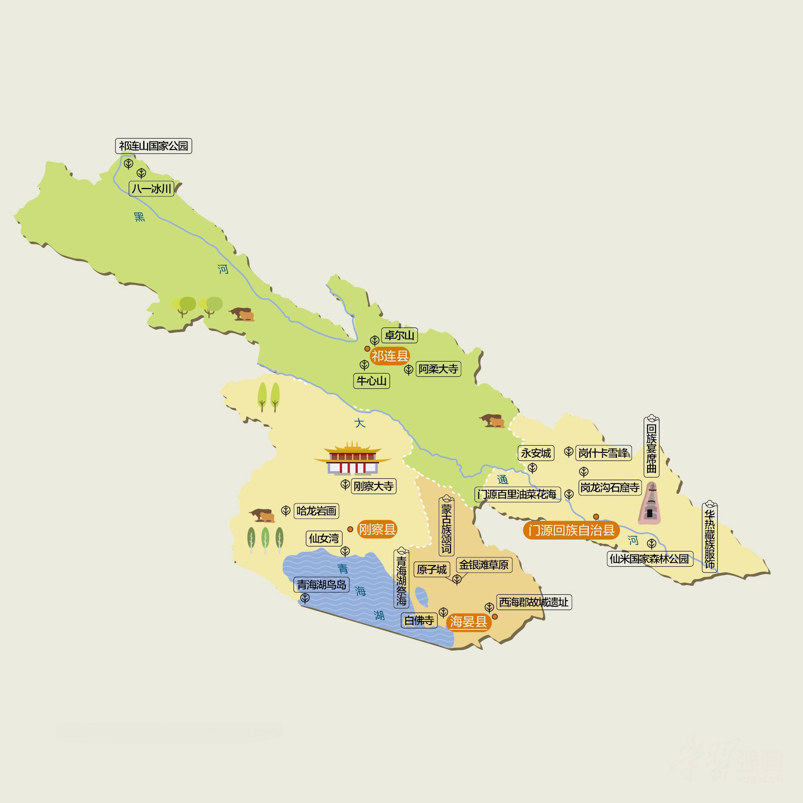
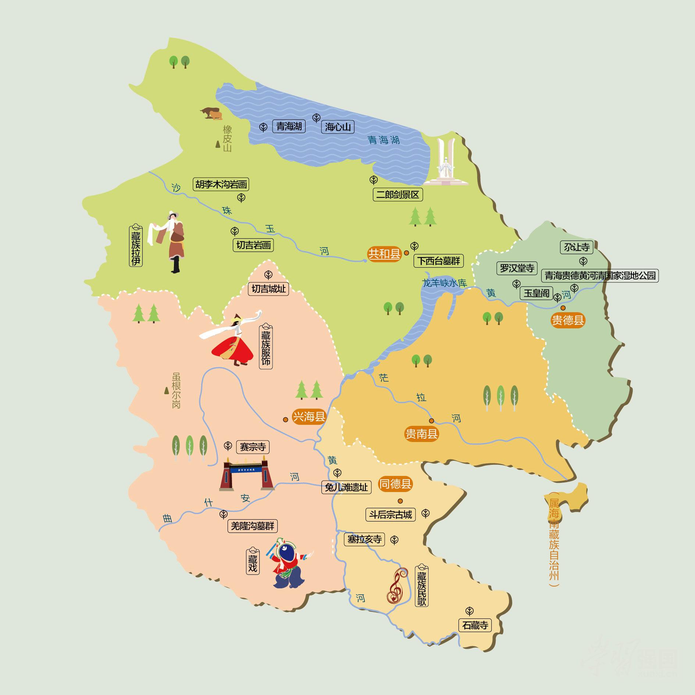
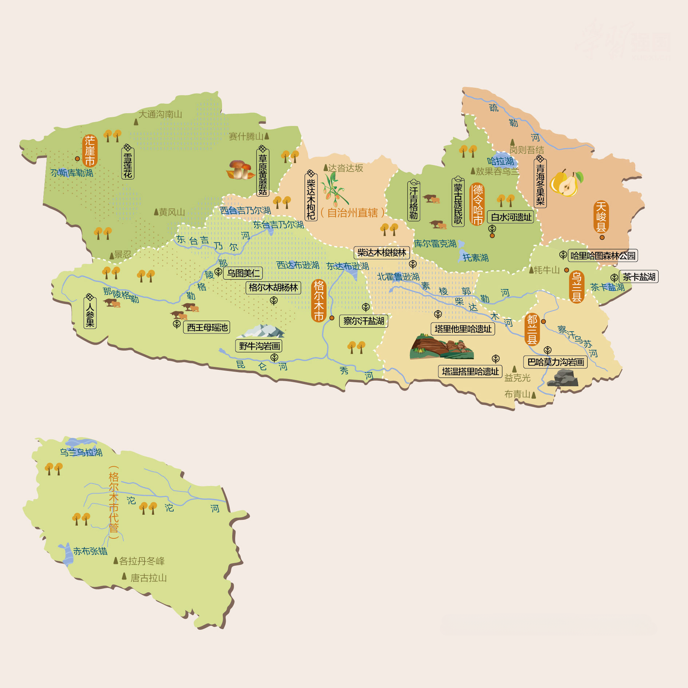
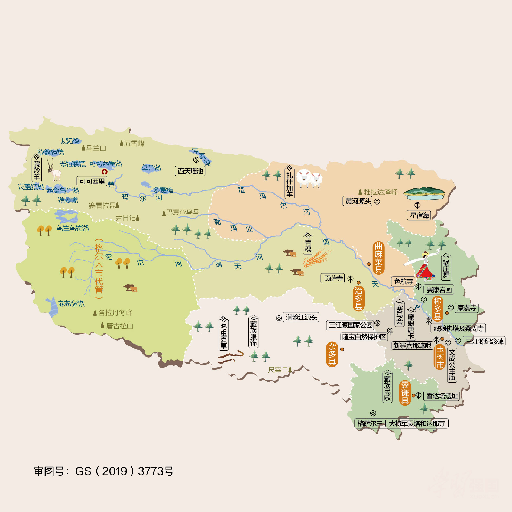
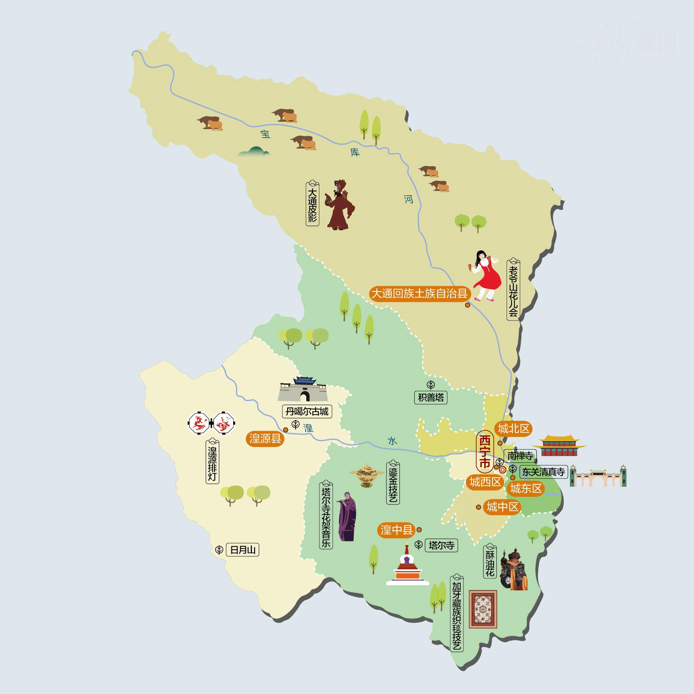
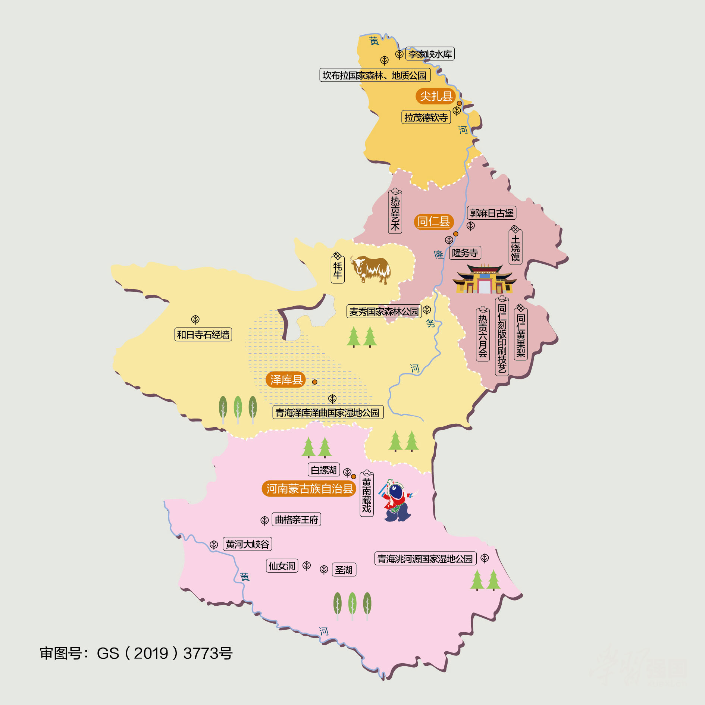

# Chapter 11 - 青海自驾游与人文地图指南

## 青海人文地图

### **青海自驾旅行经典线路推荐**

* **青海大环线经典自驾线路**  
  * **自驾线路**：西宁市→中塔尔寺景区→贵德黄河清湿地公园→坎布拉景区→峡群寺森林公园→扎龙沟景区→甘肃天堂寺景区→门源祁汉开景区→门源万亩油菜花田→祁连县→天峻县秀龙谷景区→茶卡盐湖→青海湖→海晏县→湟源大黑沟森林公园→西宁市  
  * **特点**：这是一条高饱和度色彩的高原山水与宗教圣地自驾环线。在西宁塔尔寺内观赏精妙绝伦的艺术三绝（酥油花、壁画、堆绣）；翻越日月山，在倒淌河畔倾听文成公主的思乡传说；在茶卡盐湖漫步于白茫茫的“天空之镜”；在祁连山草原上策马，7月更可在门源欣赏绵延百里的万亩油菜花海，金黄与蔚蓝的青海湖交织成绝美画卷。
* **青海海西大环线自驾线路**  
  * **自驾线路**：西宁市→祁连县→德令哈托素湖→大柴旦湖→东西台吉乃尔湖→乌素特水上雅丹→海西大黑山→茫崖尕斯库勒湖→茫崖恶魔之眼→格尔木→格尔木纳赤台→玛多扎陵湖→冬给措纳湖→青海湖  
  * **特点**：这是一条直达“外星地貌”、荒凉与纯净并存的海西魔幻自驾线。从德令哈可鲁克湖的宁静出发，探秘大柴旦翡翠湖的翠绿晶莹；穿越乌素特水上雅丹和东、西台吉乃尔湖的双色奇观；最后直达茫崖艾肯泉，在“恶魔之眼”的硫磺奇景前感叹大自然的造化，是越野与星空摄影的极致体验地。
* **青海果洛玉树探秘游路线**  
  * **自驾线路**：西宁市→尖扎县→麦秀森林公园→玛沁县阿尼玛卿雪山→久治县年保玉则→久治县白玉乡→班玛县→达日县→玉树市→隆宝错→杂多县→三江源保护区→曲麻莱县→玛多县→青海湖→西宁市
  * **特点**：这是一条深入三江源国家公园腹地、朝圣神山圣湖的巅峰自驾线。翻越壮丽的阿尼玛卿雪山，瞻仰其终年不化的冰川雄姿；在年保玉则的怪石嶙峋与高山海子间徒步；在玉树新寨玛尼石堆旁倾听信仰的诵经声，一路寻觅长江、黄河与澜沧江的源头，感受天人合一的高原秘境风光。

## 沿途城市人文地图
本章节特别附带以下城市的详细人文地图，方便您在自驾游途中进行地市深度探索：

### 果洛州人文地图

### 海东人文地图

### 海北州人文地图

### 海南州人文地图

### 海西州人文地图

### 玉树州人文地图

### 西宁人文地图

### 黄南州人文地图

