# 章节13 - 西藏自驾游与人文地图指南

## 西藏人文地图
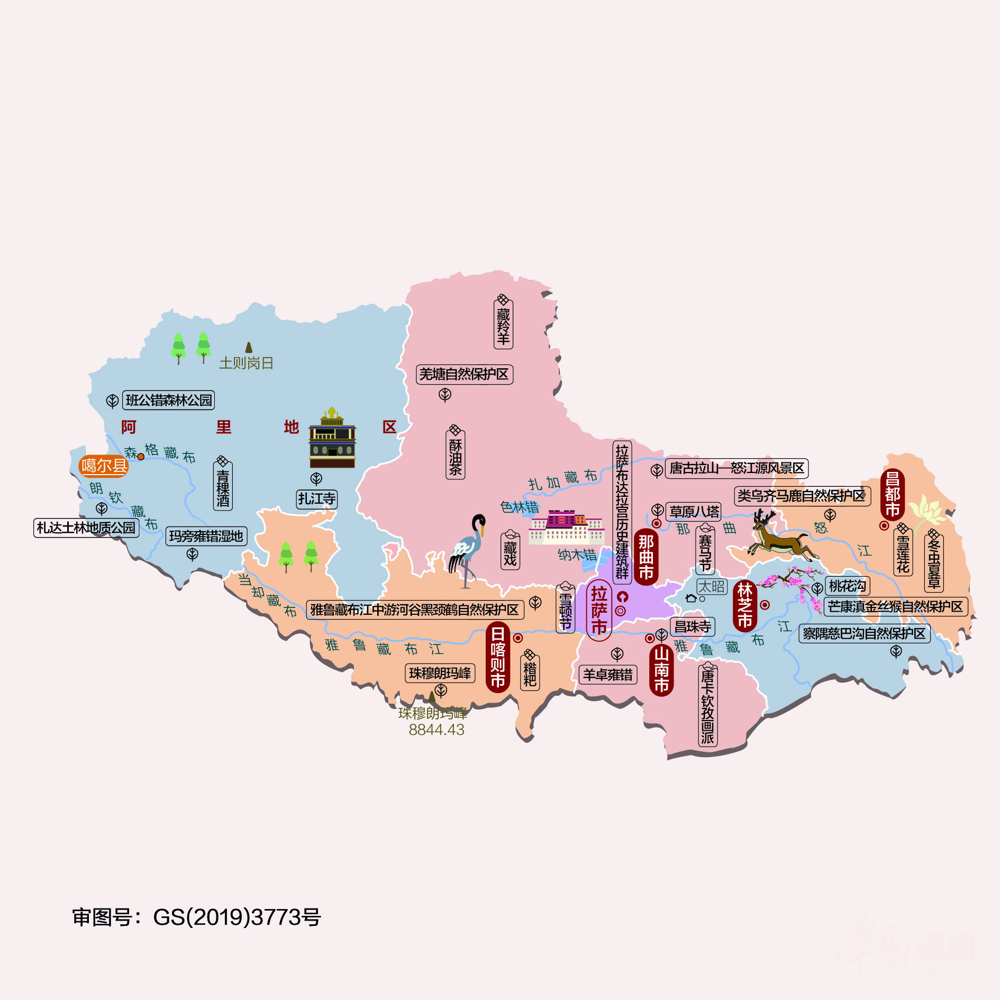

### **西藏自驾旅行经典线路推荐**

* **最美藏东自驾游路线**  
  * **自驾线路**：林芝市→达格孜缺康→米林南伊沟→雅尼国家湿地公园→派镇雅鲁藏布江大峡谷→墨脱县→波密扎古鲁→然乌湖然乌冰川→邦达仁错→洛隆县→比如县萨普神山→那曲市→当雄县纳木错湖→拉萨布达拉宫→嘎定沟→林芝市  
  * **路线路段距离与地图**
    | 起点 | 终点 | 距离 |
    | :--- | :--- | :--- |
    | (1) 林芝市 | (2) 墨脱县 | 349.1 公里 |
    | (2) 墨脱县 | (3) 洛隆县 | 357.8 公里 |
    | (3) 洛隆县 | (4) 那曲市 | 1034.0 公里 |
    | (4) 那曲市 | (5) 拉萨布达拉宫 | 713.7 公里 |
    | (5) 拉萨布达拉宫 | (6) 林芝市 | 447.4 公里 |
    | **总里程** | | **2902.1 公里** |
    
    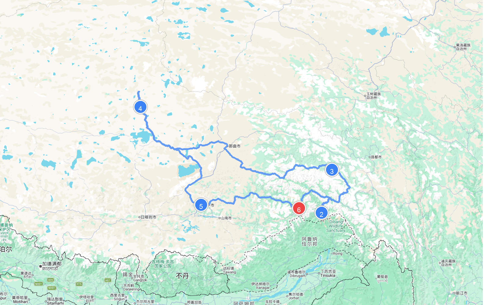
    
    
    
    
    
  * **特点**：这是一条跨越“藏地江南”、饱览雪山冰川与峡谷激流的藏东风光自驾线。自驾穿行于米林南伊沟的原始森林，在雅鲁藏布大峡谷底仰望雄伟的南迦巴瓦峰（十人九不遇的日照金山）；在波密观赏震撼的然乌湖与米堆冰川；探秘萨普神山的冰川群，最后在圣湖纳木错湖畔看梵天红日，尽显西藏山河的联袂壮美。
* **藏南拉萨周边环线游路线**  
  * **自驾线路**：拉萨市→羊卓雍错→普莫雍错→洛扎县→错那县→拿日雍错→日当镇→吉木错→朗县嘎贡沟→桑日县→帮贡村→米拉山→墨竹工卡→林周县→扎叶巴寺→拉萨市  
  * **路线路段距离与地图**
    | 起点 | 终点 | 距离 |
    | :--- | :--- | :--- |
    | (1) 拉萨布达拉宫 | (2) 羊卓雍错 | 131.2 公里 |
    | (2) 羊卓雍错 | (3) 普莫雍错 | 240.1 公里 |
    | (3) 普莫雍错 | (4) 洛扎县 | 80.7 公里 |
    | (4) 洛扎县 | (5) 错那县 | 222.7 公里 |
    | (5) 错那县 | (6) 拿日雍错 | 38.4 公里 |
    | (6) 拿日雍错 | (7) 日当镇 | 52.5 公里 |
    | (7) 日当镇 | (8) 吉木错 | 68.3 公里 |
    | (8) 吉木错 | (9) 桑日县 | 112.3 公里 |
    | (9) 桑日县 | (10) 帮贡村 | 54.1 公里 |
    | (10) 帮贡村 | (11) 米拉山 | 76.8 公里 |
    | (11) 米拉山 | (12) 墨竹工卡 | 154.3 公里 |
    | (12) 墨竹工卡 | (13) 林周县 | 100.8 公里 |
    | (13) 林周县 | (14) 扎叶巴寺 | 123.3 公里 |
    | (14) 扎叶巴寺 | (15) 拉萨布达拉宫 | 31.8 公里 |
    | **总里程** | | **1487.4 公里** |
    
    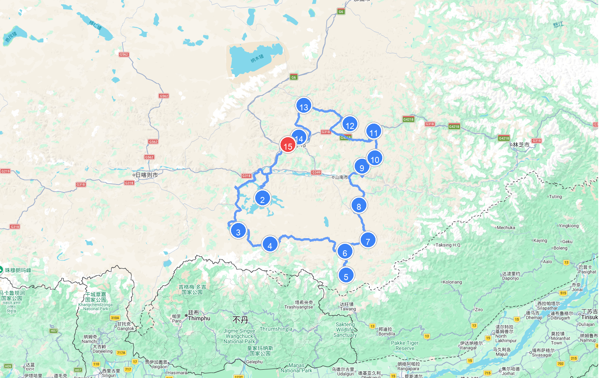
    
    
    
    
    
  * **特点**：这是一条环绕雅鲁藏布江中游、感受高原圣湖与古寺文化的藏南经典环线。从拉萨出发，自驾翻越海拔5000米的岗巴拉山口，俯瞰宛如蓝色缎带的羊卓雍错（羊湖）；前往如蓝宝石般纯净、冬季结冰呈现梦幻蓝冰的普莫雍错；最后在山南雍布拉康（西藏第一座宫殿）和桑耶寺前，追寻吐蕃王朝的起始与佛教东传的足迹。
* **西藏拉萨日喀则秋日环线游**  
  * **自驾线路**：拉萨市→浪卡子县（羊湖）→宁金岗桑峰→斯密拉山→亚东县→多庆错→江孜县→日喀则→南木林县→申扎格仁错→色林措→班戈县→久如错→纳木错湖→羊八井温泉→拉萨市  
  * **路线路段距离与地图**
    | 起点 | 终点 | 距离 |
    | :--- | :--- | :--- |
    | (1) 拉萨布达拉宫 | (2) 浪卡子县 | 205.1 公里 |
    | (2) 浪卡子县 | (3) 亚东县 | 284.1 公里 |
    | (3) 亚东县 | (4) 多庆错 | 63.2 公里 |
    | (4) 多庆错 | (5) 江孜县 | 107.6 公里 |
    | (5) 江孜县 | (6) 日喀则 | 397.9 公里 |
    | (6) 日喀则 | (7) 南木林县 | 419.8 公里 |
    | (7) 南木林县 | (8) 色林措 | 480.3 公里 |
    | (8) 色林措 | (9) 班戈县 | 127.5 公里 |
    | (9) 班戈县 | (10) 久如错 | 81.2 公里 |
    | (10) 久如错 | (11) 纳木错湖 | 474.7 公里 |
    | (11) 纳木错湖 | (12) 拉萨布达拉宫 | 807.0 公里 |
    | **总里程** | | **3448.3 公里** |
    
    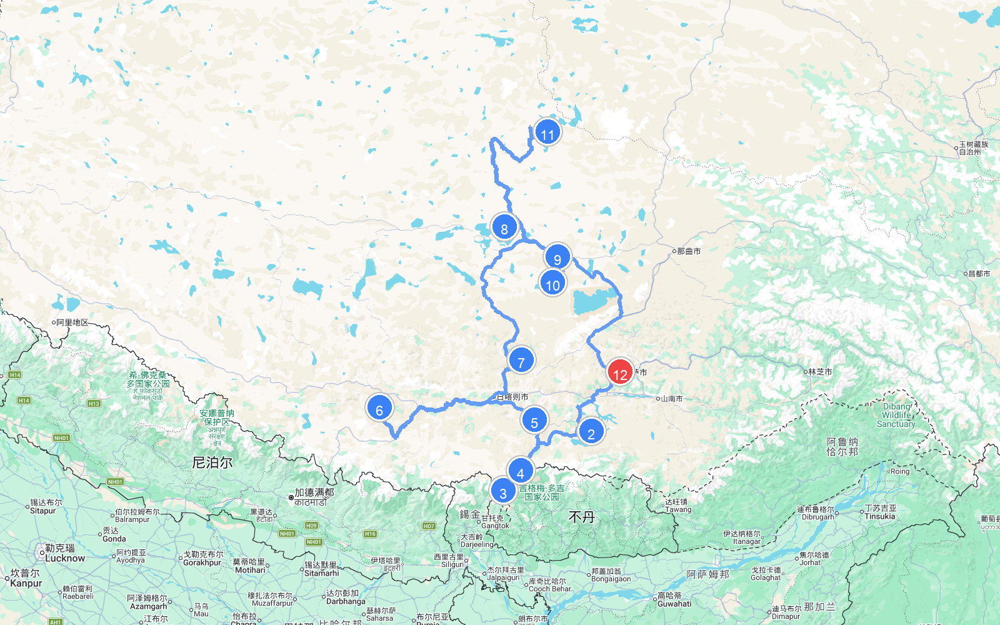
    
    
    
    
    
  * **特点**：这是一条尽显后藏异域风光、雪山湖泊与边境风情的高原秋日自驾线。除了一路打卡羊湖的碧蓝与江孜白居寺的塔庙一体之美，还能驱车亚东县在原始山谷中探秘喜马拉雅南麓秘境；在日喀则扎什伦布寺朝拜强巴大佛，最后驱车穿越色林错和纳木错，感受西藏“天河之湖”的无边壮阔。
* **西藏阿里大环线**  
  * **自驾线路**：拉萨市→纳木错湖→尼玛县→改则县→噶尔县→班公湖→扎达土林→玛旁雍错→冈仁波齐→仲巴县聂朗目错→佩枯措→珠峰景区及绒布寺→岗巴县→嘎拉错→羊卓雍措→拉萨市  
  * **路线路段距离与地图**
    | 起点 | 终点 | 距离 |
    | :--- | :--- | :--- |
    | (1) 拉萨布达拉宫 | (2) 纳木错湖 | 771.7 公里 |
    | (2) 纳木错湖 | (3) 尼玛县 | 608.6 公里 |
    | (3) 尼玛县 | (4) 改则县 | 680.4 公里 |
    | (4) 改则县 | (5) 噶尔县 | 772.5 公里 |
    | (5) 噶尔县 | (6) 班公湖 | 396.4 公里 |
    | (6) 班公湖 | (7) 扎达土林 | 465.6 公里 |
    | (7) 扎达土林 | (8) 玛旁雍错 | 290.9 公里 |
    | (8) 玛旁雍错 | (9) 冈仁波齐 | 98.6 公里 |
    | (9) 冈仁波齐 | (10) 佩枯措 | 591.8 公里 |
    | (10) 佩枯措 | (11) 岗巴县 | 420.4 公里 |
    | (11) 岗巴县 | (12) 嘎拉错 | 106.9 公里 |
    | (12) 嘎拉错 | (13) 羊卓雍措 | 380.8 公里 |
    | (13) 羊卓雍措 | (14) 拉萨布达拉宫 | 118.3 公里 |
    | **总里程** | | **5702.7 公里** |
    
    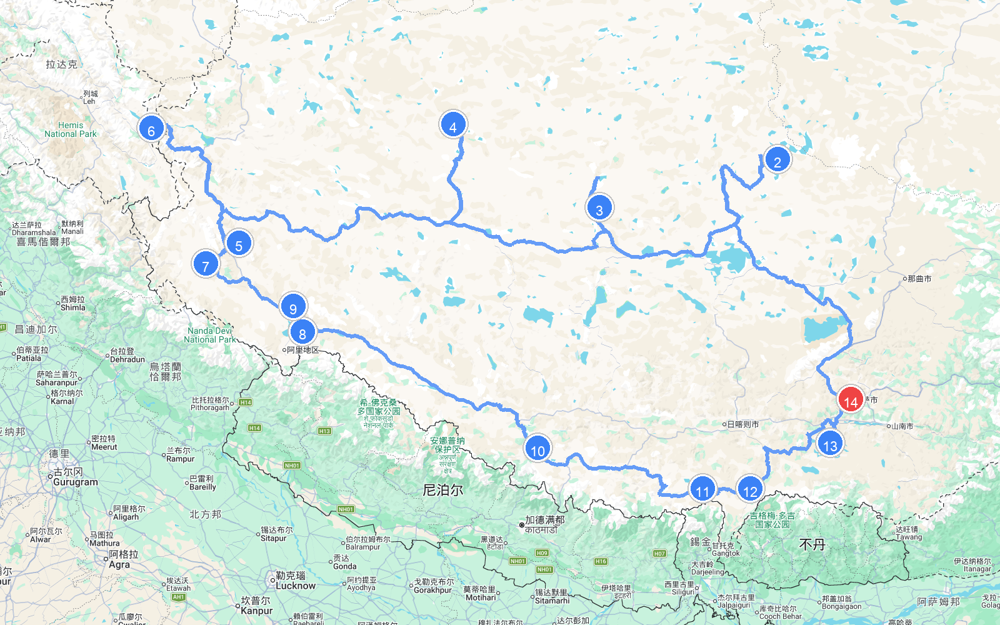
    
    
    
    
    
  * **特点**：这是一条自驾爱好者的终极梦想、横跨“世界屋脊的屋脊”的阿里极致荒野自驾线。您将驱车深入无人区，仰望佛教神山冈仁波齐的巍峨，在圣湖玛旁雍错畔洗涤心灵；震撼打卡札达土林地质公园的废墟美学与古格王朝遗址的千古遗风；在珠穆朗玛峰大本营脚下看日落金山，在班公湖畔看候鸟飞翔，是一生一次的灵魂朝圣之旅。
* **藏北无人区深度线**  
  * **自驾线路**：拉萨市→哲蚌寺→日喀则市→昂仁县→萨嘎县达加错→错帕耳→措勤县嘎仁错→达瓦错→扎日南木错→当惹雍错→文布南村→尼玛县达则错→色林错→拉萨市
  * **路线路段距离与地图**
    | 起点 | 终点 | 距离 |
    | :--- | :--- | :--- |
    | (1) 拉萨布达拉宫 | (2) 哲蚌寺 | 9.1 公里 |
    | (2) 哲蚌寺 | (3) 日喀则市 | 558.6 公里 |
    | (3) 日喀则市 | (4) 昂仁县 | 211.3 公里 |
    | (4) 昂仁县 | (5) 错帕耳 | 1196.6 公里 |
    | (5) 错帕耳 | (6) 达瓦错 | 782.1 公里 |
    | (6) 达瓦错 | (7) 扎日南木错 | 118.6 公里 |
    | (7) 扎日南木错 | (8) 当惹雍错 | 281.9 公里 |
    | (8) 当惹雍错 | (9) 文布南村 | 53.8 公里 |
    | (9) 文布南村 | (10) 色林错 | 368.8 公里 |
    | (10) 色林错 | (11) 拉萨布达拉宫 | 492.5 公里 |
    | **总里程** | | **4073.3 公里** |
    
    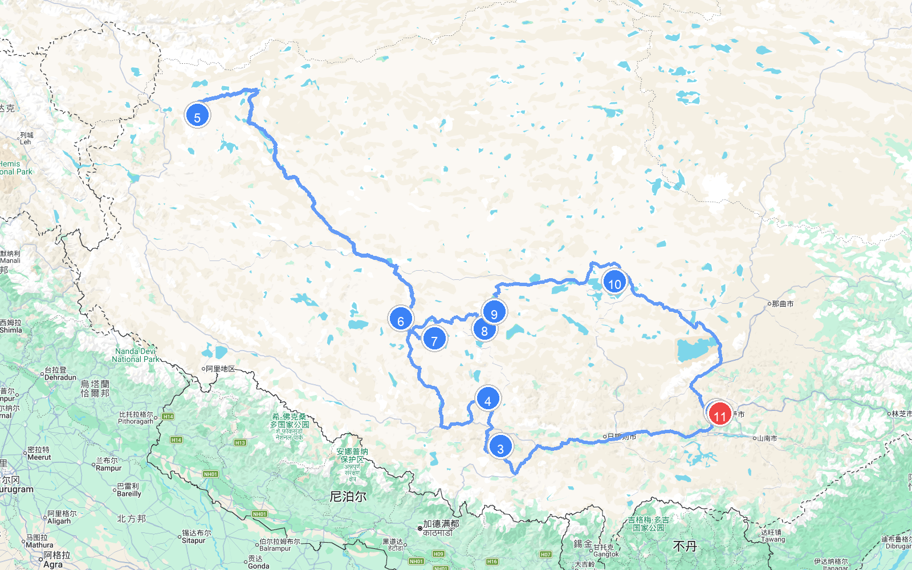
    
    
    
    
    
  * **特点**：这是一条深入羌塘国家级自然保护区、挑战生命极限的无人区探险自驾线。从拉萨哲蚌寺出发，深入藏北高原，在当惹雍错（苯教圣湖）和文布南村的古朴石屋旁感受与世隔绝的纯净；在色林错、扎日南木错的茫茫盐湖畔，看藏羚羊、野牦牛和藏野驴自由奔跑，尽显生命在旷野荒漠中绽放出的极致奇迹。

## 沿途城市人文地图
本章节特别附带以下城市的详细人文地图，方便您在自驾游途中进行地市深度探索：

### 山南人文地图
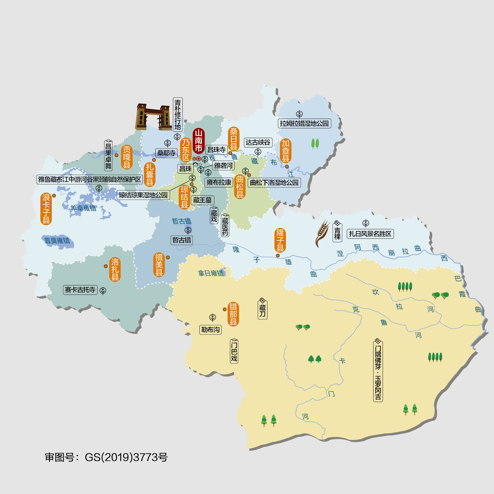

### 拉萨人文地图
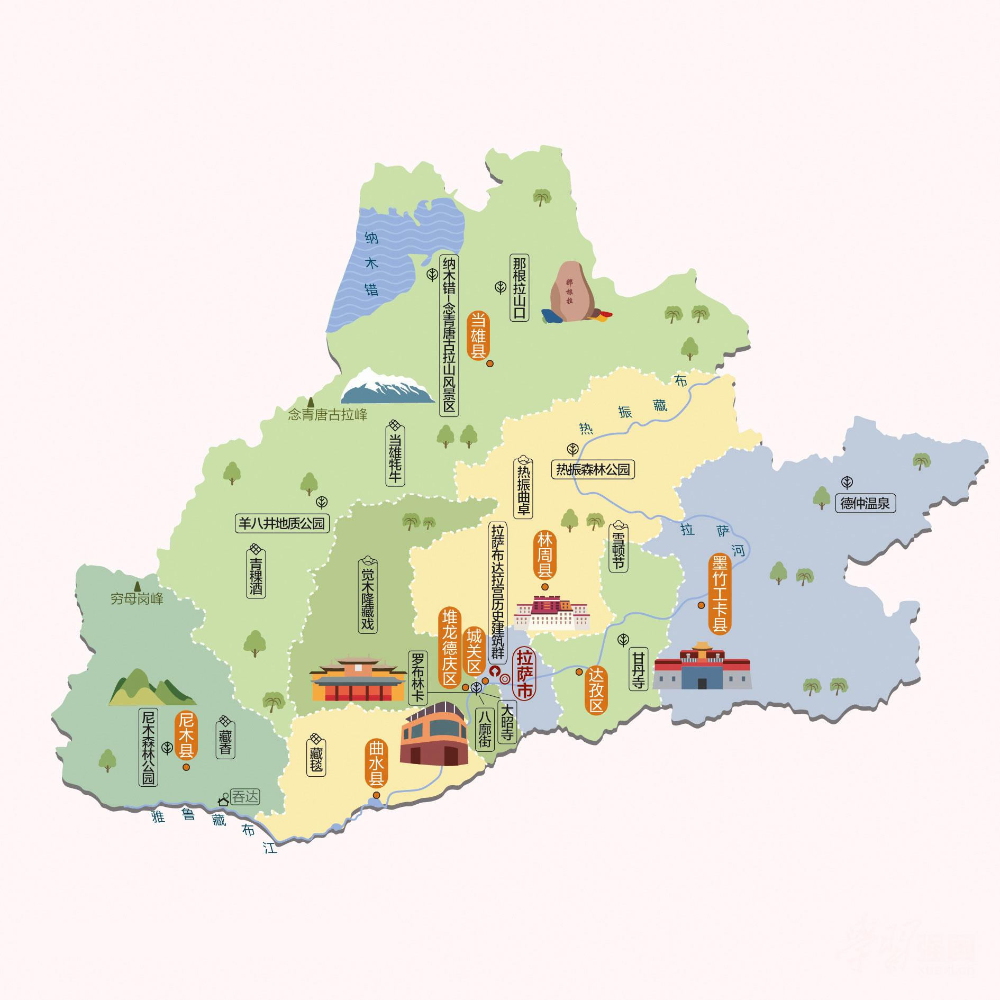

### 日喀则人文地图
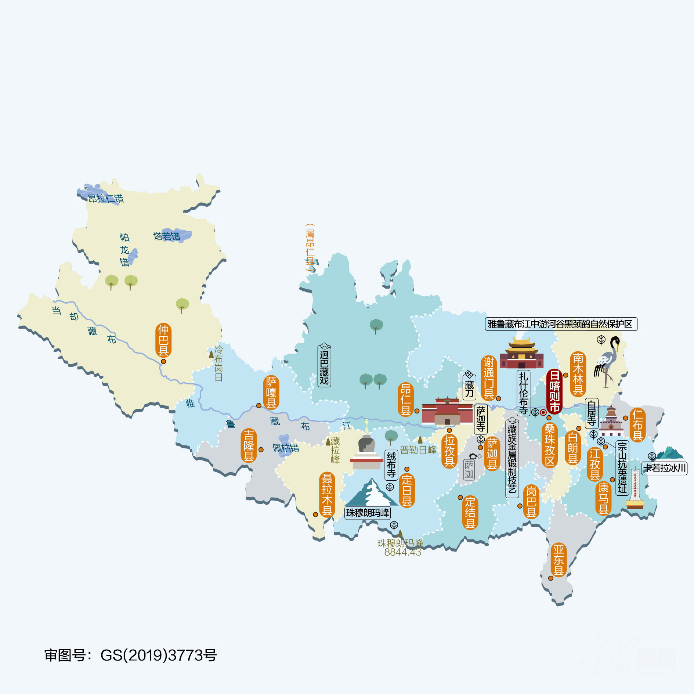

### 昌都人文地图
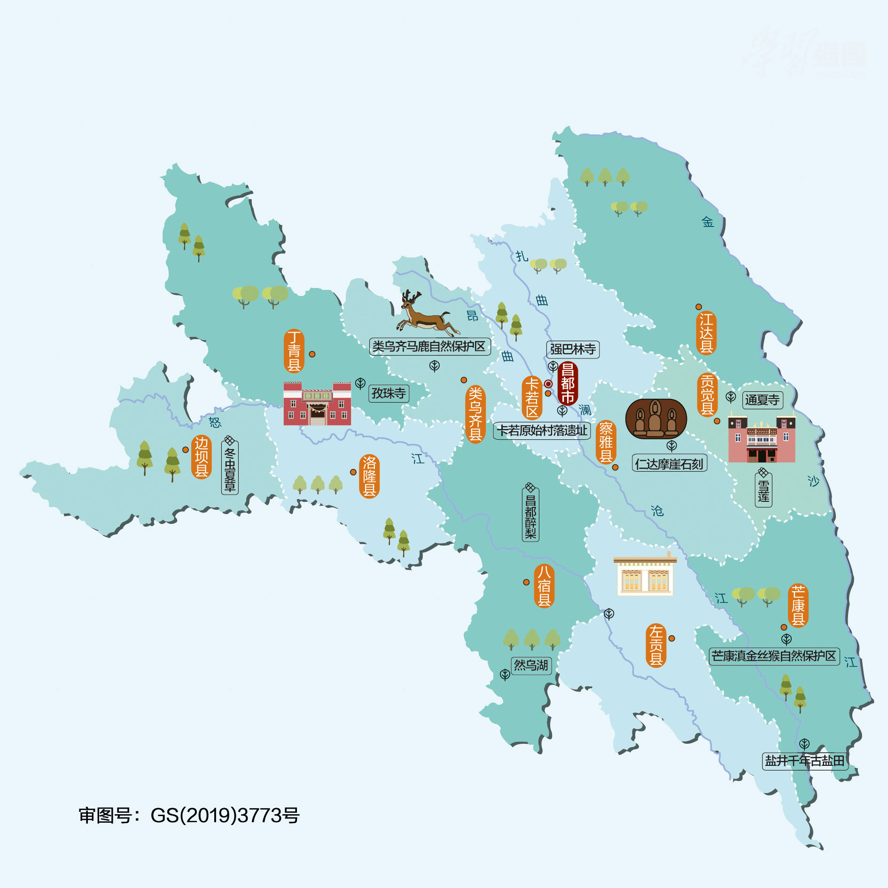

### 林芝人文地图
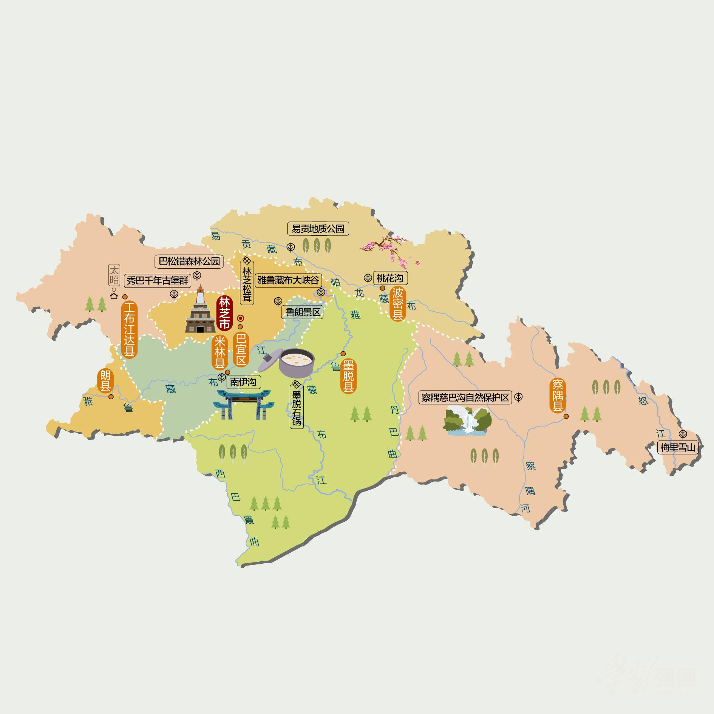

### 那曲人文地图
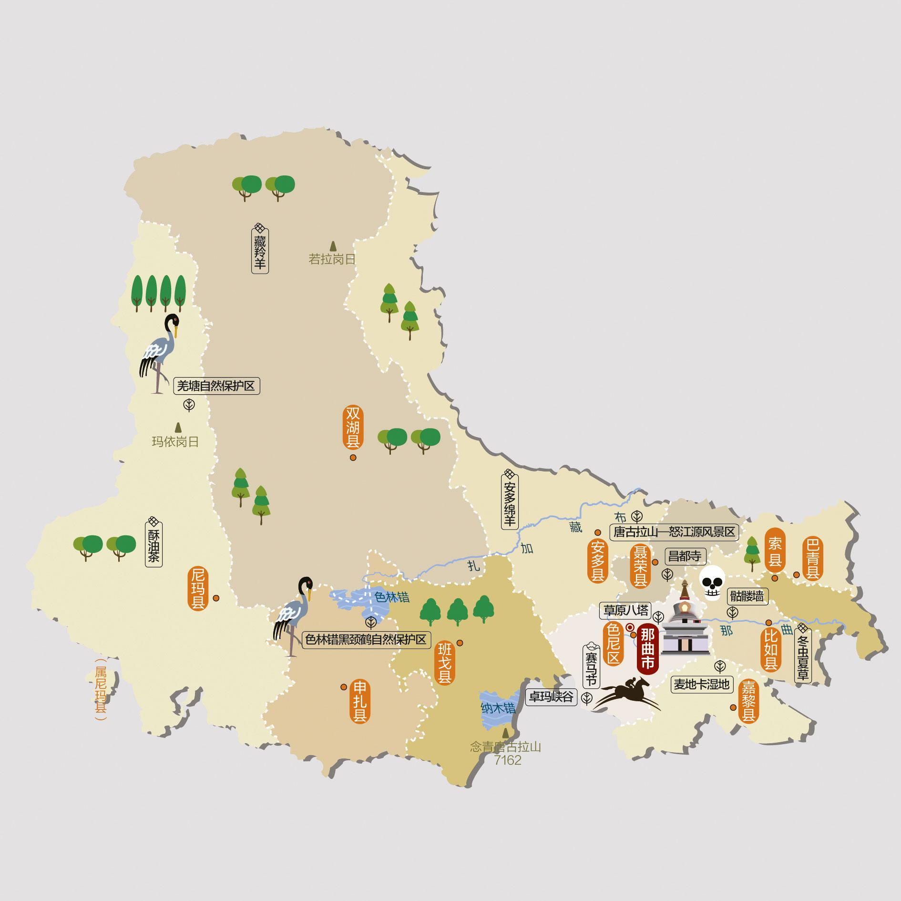

### 阿里地区人文地图
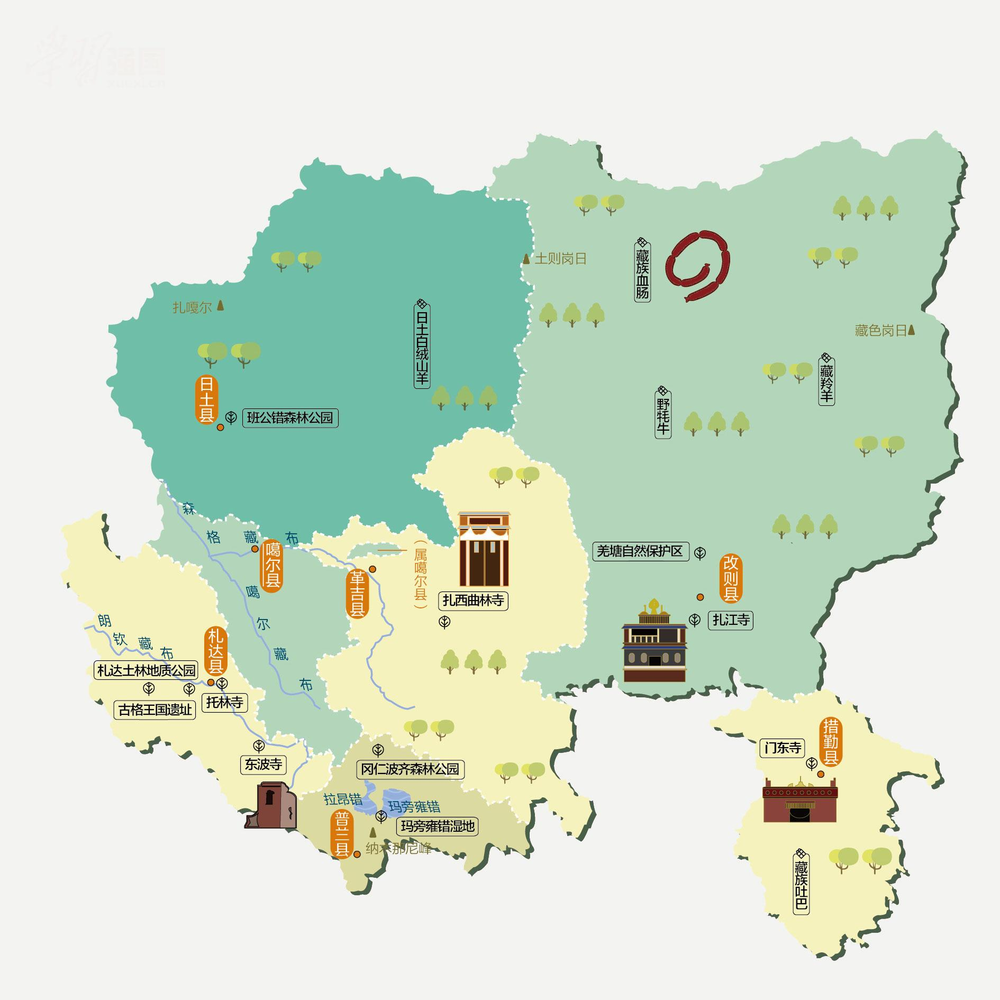
