# 章节16 - 贵州自驾游与人文地图指南

## 贵州人文地图
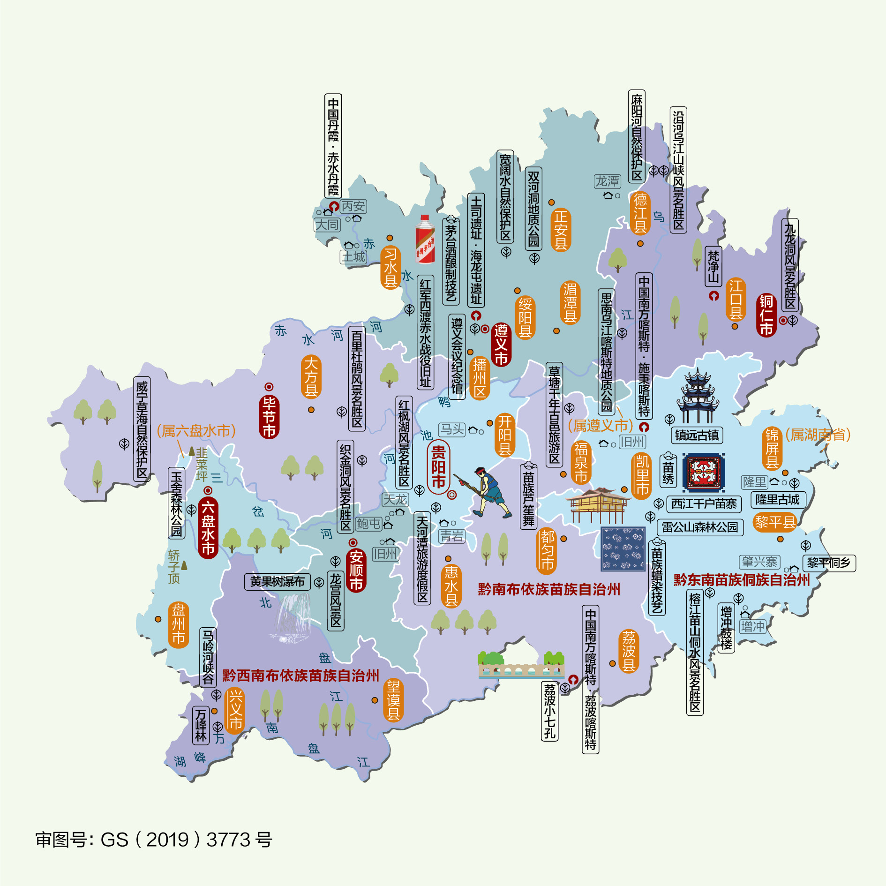

## **贵州自驾旅行经典线路推荐**

#### 最美喀斯特自驾路线

* **自驾线路**：荔波樟江风景名胜区→大小七孔→青岩古镇→花溪湿地公园→贵阳甲秀楼→开阳南江大峡谷→毕节织金洞→安顺天龙屯堡→龙宫风景名胜区→黄果树瀑布→北盘江大峡谷→贵州双乳峰→马岭河大峡谷→万峰林  
* **路线路段距离与地图**

    | 起点 | 终点 | 距离 |
    | :--- | :--- | :--- |
    | (1) 大小七孔 | (2) 青岩古镇 | 254.8 公里 |
    | (2) 青岩古镇 | (3) 黄果树瀑布 | 125.7 公里 |
    | (3) 黄果树瀑布 | (4) 万峰林 | 201.5 公里 |
    | **总里程** | | **582.1 公里** |
  
  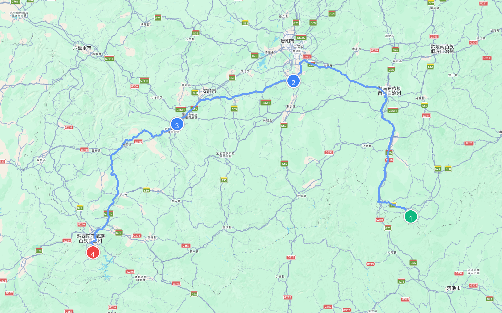
  
  
  
  
  
  
  
* **特点**：这是一条饱览贵州喀斯特奇特峰林、峡谷溶洞与历史雄关的自驾探险线。您将深入兴义万峰林，看万座奇峰挺拔于金黄的油菜花田间，构成绝美田园长卷；在马岭河大峡谷中看白练飞泻的飞瀑群；挑战晴隆二十四道拐抗战历史公路的发夹弯道；最后在安顺黄果树瀑布和龙宫暗河溶洞前，感悟大自然神奇的地质造化。

#### 贵州民族风情游

* **自驾线路**：镇远古城 → 旧州古镇 → 剑河温泉 → 西江千户苗寨 → 下司古镇 → 榕江县 → 肇兴侗寨 → 岜沙苗寨 → 加榜梯田 → 荔波大小七孔景区 → 荔波县
* **路线路段距离与地图**

    | 起点 | 终点 | 距离 |
    | :--- | :--- | :--- |
    | (1) 镇远古城 | (2) 旧州古镇 | 286.3 公里 |
    | (2) 旧州古镇 | (3) 剑河温泉 | 184.5 公里 |
    | (3) 剑河温泉 | (4) 西江千户苗寨 | 113.4 公里 |
    | (4) 西江千户苗寨 | (5) 下司古镇 | 52.4 公里 |
    | (5) 下司古镇 | (6) 榕江县 | 171.8 公里 |
    | (6) 榕江县 | (7) 肇兴侗寨 | 134.1 公里 |
    | (7) 肇兴侗寨 | (8) 岜沙苗寨 | 50.4 公里 |
    | (8) 岜沙苗寨 | (9) 加榜梯田 | 91.4 公里 |
    | (9) 加榜梯田 | (10) 荔波大小七孔景区 | 218.9 公里 |
    | (10) 荔波大小七孔景区 | (11) 荔波县 | 39.9 公里 |
    | **总里程** | | **1343.2 公里** |
  
  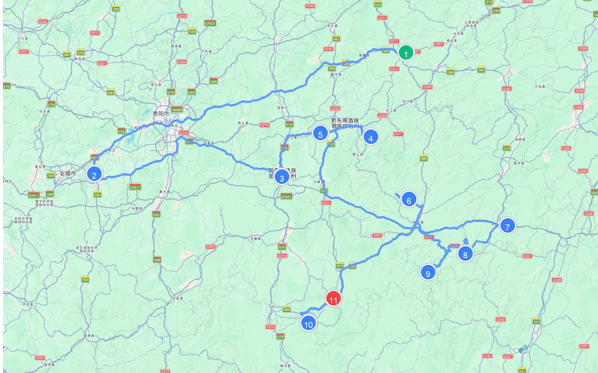
  
* **路线描述**：全长750公里，自驾游玩时间5-7天。从黔东南州镇远古城出发，往南途经礼州（旧州）、剑河温泉、西江千户苗寨、凯里下司古镇、三宝千户侗寨、肇兴侗寨、岜沙苗寨、加榜梯田、大小七孔，终点为黔南布依族苗族自治州瑶山古寨。
* **特点**：这是一条深度领略贵州黔东南与黔西北绚丽少数民族民俗与山水秘境的自驾环线。在凯里西江千户苗寨漫步于吊脚楼群，看万家灯火的震撼夜景；在镇远古镇依山傍水看舞阳河碧波；深入肇兴侗寨和岜沙苗寨，听侗族大歌，看最后的枪手部落展示古老图腾，尽显多彩贵州独特魅力。

#### 贵州夏季清凉避暑之旅

* **自驾线路**：铜仁市 → 梵净山 → 开阳县 → 修文县 → 贵阳 → 青岩古镇 → 荔波大小七孔景区 → 安顺市 → 安顺龙宫 → 黄果树瀑布 → 盘州市 → 六盘水 → 阿西里西韭菜坪 → 织金洞
* **路线路段距离与地图**

    | 起点 | 终点 | 距离 |
    | :--- | :--- | :--- |
    | (1) 铜仁市 | (2) 梵净山 | 14.9 公里 |
    | (2) 梵净山 | (3) 开阳县 | 264.3 公里 |
    | (3) 开阳县 | (4) 修文县 | 70.1 公里 |
    | (4) 修文县 | (5) 贵阳 | 67.4 公里 |
    | (5) 贵阳 | (6) 青岩古镇 | 31.9 公里 |
    | (6) 青岩古镇 | (7) 荔波大小七孔景区 | 253.3 公里 |
    | (7) 荔波大小七孔景区 | (8) 安顺市 | 331.7 公里 |
    | (8) 安顺市 | (9) 安顺龙宫 | 4.2 公里 |
    | (9) 安顺龙宫 | (10) 黄果树瀑布 | 50.9 公里 |
    | (10) 黄果树瀑布 | (11) 盘州市 | 151.7 公里 |
    | (11) 盘州市 | (12) 六盘水 | 118.3 公里 |
    | (12) 六盘水 | (13) 阿西里西韭菜坪 | 68.0 公里 |
    | (13) 阿西里西韭菜坪 | (14) 织金洞 | 210.5 公里 |
    | **总里程** | | **1637.1 公里** |
  
  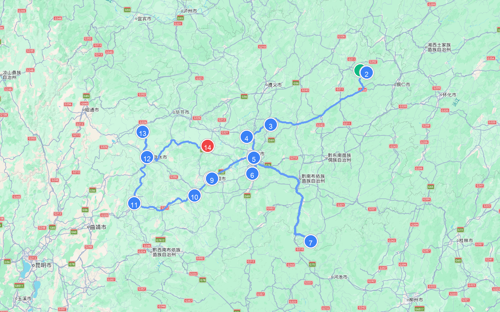
  
* **路线描述**：全程约1600公里，游玩时间6-8天。从铜仁市出发一路向西自驾，沿途经梵净山、开阳南江大峡谷、修文桃源河、贵阳市、青岩古镇、樟江风景名胜区（大七孔、小七孔）、安顺市、安顺龙宫、安顺黄果树大瀑布、乌蒙大草原、六盘水、大韭菜坪，终点为毕节织金洞。
* **特点**：这是一条专为盛夏消暑设计的贵州绿色生态与高负氧离子清凉自驾线。自驾前往登临“天空之城”梵净山，看金顶红云与蘑菇石奇观；在荔波小七孔的茂兰国家森林公园与卧龙潭碧绿的泉水间玩水消暑；最后在南江大峡谷和开阳十里画廊中静享清凉竹海与避暑漂流，体验悠闲生活。

#### 贵州红色旅游经典线路

* **自驾线路**：贵阳 → 息烽县 → 开阳县 → 遵义会议会址 → 娄山关 → 苟坝会议会址 → 仁怀国酒门 → 中国酒文化城 → 赤水河谷 → 习水县 → 赤水佛光岩 → 赤水市 → 丙安古镇
* **路线路段距离与地图**

    | 起点 | 终点 | 距离 |
    | :--- | :--- | :--- |
    | (1) 贵阳 | (2) 息烽县 | 81.5 公里 |
    | (2) 息烽县 | (3) 开阳县 | 78.2 公里 |
    | (3) 开阳县 | (4) 遵义会议会址 | 85.5 公里 |
    | (4) 遵义会议会址 | (5) 娄山关 | 45.9 公里 |
    | (5) 娄山关 | (6) 苟坝会议会址 | 88.6 公里 |
    | (6) 苟坝会议会址 | (7) 仁怀国酒门 | 45.4 公里 |
    | (7) 仁怀国酒门 | (8) 中国酒文化城 | 19.6 公里 |
    | (8) 中国酒文化城 | (9) 赤水河谷 | 72.1 公里 |
    | (9) 赤水河谷 | (10) 习水县 | 24.4 公里 |
    | (10) 习水县 | (11) 赤水佛光岩 | 50.1 公里 |
    | (11) 赤水佛光岩 | (12) 赤水市 | 16.1 公里 |
    | (12) 赤水市 | (13) 丙安古镇 | 23.4 公里 |
    | **总里程** | | **630.9 公里** |
  
  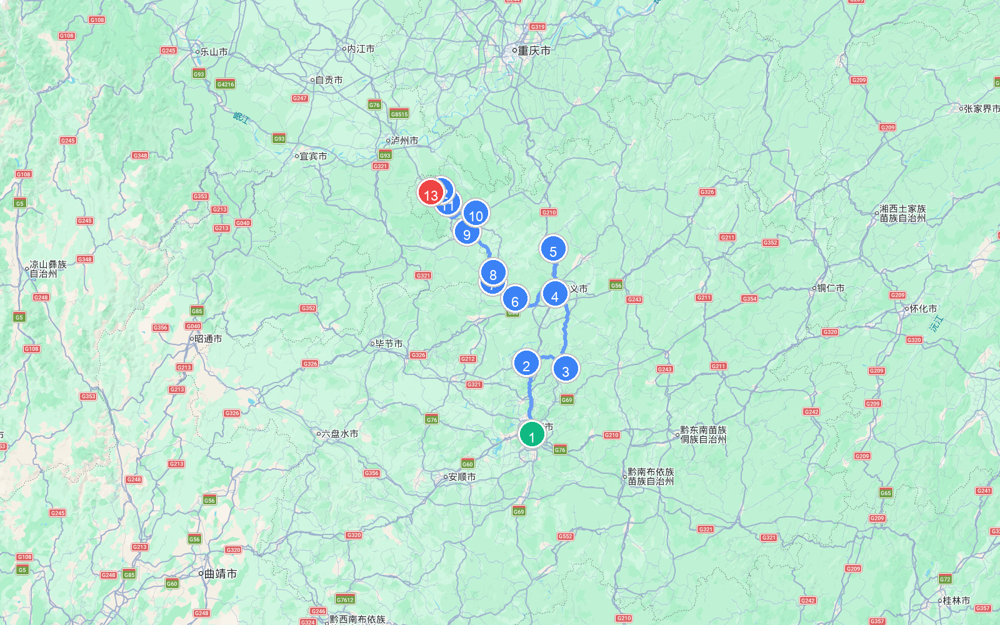
  
* **路线描述**：全程约500公里，游玩时间6-8天左右。从省会贵阳市出发，自驾至息烽（集中营旧址、息烽温泉），一路往北自驾，途经乌江峡红色经典景区、遵义会议会址、娄山关景区、苟坝会议会址、国酒门温泉、中国酒文化城、赤水河谷旅游公路、土城古镇、四渡赤水纪念馆、中国女红军纪念馆、佛光岩、赤水竹海、丙安古镇，终点为丙安红一军团陈列馆。
* **特点**：这是一条将长征历史足迹与自然奇观紧密结合的爱国情怀自驾线。从红军长征重要会议遗址遵义会议旧址出发，在赤水大瀑布和佛光岩的红砂岩丹霞奇观中自驾，感受红军四渡赤水战役的历史智慧；最后前往毕设的织金洞（溶洞之王）与乌江源百里画廊，探寻雄浑的喀斯特山水风光。

#### 贵州唯美赏花之旅

* **自驾线路**：铜仁市 → 梵净山 → 开阳县 → 贵定县 → 贵阳 → 平坝区 → 天龙屯堡 → 毕节百里杜鹃 → 水城区 → 盘州市 → 兴义万峰林
* **路线路段距离与地图**

    | 起点 | 终点 | 距离 |
    | :--- | :--- | :--- |
    | (1) 铜仁市 | (2) 梵净山 | 14.9 公里 |
    | (2) 梵净山 | (3) 开阳县 | 264.3 公里 |
    | (3) 开阳县 | (4) 贵定县 | 111.0 公里 |
    | (4) 贵定县 | (5) 贵阳 | 69.7 公里 |
    | (5) 贵阳 | (6) 平坝区 | 57.2 公里 |
    | (6) 平坝区 | (7) 天龙屯堡 | 13.4 公里 |
    | (7) 天龙屯堡 | (8) 毕节百里杜鹃 | 222.4 公里 |
    | (8) 毕节百里杜鹃 | (9) 水城区 | 112.0 公里 |
    | (9) 水城区 | (10) 盘州市 | 115.9 公里 |
    | (10) 盘州市 | (11) 兴义万峰林 | 141.1 公里 |
    | **总里程** | | **1121.8 公里** |
  
  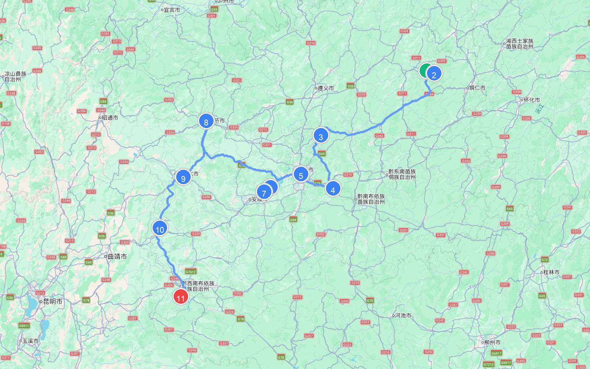
  
* **路线描述**：全程约1100公里，游玩时间6-7天。从铜仁市出发，沿途经梵净山、开阳十里画廊、贵定金海雪山、贵阳市、红枫湖平坝万亩樱花园、天龙屯堡、百里杜鹃、百车河生态旅游景区、乌蒙大草原，终点为兴义万峰林。
* **特点**：这是一条聚焦贵州金春赏花、融花海与茶山风光于一体的浪漫自驾景观路。春季时节，大方百里杜鹃风景区内数万亩天然杜鹃花竞相盛开，红黄白紫交织宛如“地球彩带”；自驾前往平坝万亩樱花园，看洁白的樱花如雪铺展在红枫湖畔；在遵义湄潭万亩茶海中闻茶香，是自驾踏春与人像摄影的极佳天堂。

## 沿途城市人文地图
本章节特别附带以下城市的详细人文地图，方便您在自驾游途中进行地市深度探索：

### 黔南州人文地图
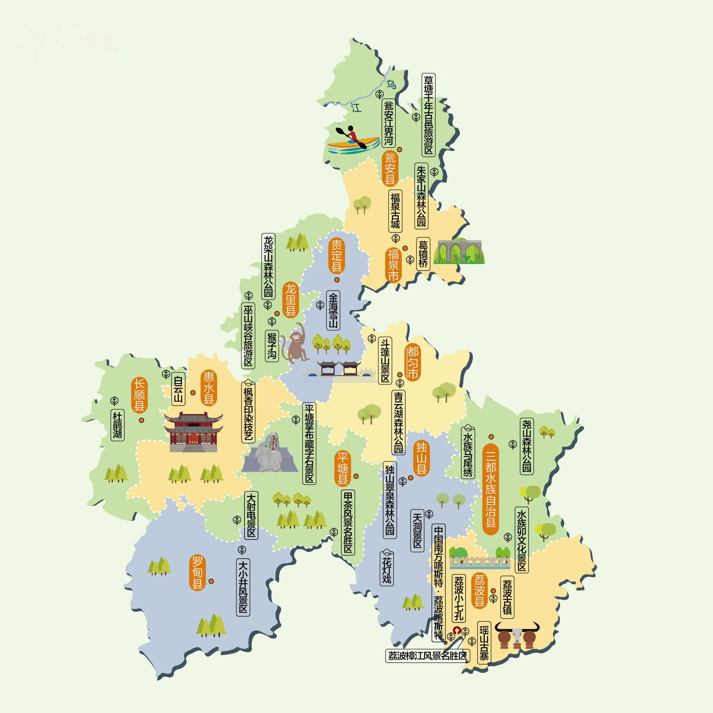

### 贵阳人文地图
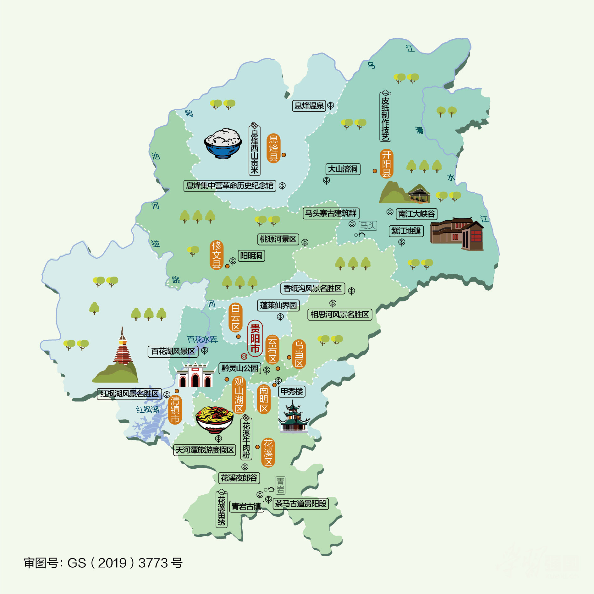

### 六盘水人文地图
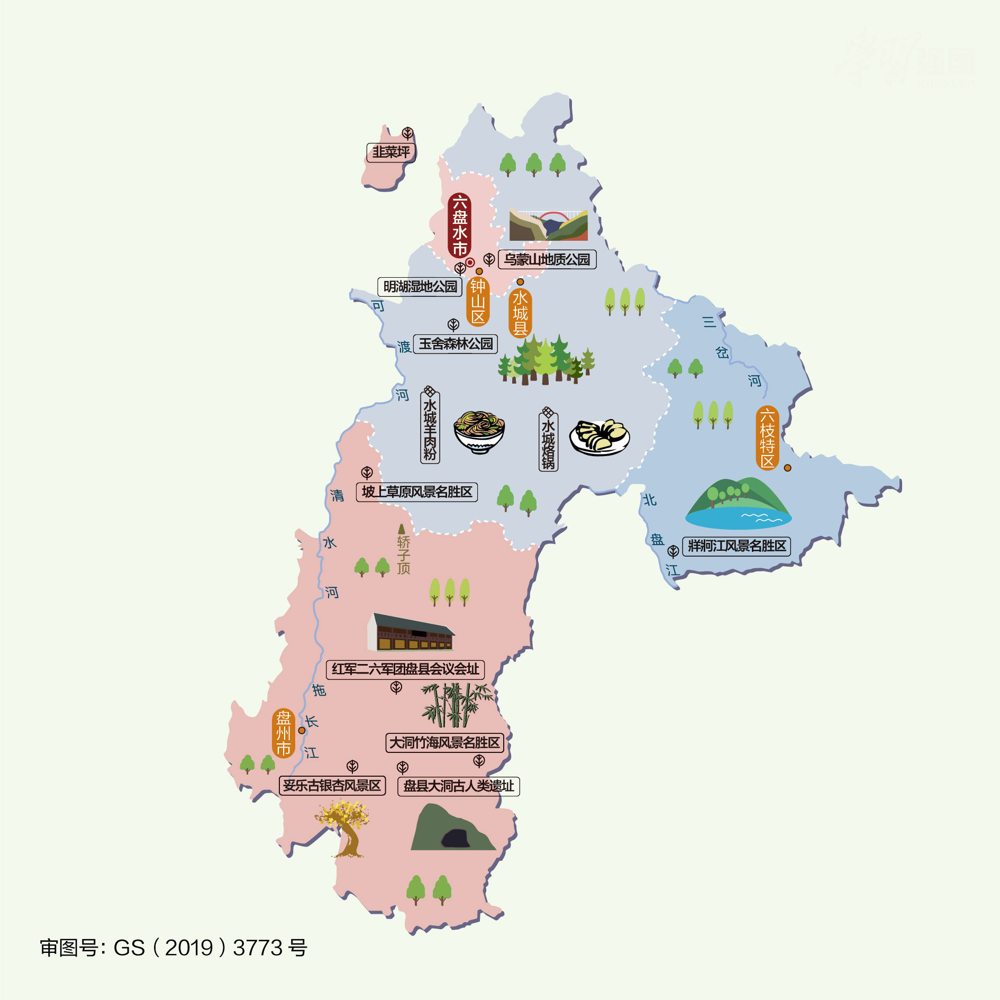

### 遵义人文地图
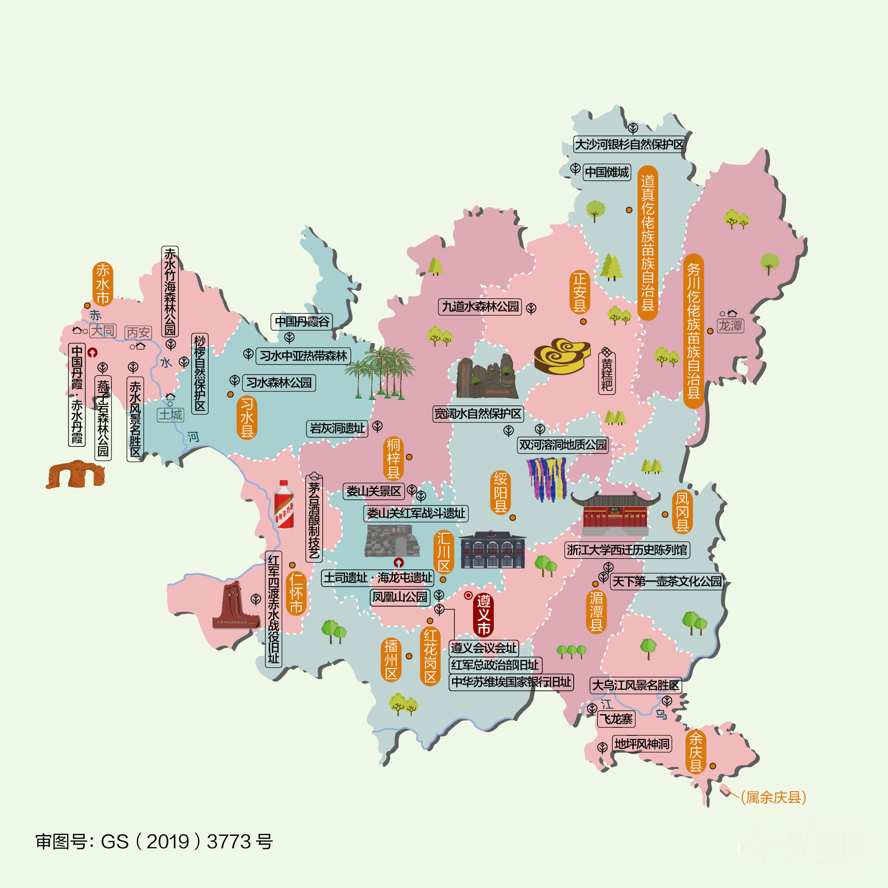

### 安顺人文地图
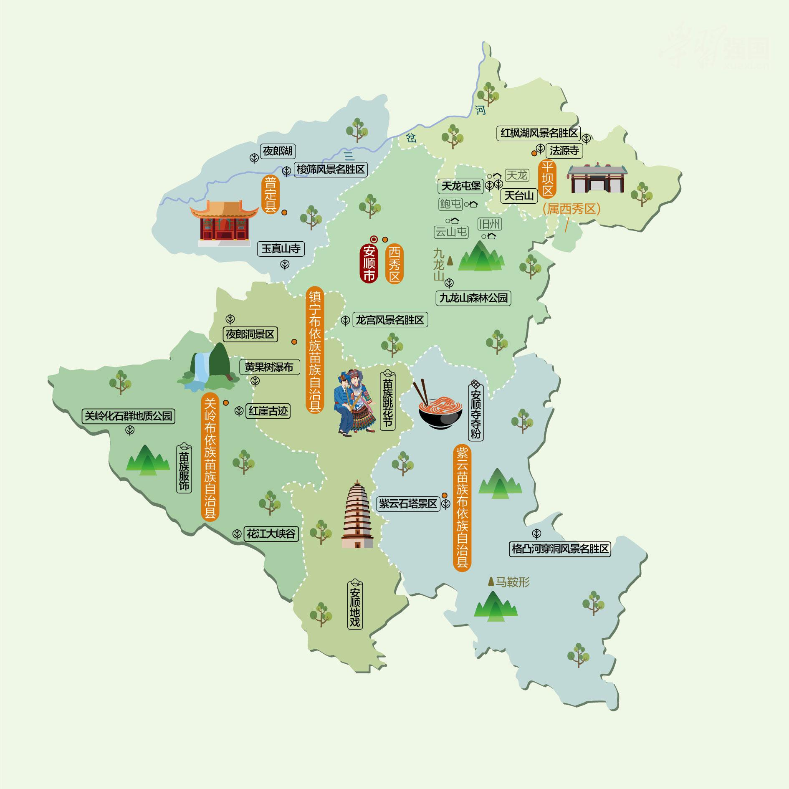

### 毕节人文地图
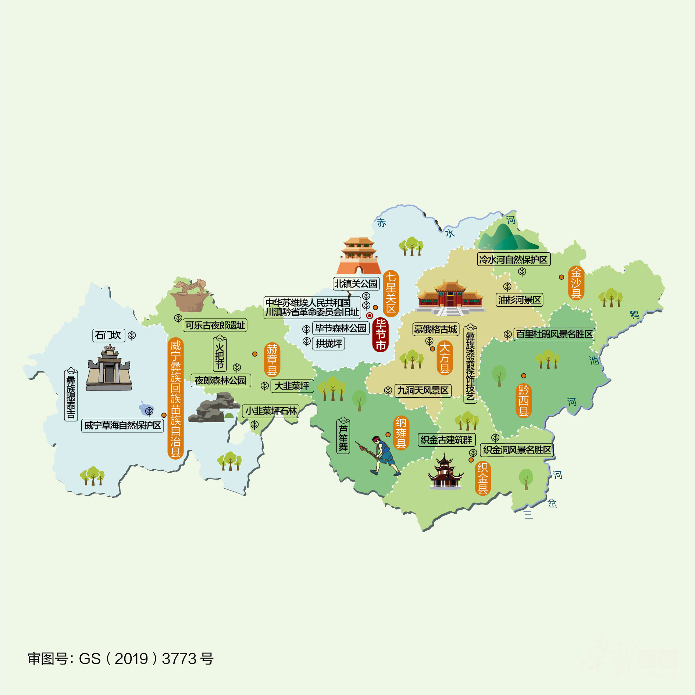

### 铜仁人文地图
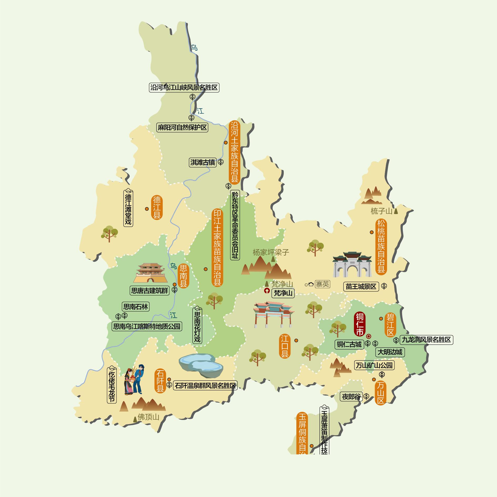

### 黔西南州人文地图
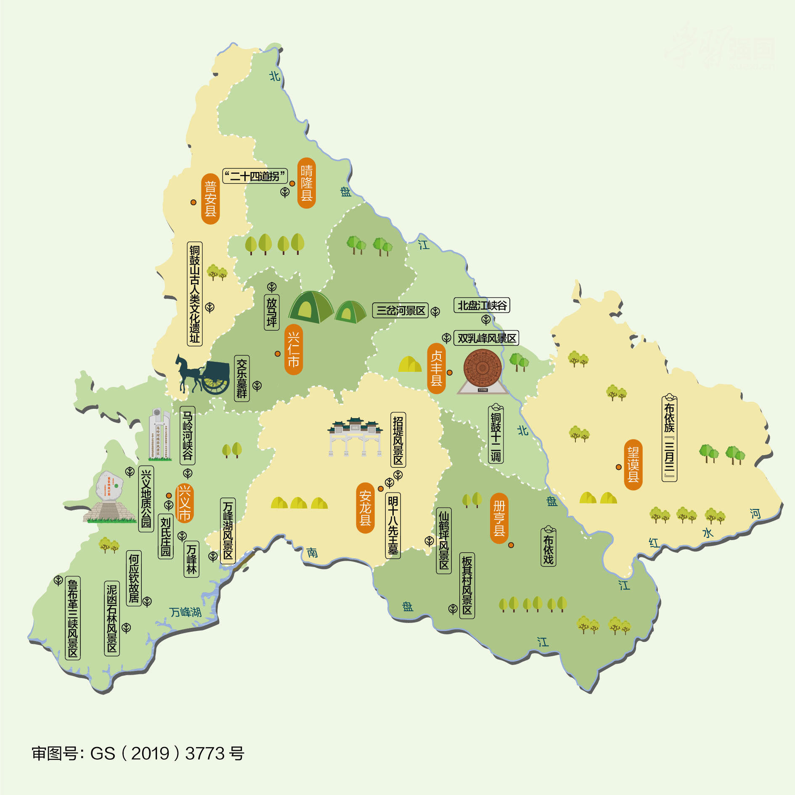

### 黔东南州人文地图
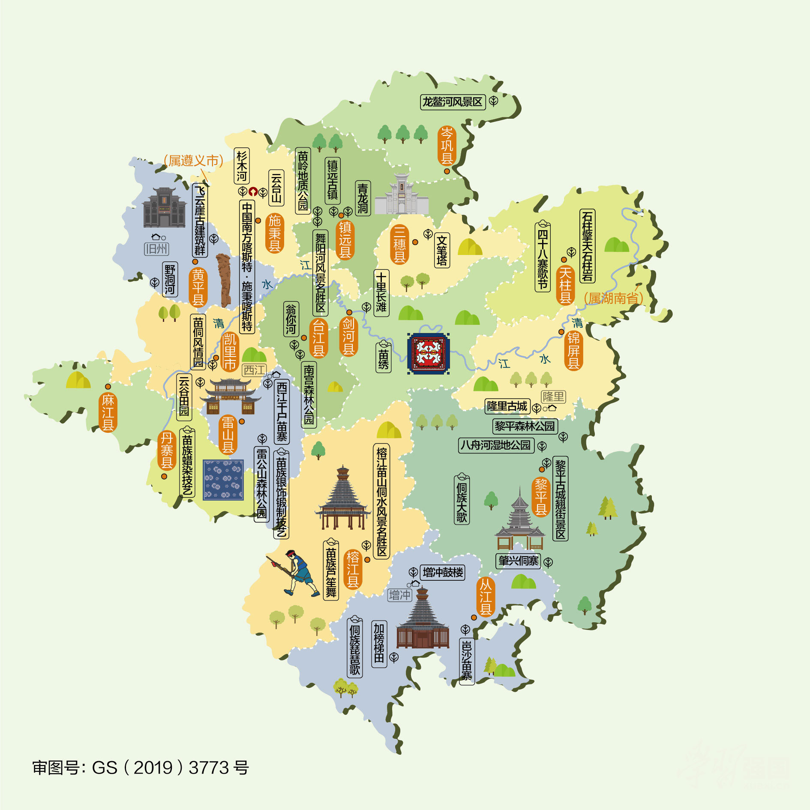
