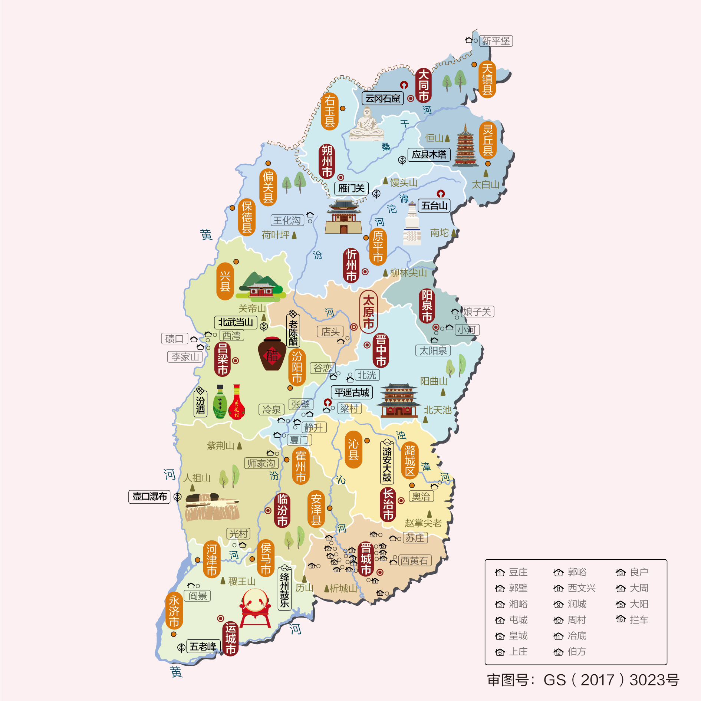
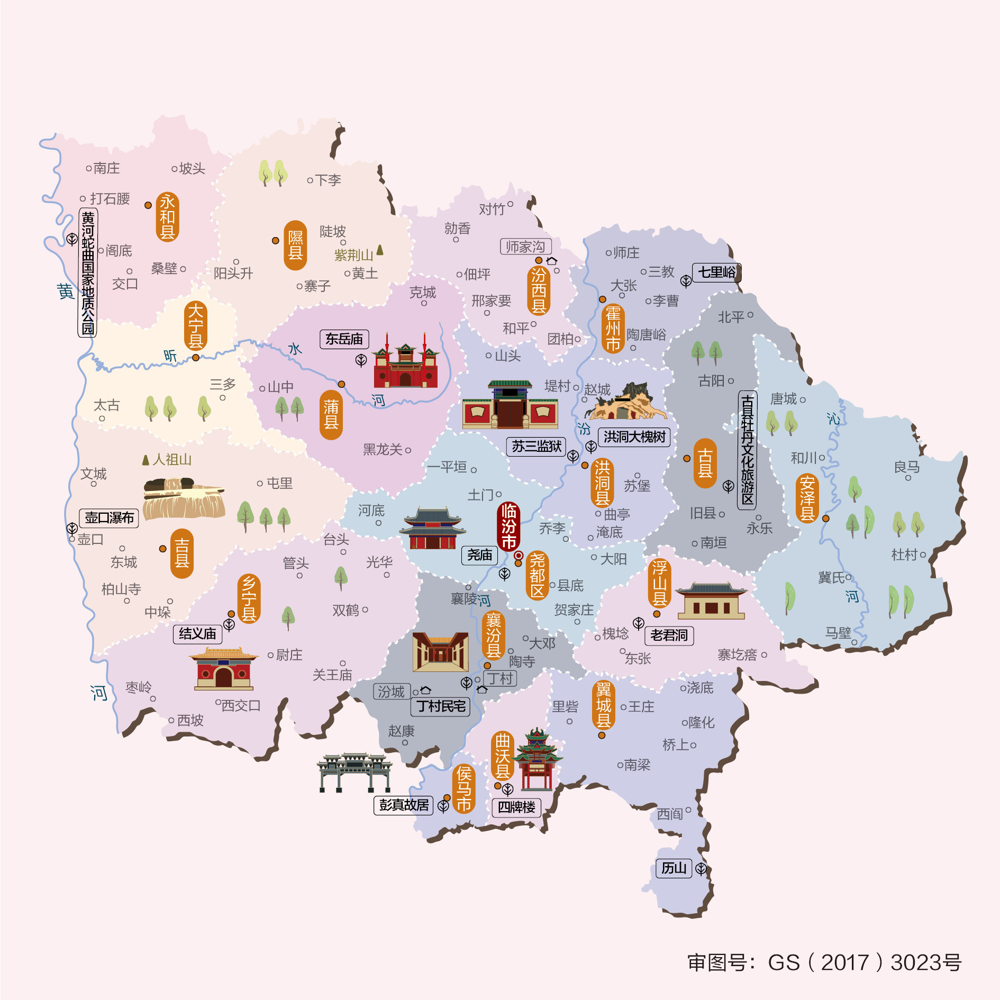
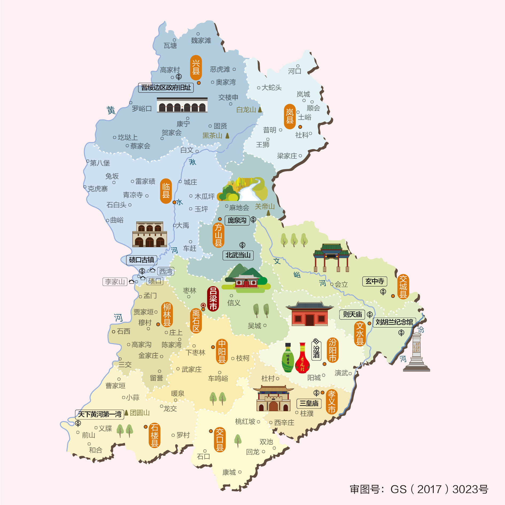
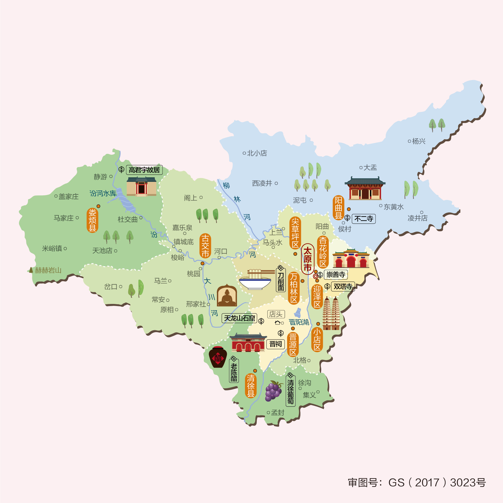
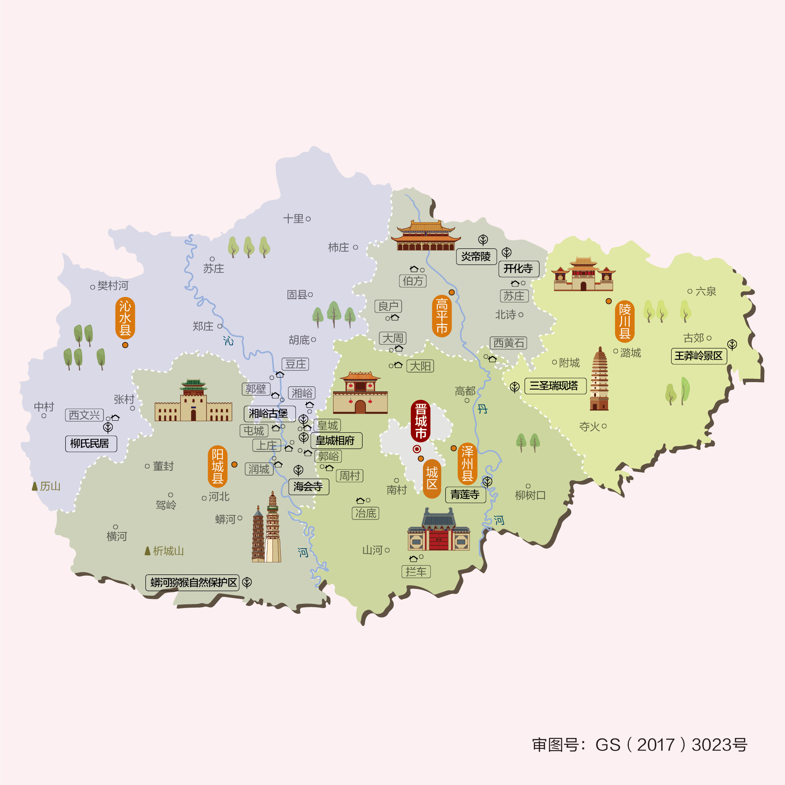
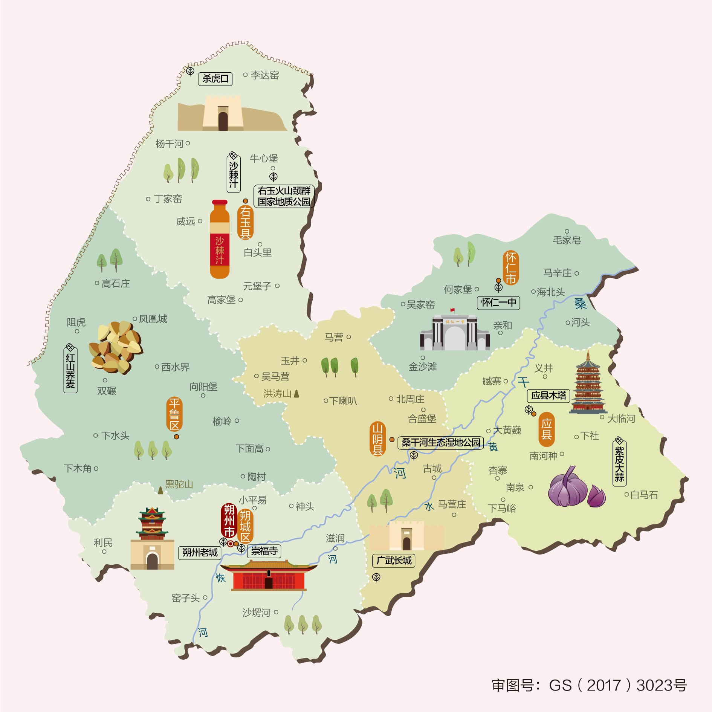
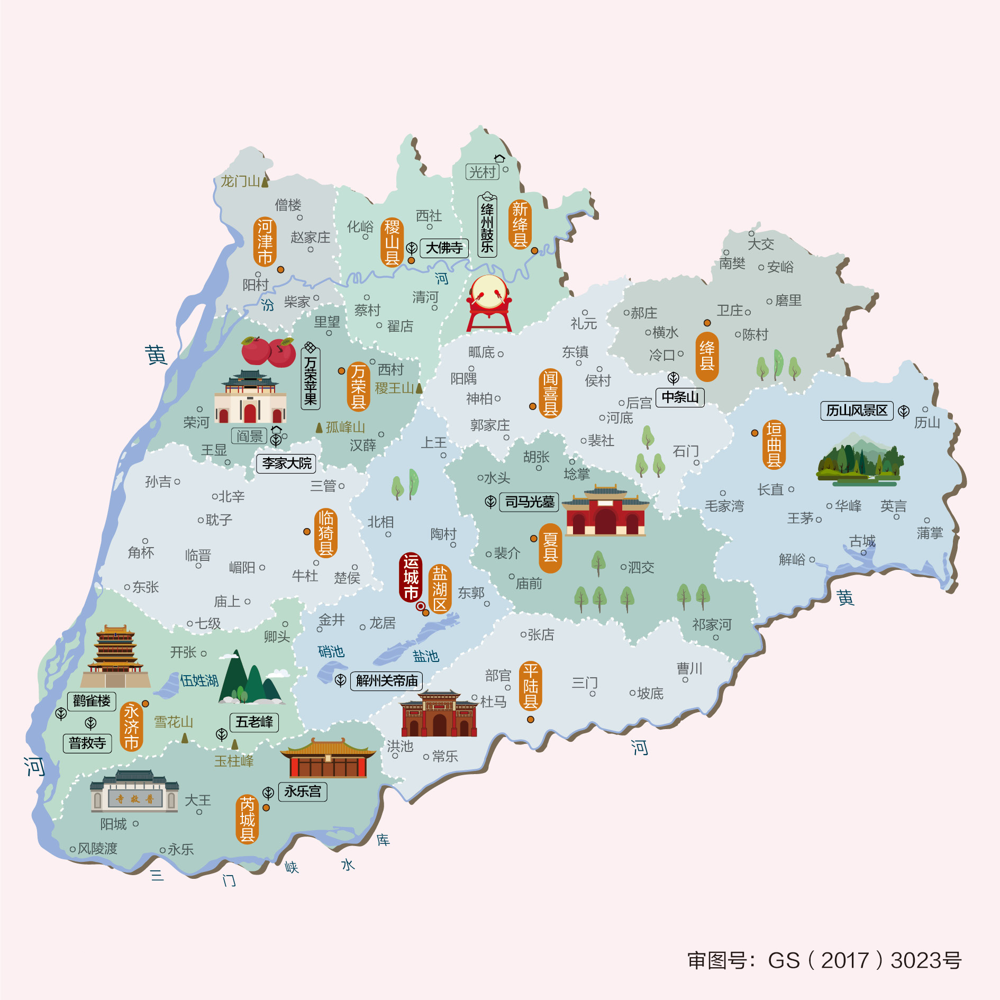
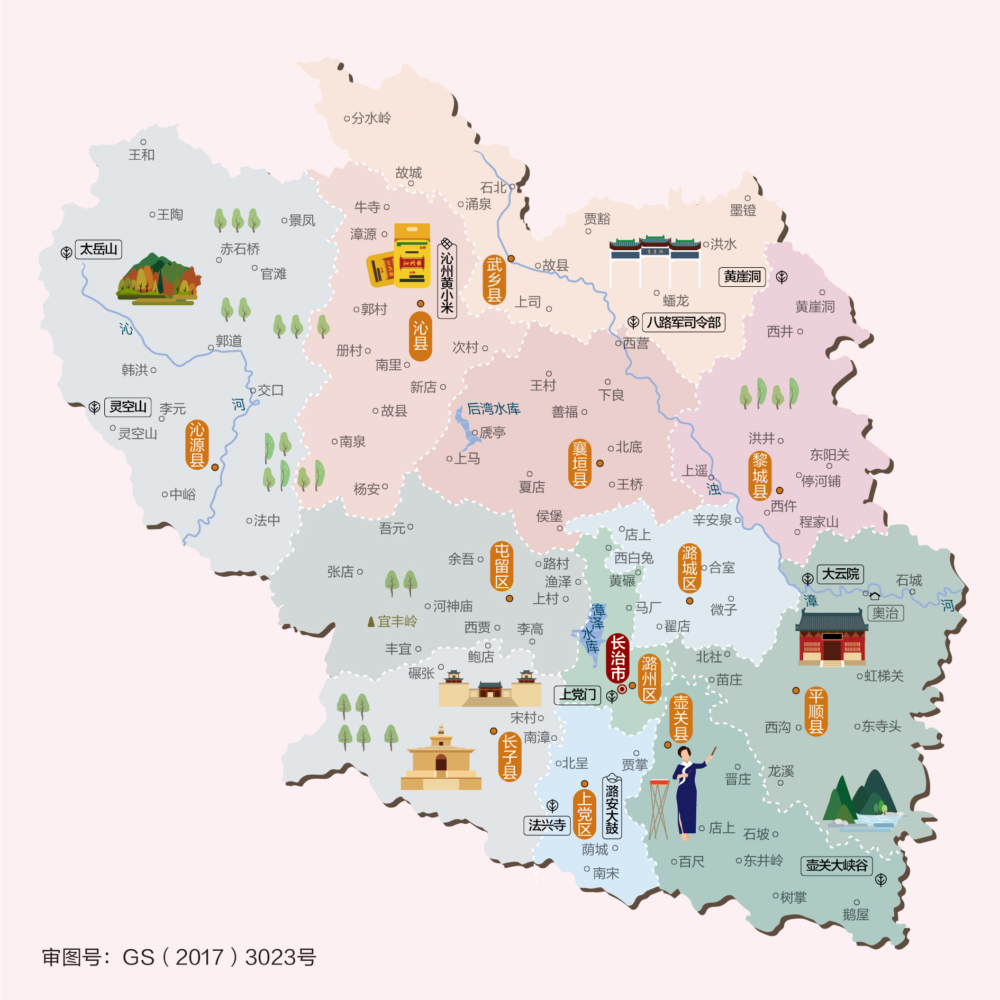
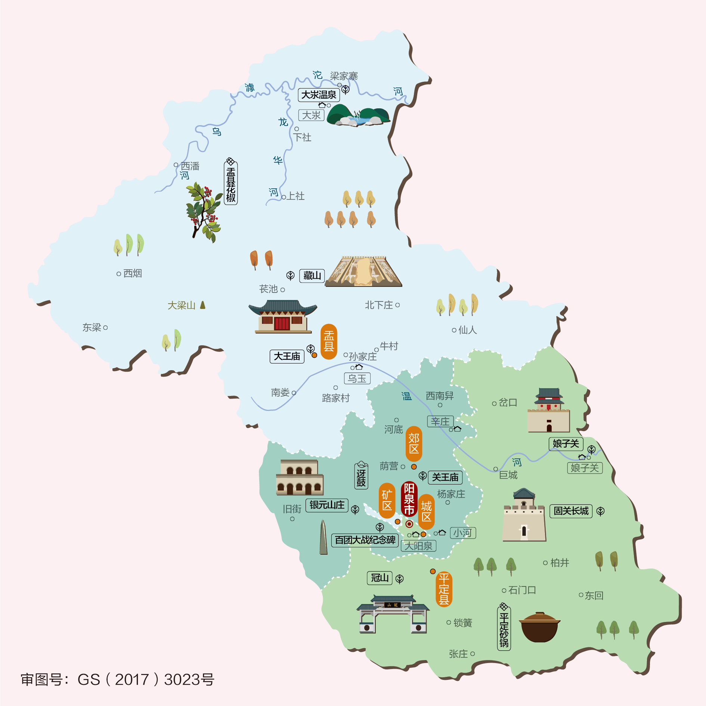

# Chapter 18 - 山西自驾游与人文地图指南

## 山西人文地图

### 经典旅游路线与自驾路线

#### 路线一：晋北古建艺术与佛教圣地线
* **特点**：领略中华古代建筑与雕塑艺术的巅峰，拜谒佛教名山。
* **行车路线**：太原 → 晋祠 → 忻州五台山（佛教四大名山之首） → 浑源恒山/悬空寺（半天高悬的建筑奇迹） → 大同云冈石窟（北魏雕刻艺术）/华严寺 → 朔州应县木塔（世界现存最古老木塔） → 偏关老牛湾（黄河长城握手处）。

#### 路线二：晋南华夏寻根与晋商文化线
* **特点**：漫步保存最完整的古县城，寻根华夏文明源头。
* **行车路线**：太原 → 平遥古城 → 灵石王家大院（民间故宫） → 介休绵山 → 临汾黄河壶口瀑布 → 洪洞大槐树（寻根问祖） → 运城解州关帝庙/盐湖 → 芮城永乐宫（元代壁画瑰宝）。

## 沿途城市人文地图
本章节特别附带以下城市的详细人文地图，方便您在自驾游途中进行地市深度探索：

### 临汾人文地图

### 吕梁人文地图

### 大同人文地图

### 太原人文地图

### 忻州人文地图

### 晋中人文地图

### 晋城人文地图

### 朔州人文地图

### 运城人文地图

### 长治人文地图

### 阳泉人文地图

