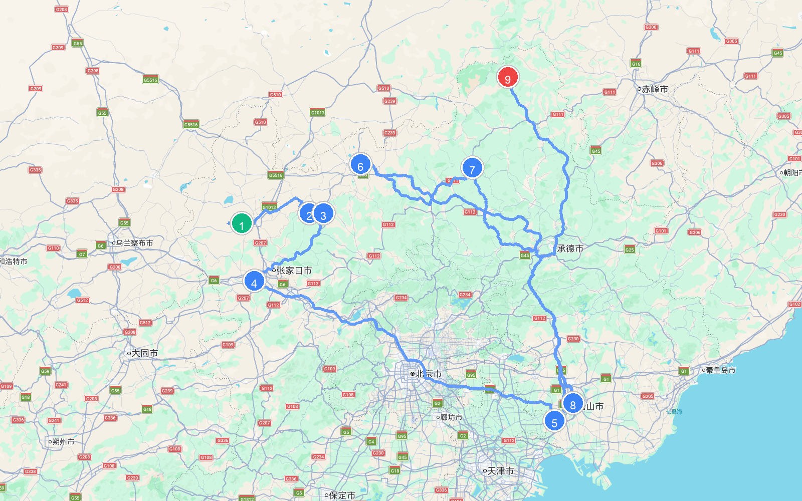
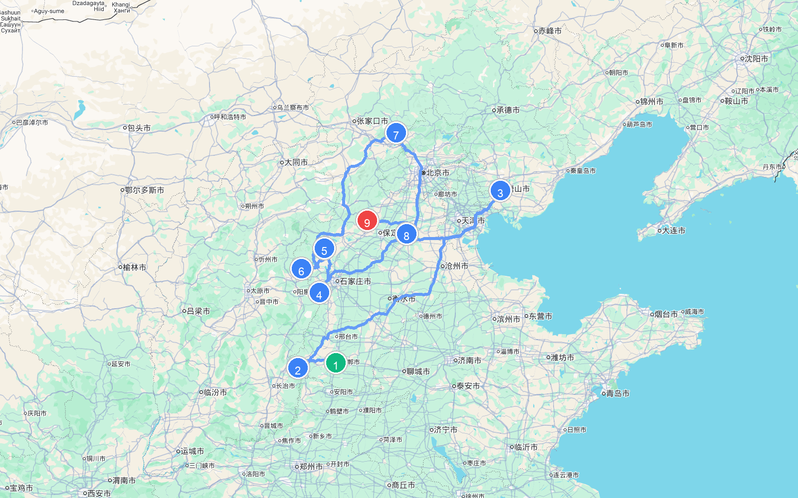
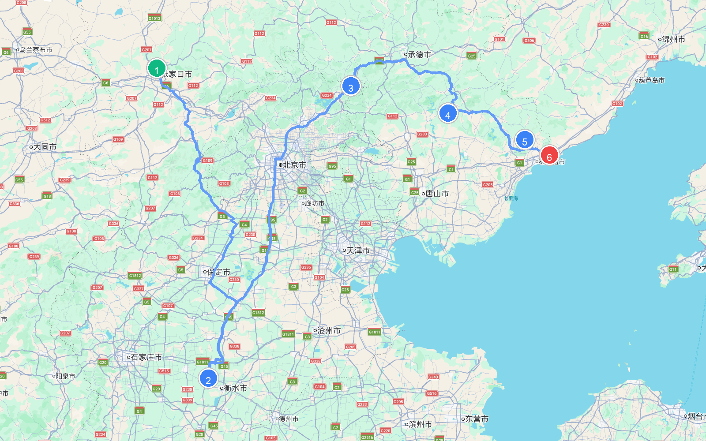
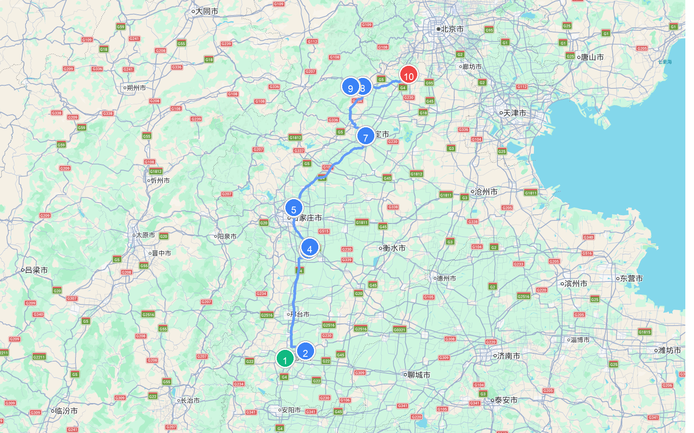
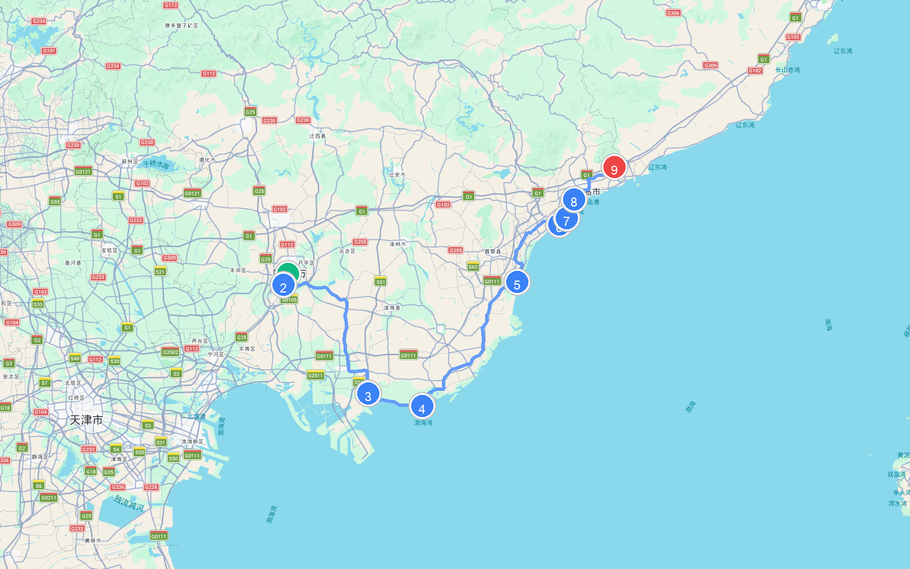

# 章节19 - 河北自驾游与人文地图指南

## 河北人文地图

## **河北经典自驾游线路推荐**

#### 草原天路自驾游路线

* **自驾线路**：张北草原→野狐岭要塞→塞北梯田→阎片山→桦皮岭→天鹅湖→大汗行宫→中国马镇→丰宁大滩→坝上草原→五道沟风景区→小滦河国家湿地→御道口风景区→塞罕坝国家森林公园→乌兰布统草原  
* **路线路段距离与地图**

    | 起点 | 终点 | 距离 |
    | :--- | :--- | :--- |
    | (1) 张北草原 | (2) 阎片山 | 113.0 公里 |
    | (2) 阎片山 | (3) 桦皮岭 | 19.1 公里 |
    | (3) 桦皮岭 | (4) 天鹅湖 | 119.4 公里 |
    | (4) 天鹅湖 | (5) 中国马镇 | 366.5 公里 |
    | (5) 中国马镇 | (6) 坝上草原 | 424.1 公里 |
    | (6) 坝上草原 | (7) 小滦河国家湿地 | 166.6 公里 |
    | (7) 小滦河国家湿地 | (8) 御道口风景区 | 309.8 公里 |
    | (8) 御道口风景区 | (9) 塞罕坝国家森林公园 | 396.1 公里 |
    | **总里程** | | **1914.7 公里** |
  
  
  
  
  
  
  
  
  
* **特点**：这是一条极富盛名的中国版“66号公路”坝上草原自驾天路。行驶在张家口草原天路蜿蜒起伏的柏油路面上，两旁翠绿的草甸起伏，巨大的白色风力发电机叶片缓缓转动，蔚为壮观；行车在野狐岭与沽源坝上，夏日清风吹过野花烂漫，蓝天白云低垂，成群的牛羊散落在原野间，是消暑避暑与风光摄影的绝佳大片产出地。

#### 京西太行山水自驾游路线

* **自驾线路**：邯郸市→太行五指山→太行三峡京娘湖→武安七步沟→邢台天河山→邢台太行奇峡群→邢台云梦山→石家庄嶂石岩→苍岩山→沕沕水→天桂山→驼梁景区→白洋淀→狼牙山→涞源白石山→京西野三坡  
* **路线路段距离与地图**

    | 起点 | 终点 | 距离 |
    | :--- | :--- | :--- |
    | (1) 邯郸市 | (2) 太行五指山 | 89.9 公里 |
    | (2) 太行五指山 | (3) 邢台天河山 | 625.2 公里 |
    | (3) 邢台天河山 | (4) 苍岩山 | 484.5 公里 |
    | (4) 苍岩山 | (5) 沕沕水 | 126.5 公里 |
    | (5) 沕沕水 | (6) 天桂山 | 104.0 公里 |
    | (6) 天桂山 | (7) 驼梁景区 | 459.5 公里 |
    | (7) 驼梁景区 | (8) 白洋淀 | 260.4 公里 |
    | (8) 白洋淀 | (9) 狼牙山 | 156.7 公里 |
    | **总里程** | | **2306.8 公里** |
  
  
  
  
  
  
  
  
  
* **特点**：这是一条穿越京西太行、饱览奇峡幽谷与历史陵寝的历史山水自驾线。自驾穿行于涞水野三坡百里峡的幽深地缝，在白石山体验大理岩峰林与悬空玻璃栈道；在易县清西陵的松柏林中瞻仰皇家陵寝的肃穆与幽静；最后自驾经过太行天路，体悟大山深处的壮烈抗战历史与太行山脉的铁骨脊梁。

#### 河北长城自驾游路线

* **自驾线路**：张家口大境门→宣化古城→北京八达岭长城→黄花城水长城→慕田峪长城→古北水镇→司马台长城→承德金山岭长城→天津黄崖关长城→迁西喜峰口长城→青山关→迁安白羊峪长城→祖山风景区→山海关  
* **路线路段距离与地图**

    | 起点 | 终点 | 距离 |
    | :--- | :--- | :--- |
    | (1) 张家口大境门 | (2) 古北水镇 | 447.1 公里 |
    | (2) 古北水镇 | (3) 司马台长城 | 413.1 公里 |
    | (3) 司马台长城 | (4) 青山关 | 199.6 公里 |
    | (4) 青山关 | (5) 祖山风景区 | 151.2 公里 |
    | (5) 祖山风景区 | (6) 山海关 | 38.8 公里 |
    | **总里程** | | **1250.0 公里** |
  
  
  
  
  
  
  
  
  
* **特点**：这是一条横跨京津冀三地、纵览长城雄关天险与山海关古城风光的大型历史主题自驾线。从长城四大雄关之一的张家口大境门出发，自驾经过宣化古城、八达岭、黄花城水长城与古北水镇；随后探秘承德金山岭长城与天津黄崖关长城，感受万里长城在险峰上的挺拔与陡峭；途经喜峰口水下长城与白羊峪大理石长城；最终抵达山海关，看长城入海处的“老龙头”与“天下第一关”的宏伟气势。

#### 燕赵文化之旅

* **自驾线路**：邯郸丛台公园→赵苑公园→黄梁梦吕仙祠→广府古城→娲皇宫风景名胜区→赵州桥→柏林禅寺→正定古城→隆兴寺→正定荣国府→安国药王庙→古莲花池→直隶总督署→荆轲公园→清西陵→涿州三义宫（原文图示有）→涿州影视城  
* **路线路段距离与地图**

    | 起点 | 终点 | 距离 |
    | :--- | :--- | :--- |
    | (1) 赵苑公园 | (2) 广府古城 | 28.8 公里 |
    | (2) 广府古城 | (3) 赵州桥 | 140.2 公里 |
    | (3) 赵州桥 | (4) 柏林禅寺 | 5.4 公里 |
    | (4) 柏林禅寺 | (5) 隆兴寺 | 51.7 公里 |
    | (5) 隆兴寺 | (6) 古莲花池 | 125.4 公里 |
    | (6) 古莲花池 | (7) 直隶总督署 | 0.9 公里 |
    | (7) 直隶总督署 | (8) 荆轲公园 | 77.9 公里 |
    | (8) 荆轲公园 | (9) 清西陵 | 21.9 公里 |
    | (9) 清西陵 | (10) 涿州影视城 | 80.9 公里 |
    | **总里程** | | **533.1 公里** |
  
  
  
  
  
  
  
  
  
* **特点**：这是一条纵览燕赵历史古迹、探寻赵国与战国文化精髓的历史自驾线。从邯郸丛台和广府古城出发，在娲皇宫前感悟女娲传说；自驾跨越著名的赵州桥，在正定古城和隆兴寺、荣国府前，体验红楼梦大观园的风采与宋代木结构古建之美；最终抵达保定直隶总督署和清西陵，深度触摸华夏历史的风云变幻。

#### 冀东海滨自驾游路线

* **自驾线路**：唐山市→南湖景区→曹妃甸湿地→月坨岛→菩提岛（或祥云岛）→渔岛海洋温泉景区→沙雕海洋乐园→南戴河度假区→老虎石海上公园→碧螺塔酒吧公园→北戴河鸽子窝公园→秦皇岛野生动物园→新澳海底世界→乐岛海洋公园→山海关古城  
* **路线路段距离与地图**

    | 起点 | 终点 | 距离 |
    | :--- | :--- | :--- |
    | (1) 唐山市 | (2) 南湖景区 | 7.1 公里 |
    | (2) 南湖景区 | (3) 曹妃甸湿地 | 77.9 公里 |
    | (3) 曹妃甸湿地 | (4) 菩提岛 | 35.6 公里 |
    | (4) 菩提岛 | (5) 渔岛海洋温泉景区 | 78.9 公里 |
    | (5) 渔岛海洋温泉景区 | (6) 老虎石海上公园 | 42.8 公里 |
    | (6) 老虎石海上公园 | (7) 北戴河鸽子窝公园 | 4.8 公里 |
    | (7) 北戴河鸽子窝公园 | (8) 新澳海底世界 | 10.0 公里 |
    | (8) 新澳海底世界 | (9) 山海关古城 | 39.1 公里 |
    | **总里程** | | **296.1 公里** |
  
  
  
  
  
  
  
  
  
* **特点**：这是一条跨越黄金海岸沙滩与避暑海滨的沿海黄金自驾线。从唐山南湖和曹妃甸湿地出发，乘游船前往月坨岛与菩提岛，感受海岛野趣；沿着冀东滨海大道北上秦皇岛，在北戴河鸽子窝公园看海上日出与群鸟翱翔，最终在山海关古城，感受山海关天下第一关的雄浑历史。

## 沿途城市人文地图
本章节特别附带以下城市的详细人文地图，方便您在自驾游途中进行地市深度探索：

### 保定人文地图

### 唐山人文地图

### 廊坊人文地图

### 张家口人文地图

### 承德人文地图

### 沧州人文地图

### 石家庄人文地图

### 秦皇岛人文地图

### 衡水人文地图

### 邢台人文地图

### 邯郸人文地图

