# 章节28 - 福建自驾游与人文地图指南

## 福建人文地图
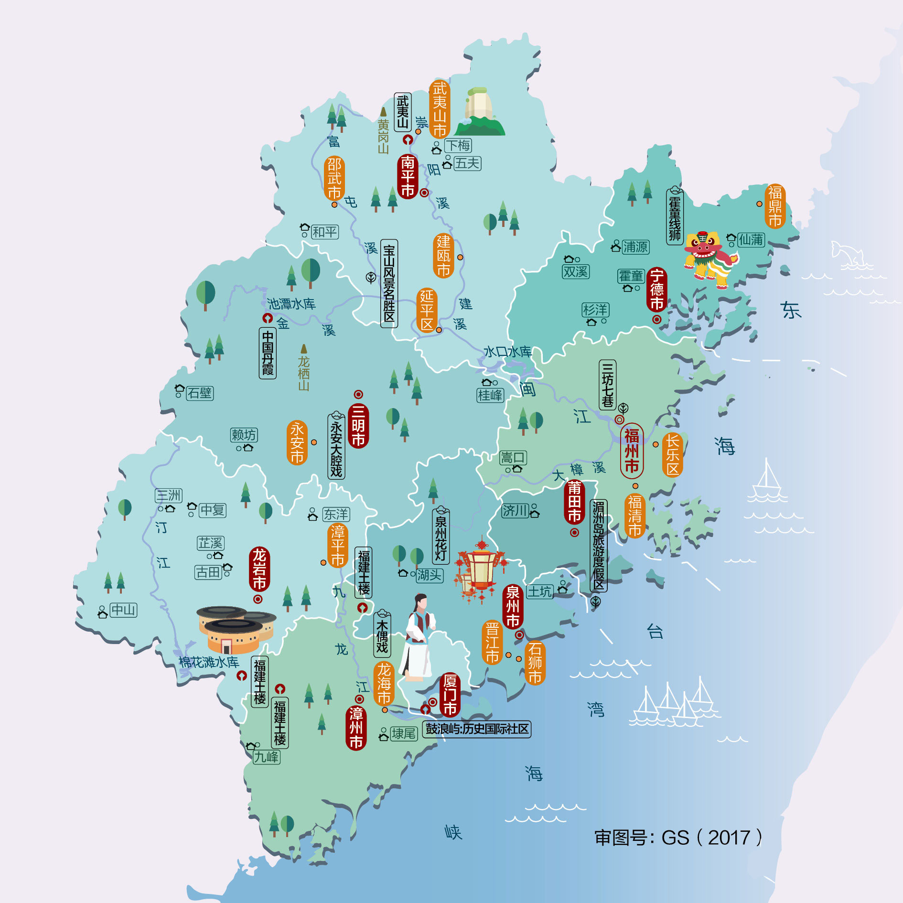

### **福建经典自驾游线路推荐**

* **福建闽中环线游路线**  
  * **自驾线路**：福州市→连江妈祖庙+天后宫→宁德霞浦+太姥山→福安西塔葡萄沟（图作“溪塔”）→周宁白水洋（屏南/周宁）→武夷山→泰宁古城+上清溪+金湖→泰宁猫儿山→灵台山+客家祖山文化园→长汀县→冠豸山→永定土楼+南靖土楼→漳州+东山县→厦门→泉州→平潭县→福州市  
  * **路线路段距离与地图**
    | 起点 | 终点 | 距离 |
    | :--- | :--- | :--- |
    | (1) 三坊七巷 | (2) 武夷山 | 278.9 公里 |
    | (2) 武夷山 | (3) 长汀县 | 417.5 公里 |
    | (3) 长汀县 | (4) 冠豸山 | 76.9 公里 |
    | (4) 冠豸山 | (5) 漳州+东山县 | 298.7 公里 |
    | (5) 漳州+东山县 | (6) 厦门 | 162.5 公里 |
    | (6) 厦门 | (7) 泉州 | 111.1 公里 |
    | (7) 泉州 | (8) 平潭县 | 225.2 公里 |
    | (8) 平潭县 | (9) 三坊七巷 | 103.1 公里 |
    | **总里程** | | **1673.8 公里** |
    
    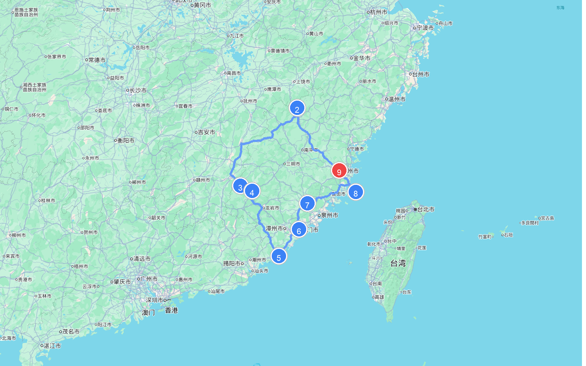
    
    
    
  * **特点**：这是一条将闽东霞浦滩涂与闽北武夷大山融为一体的福建全景山海大环线。在福州三坊七巷的白墙黛瓦牌坊间寻觅闽都古韵；在宁德霞浦滩涂看光影下的渔排木舟与海湾落日；攀登世界自然与文化双遗产武夷山，在九曲溪畔竹筏漂流；在泰宁大金湖的丹霞赤壁前看甘露岩寺“一柱撑天”，最终前往永定土楼感受客家围屋的建筑传奇。
* **福建闽西与闽北绿野溶洞山水线**  
  * **自驾线路**：三明市→瑞云山→沙县→将乐玉华洞→泰宁古城+上清溪→泰宁金湖+猫儿山→长汀→漳平→同安→南安→南川宫（应为南安诗山凤山寺/南川厂等古迹）→安溪凤山→永春乌髻岩→大田→尤溪→南平溪源峡谷  
  * **路线路段距离与地图**
    | 起点 | 终点 | 距离 |
    | :--- | :--- | :--- |
    | (1) 三明市 | (2) 瑞云山 | 221.1 公里 |
    | (2) 瑞云山 | (3) 沙县 | 199.7 公里 |
    | (3) 沙县 | (4) 长汀 | 236.4 公里 |
    | (4) 长汀 | (5) 漳平 | 202.1 公里 |
    | (5) 漳平 | (6) 同安 | 152.9 公里 |
    | (6) 同安 | (7) 南安 | 45.5 公里 |
    | (7) 南安 | (8) 南川宫 | 25.0 公里 |
    | (8) 南川宫 | (9) 大田 | 151.9 公里 |
    | (9) 大田 | (10) 尤溪 | 109.9 公里 |
    | **总里程** | | **1344.3 公里** |
    
    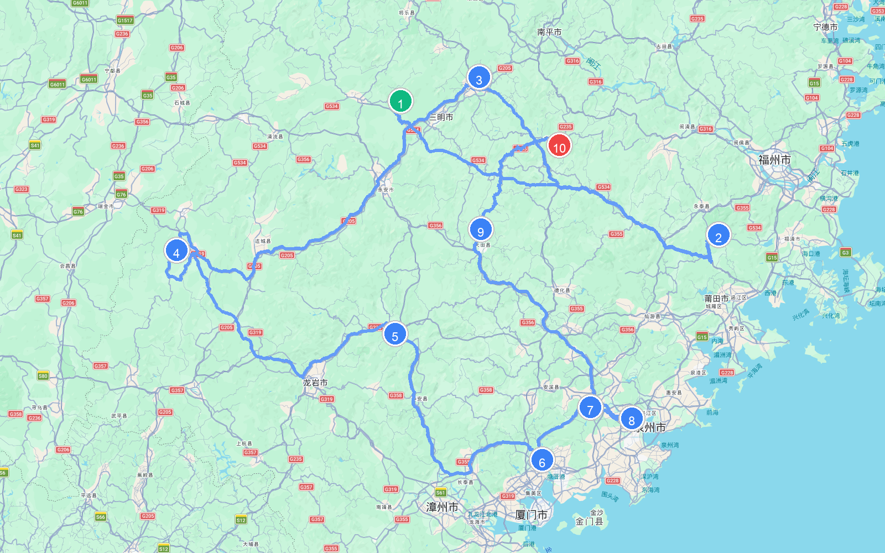
    
    
    
  * **特点**：这是一条探索福建内陆深山茂林、神奇溶洞与徽派客家古城的绿野自驾探险线。在大田和尤溪看壮丽的层叠梯田；在三明将乐玉华洞内，惊叹于明代徐霞客笔下的石钟乳溶洞奇观；在泰宁古城和上清溪的幽深丹霞峡谷间竹筏漂流，最终抵达“客家首府”长汀古城（旧称汀州），在古城墙与红色旧址前，感受厚重的客家文化底蕴。
* **福建闽南土楼海岛春夏游**  
  * **自驾线路**：厦门→牛角山（应为漳浦六鳌等海滨）→漳浦火山岛→东山县东山岛→红星乡乌山→官陂镇→南靖县→南靖土楼→永定土楼群→上杭县→龙岩市+古田会议会址→华安县→芦田镇→洪恩岩风景区→北辰山旅游区→泉州  
  * **路线路段距离与地图**
    | 起点 | 终点 | 距离 |
    | :--- | :--- | :--- |
    | (1) 厦门 | (2) 牛角山 | 204.2 公里 |
    | (2) 牛角山 | (3) 漳浦火山岛 | 229.9 公里 |
    | (3) 漳浦火山岛 | (4) 官陂镇 | 139.1 公里 |
    | (4) 官陂镇 | (5) 南靖县 | 121.3 公里 |
    | (5) 南靖县 | (6) 上杭县 | 135.9 公里 |
    | (6) 上杭县 | (7) 华安县 | 159.9 公里 |
    | (7) 华安县 | (8) 芦田镇 | 64.4 公里 |
    | (8) 芦田镇 | (9) 泉州 | 82.9 公里 |
    | **总里程** | | **1137.6 公里** |
    
    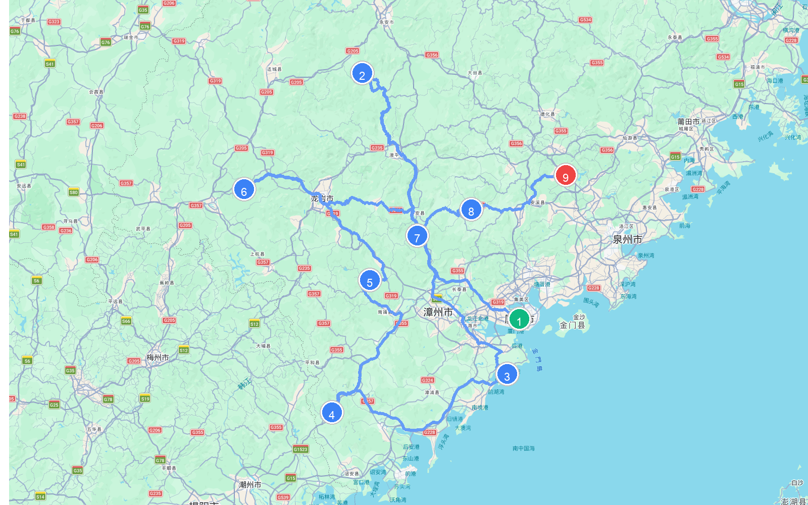
    
    
    
  * **特点**：这是一条专为春夏设计的闽南土楼建筑传奇与浪漫蓝色海岛自驾线。从浪漫的厦门鼓浪屿出发，驱车前往漳浦火山岛，看奇特的玄武岩海蚀地貌与海岛城堡；在东山岛的鱼骨沙洲与风动石前，看湛蓝的海水与海天一色；最后深入南靖与永定土楼群，在田螺坑土楼群（四菜一汤）和承启楼前，震撼感悟客家先民的聚族防御智慧。
* **福建海岸名城沿海游**  
  * **自驾线路**：福州市→白云山景区（属福安）→白水洋（属屏南）→溪塔葡萄沟→宁德霞浦县→宁德罗源县鉴江镇→连江定海村→长乐九龙山→平潭岛→莆田九龙谷→泉州仙公山→泉州市→晋江灵源山→石狮永永古镇（永宁古镇）→厦门市→云洞岩景区（属漳州）  
  * **路线路段距离与地图**
    | 起点 | 终点 | 距离 |
    | :--- | :--- | :--- |
    | (1) 三坊七巷 | (2) 白云山景区 | 162.9 公里 |
    | (2) 白云山景区 | (3) 白水洋 | 106.7 公里 |
    | (3) 白水洋 | (4) 宁德霞浦县 | 115.8 公里 |
    | (4) 宁德霞浦县 | (5) 平潭岛 | 233.3 公里 |
    | (5) 平潭岛 | (6) 泉州仙公山 | 191.8 公里 |
    | (6) 泉州仙公山 | (7) 泉州市 | 91.8 公里 |
    | (7) 泉州市 | (8) 晋江灵源山 | 63.1 公里 |
    | (8) 晋江灵源山 | (9) 厦门市 | 68.7 公里 |
    | **总里程** | | **1034.1 公里** |
    
    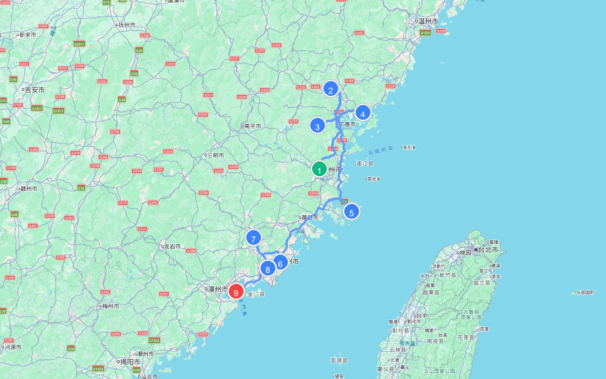
    
  * **特点**：这是一条自驾在福建漫长黄金海岸线、领略海丝古港与妈祖信仰的蓝色风景线。从福州出发，前往“中国最美滩涂”霞浦看潮汐渔网的光影魔幻；前往平潭岛自驾环海路，看神奇的“蓝眼泪”荧光海滩与石牌洋海蚀奇观；在莆田湄洲岛瞻仰世界妈祖祖庙，在海丝起点泉州开元寺双塔下感受古城烟火，最终止于海上花园厦门。
* **福建闽东山水森林综合线**  
  * **自驾线路**：福州市→白云山景区→连江妈祖庙+天后宫→霞浦县→溪塔葡萄沟→白水洋→浦城浮盖山→武夷山→顺昌华阳山→将乐玉华洞→三明格氏栲森林公园（图作“格氏梅”）→石牛山地质公园→天门山→莆田九龙谷→福州市
  * **路线路段距离与地图**
    | 起点 | 终点 | 距离 |
    | :--- | :--- | :--- |
    | (1) 三坊七巷 | (2) 白云山景区 | 162.9 公里 |
    | (2) 白云山景区 | (3) 霞浦县 | 122.4 公里 |
    | (3) 霞浦县 | (4) 白水洋 | 112.2 公里 |
    | (4) 白水洋 | (5) 武夷山 | 257.6 公里 |
    | (5) 武夷山 | (6) 天门山 | 263.4 公里 |
    | (6) 天门山 | (7) 三坊七巷 | 132.2 公里 |
    | **总里程** | | **1050.6 公里** |
    
    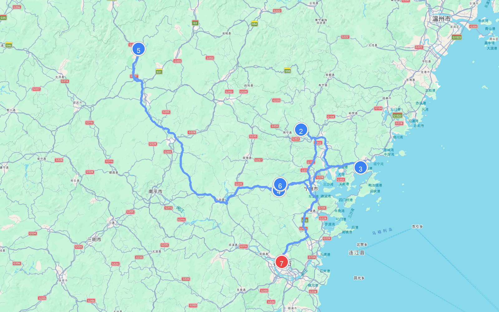
    
    
    
  * **特点**：这是一条跨越闽江口、白水洋奇特水上广场与闽东名山林海的综合生态自驾线。从福州出发，在连江天后宫听江涛声；深入屏南白水洋，在世界罕见的万平高山平底基岩河床水上广场上嬉水，看溪塔葡萄沟与鸳鸯溪白鹭飞翔；在顺昌华阳山和三明格氏栲原始森林中，看万亩森林与松涛林海，享受天然氧吧的洗礼。

## 沿途城市人文地图
本章节特别附带以下城市的详细人文地图，方便您在自驾游途中进行地市深度探索：

### 三明人文地图
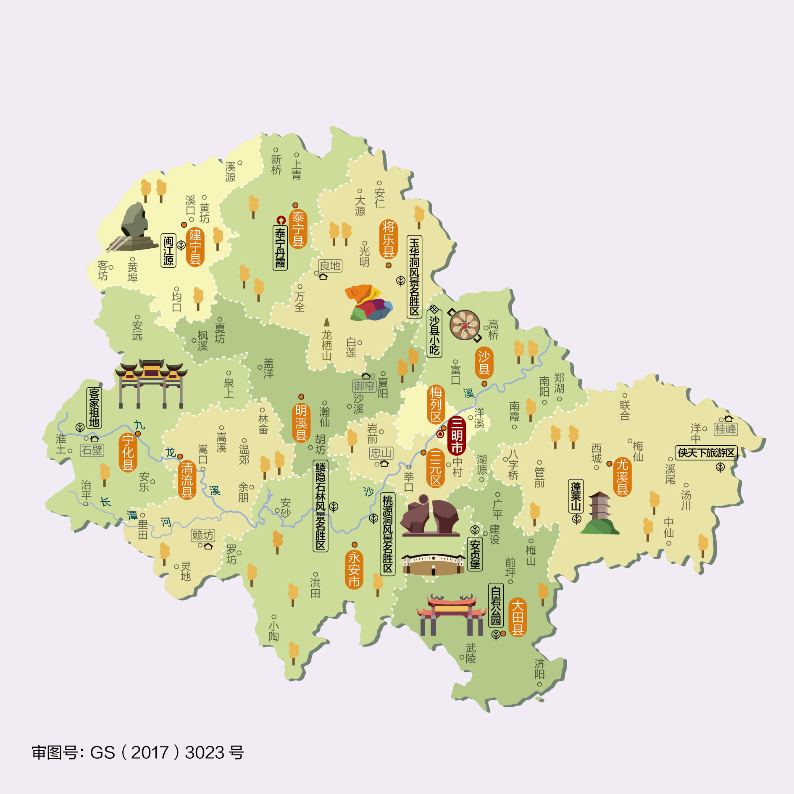

### 南平人文地图
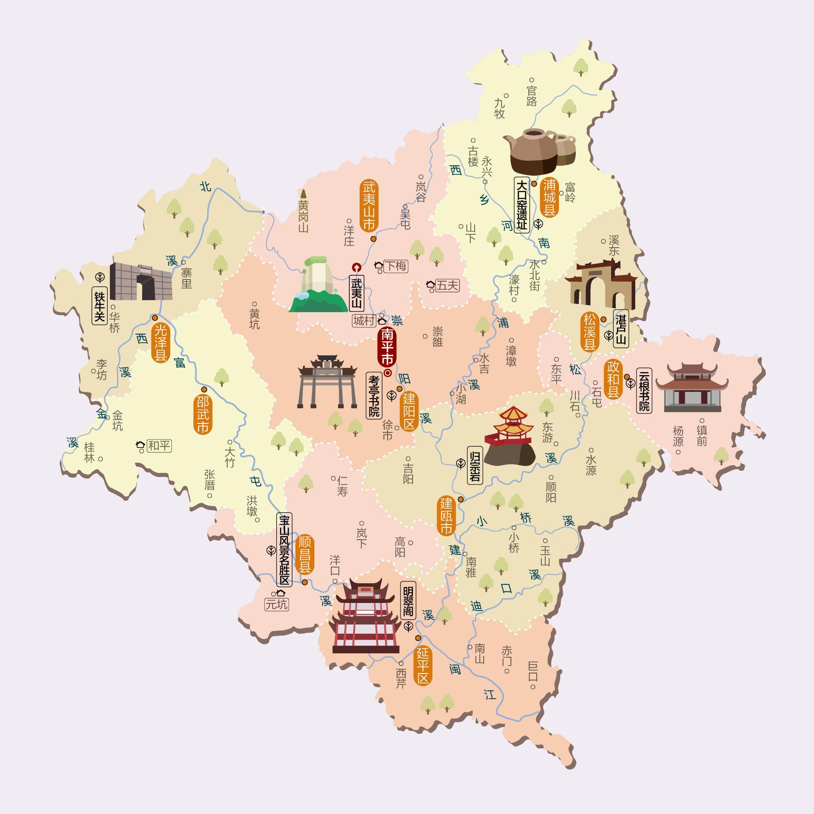

### 厦门人文地图
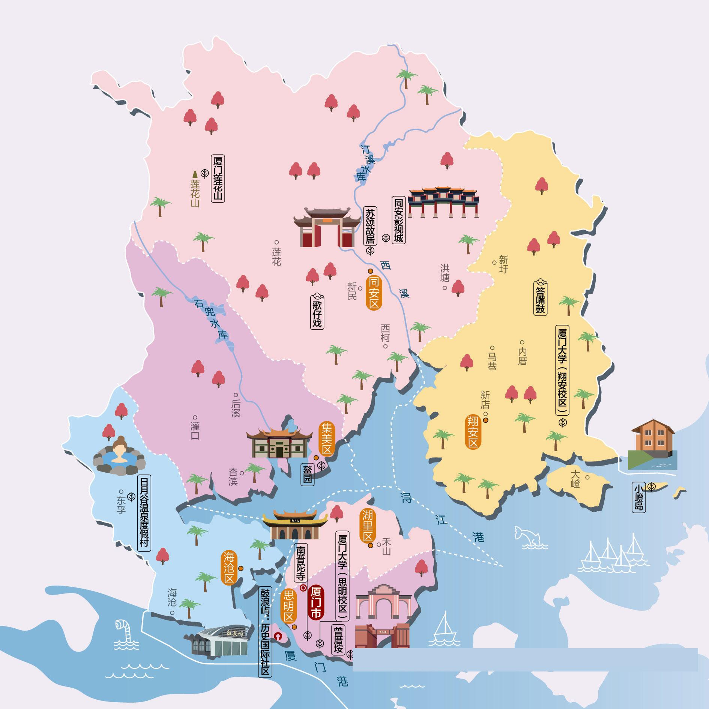

### 宁德人文地图
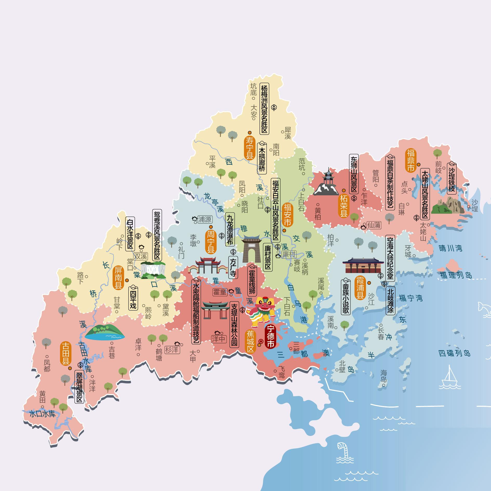

### 泉州人文地图
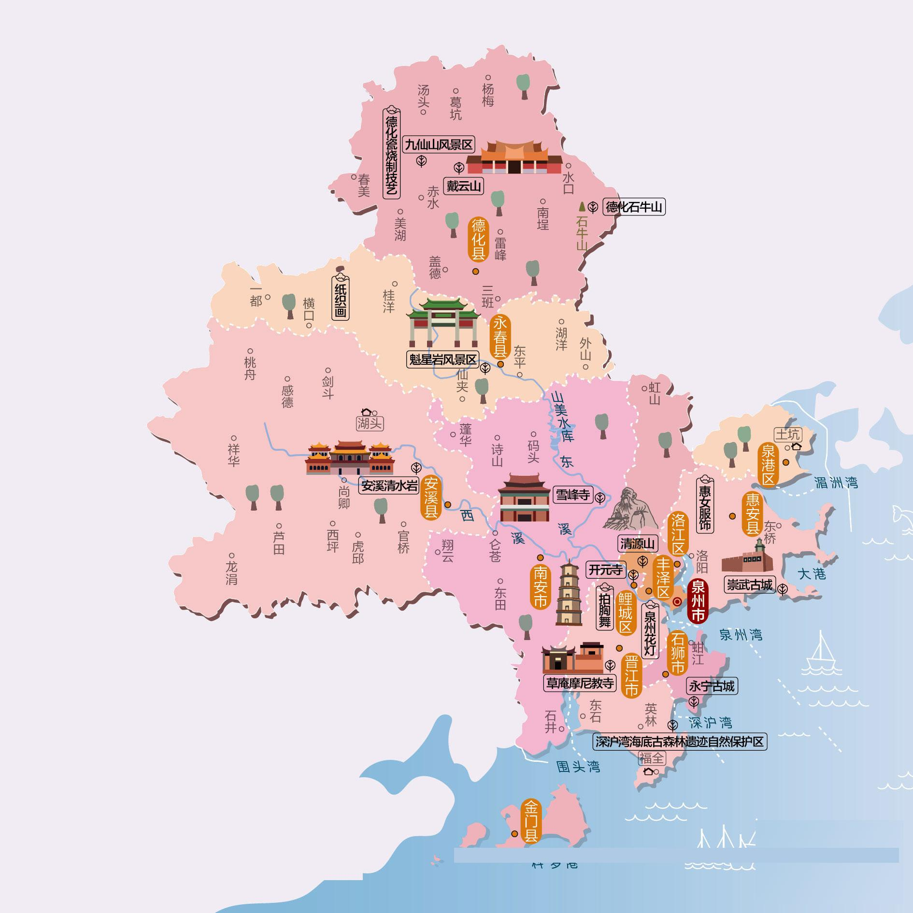

### 漳州人文地图
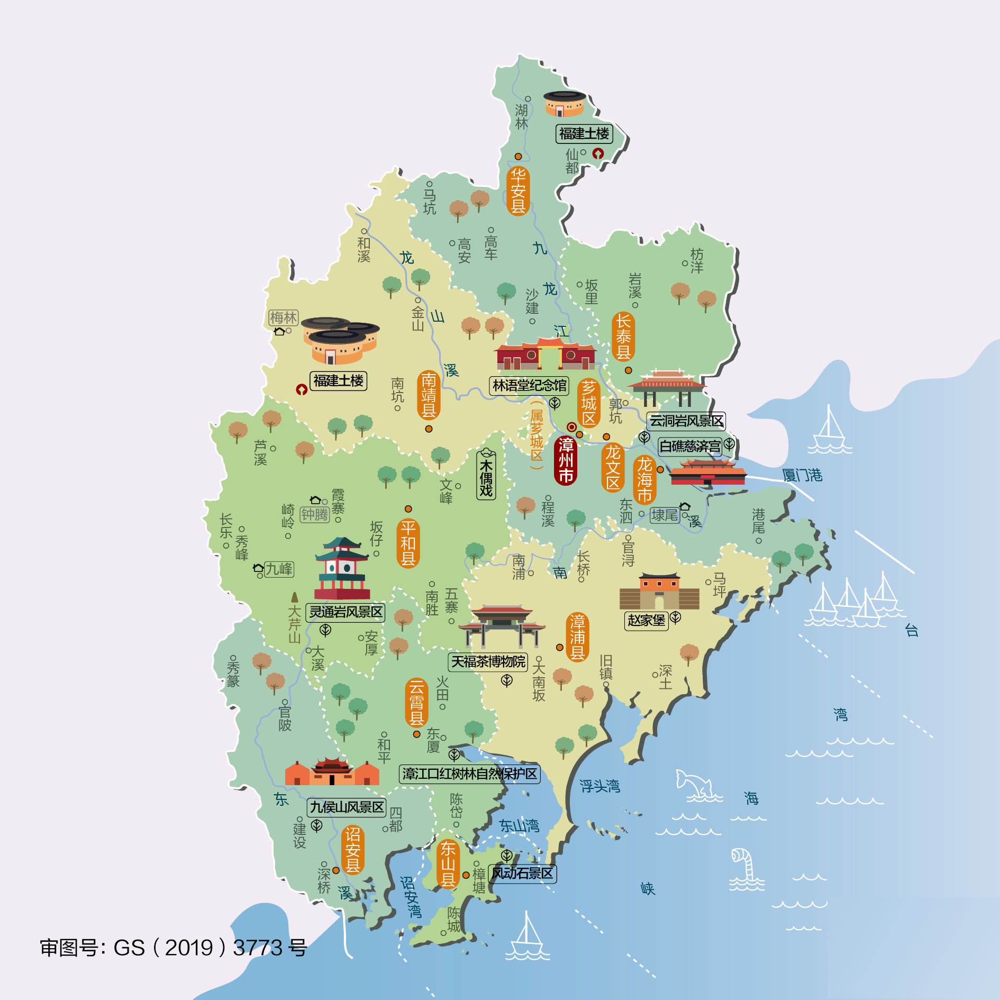

### 福州人文地图
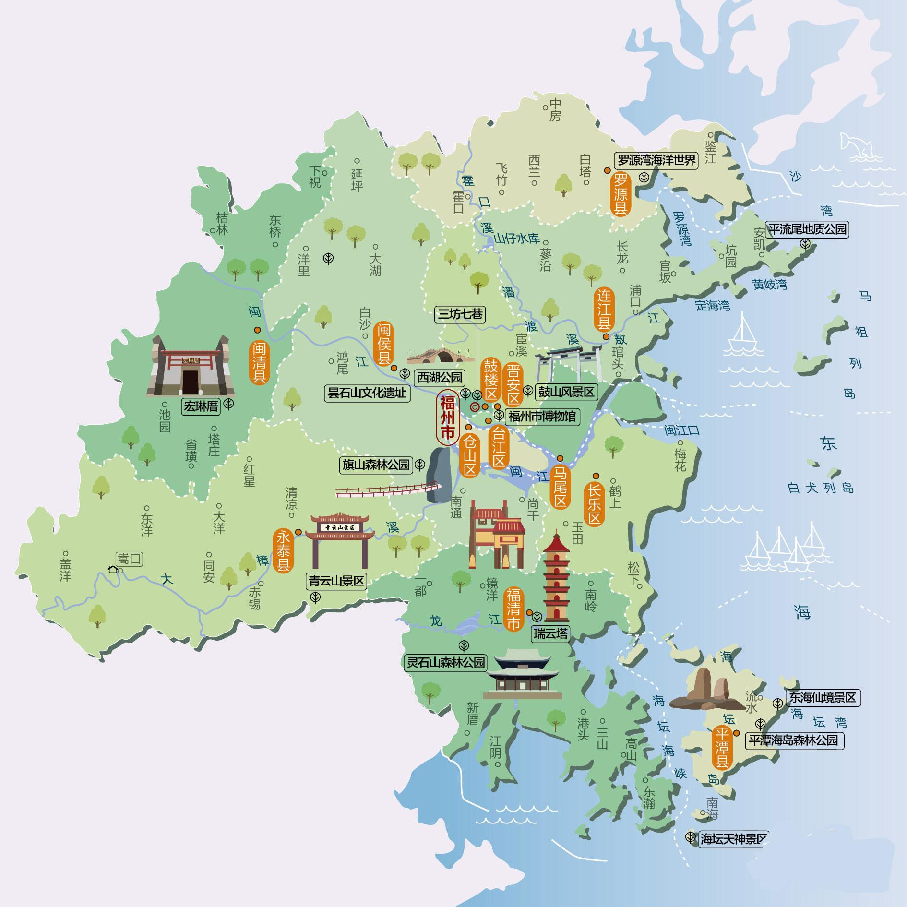

### 莆田人文地图
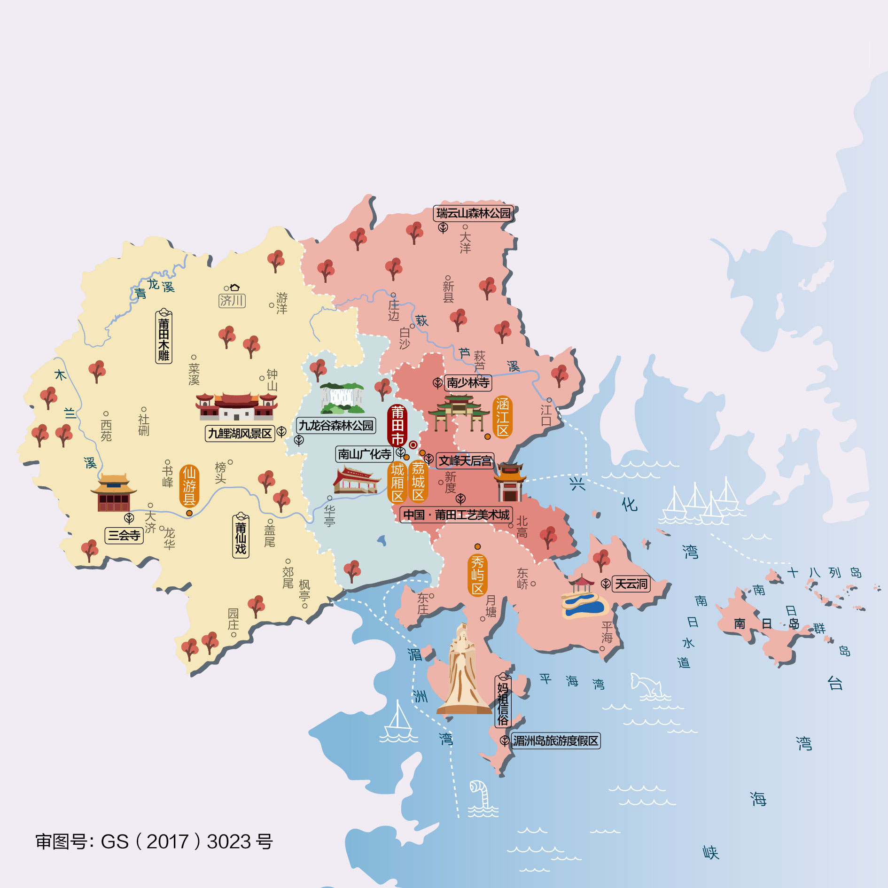

### 龙岩人文地图
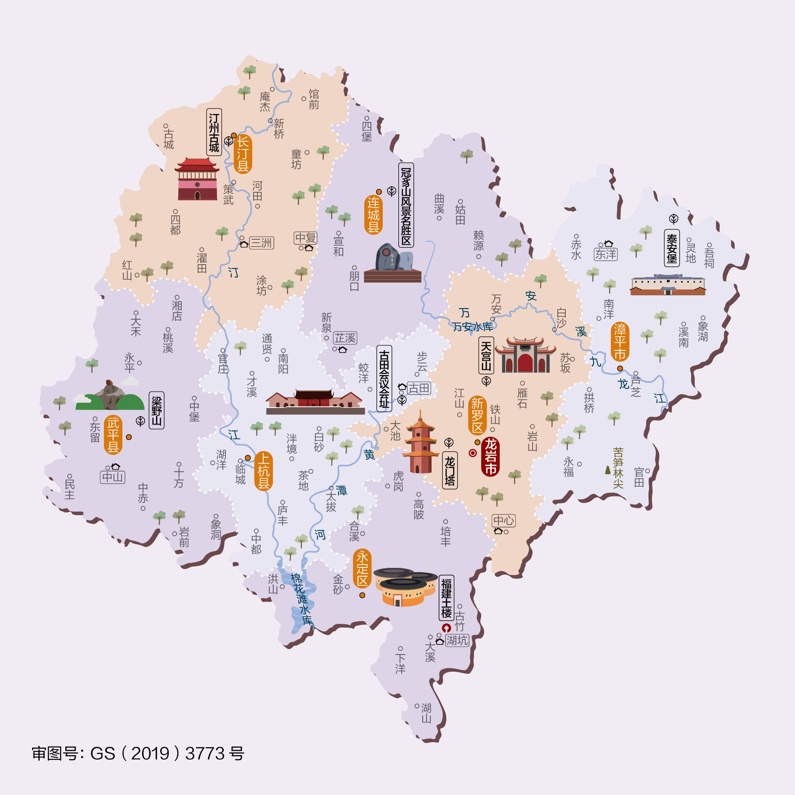
