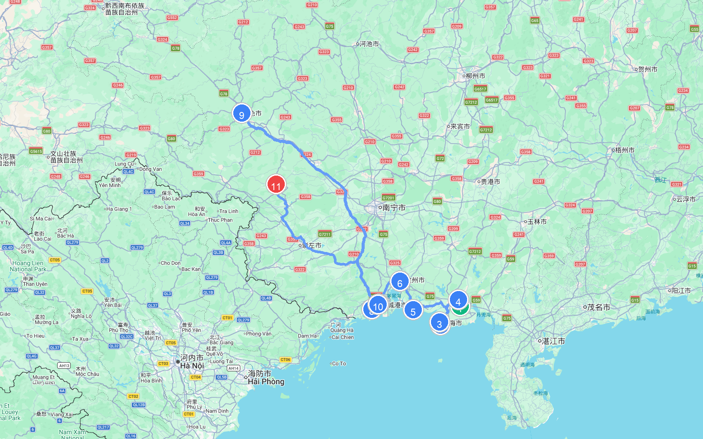
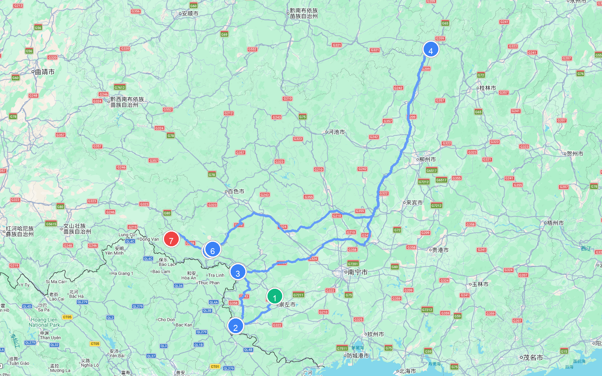
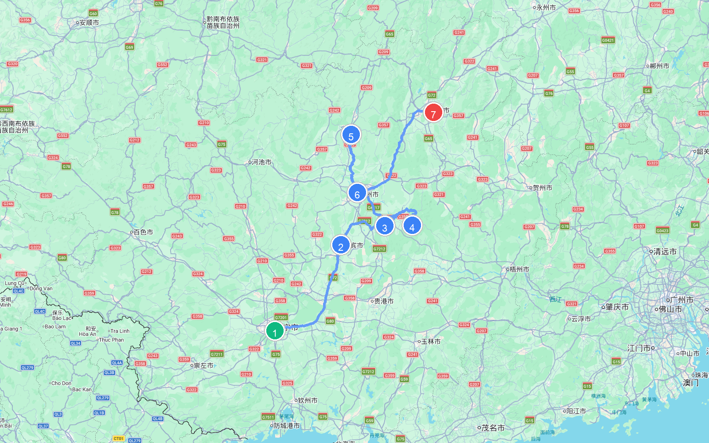
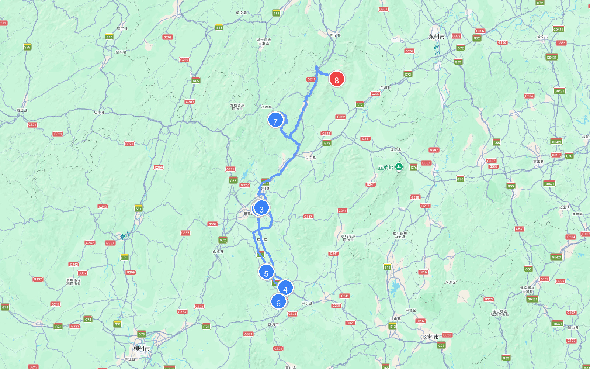
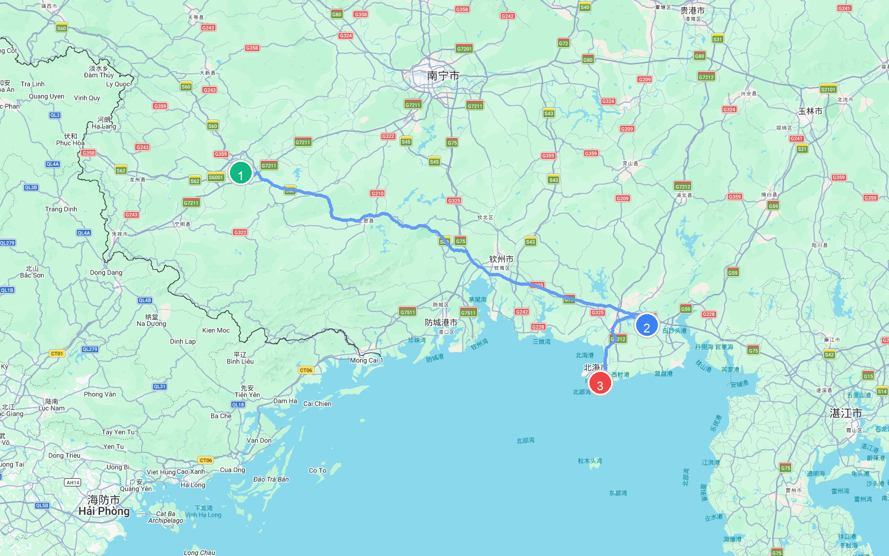

# 章节30 - 广西自驾游与人文地图指南

## 广西人文地图

## **广西经典自驾旅行经典线路推荐**

#### 北部湾滨海风情自驾线

* **自驾线路**：北海市→北海海底世界→北海老城→十里银滩（应包含银滩度假区、十里银滩等两处）→合浦县→三娘湾→钦州市→防城港西湾景区→江山半岛→东兴京岛→万尾金滩→天等（或凭祥/东兴边境国门景区）
* **路线路段距离与地图**

    | 起点 | 终点 | 距离 |
    | :--- | :--- | :--- |
    | (1) 北海市 | (2) 北海海底世界 | 54.7 公里 |
    | (2) 北海海底世界 | (3) 北海老城 | 4.5 公里 |
    | (3) 北海老城 | (4) 合浦县 | 52.0 公里 |
    | (4) 合浦县 | (5) 三娘湾 | 75.8 公里 |
    | (5) 三娘湾 | (6) 钦州市 | 52.3 公里 |
    | (6) 钦州市 | (7) 防城港西湾景区 | 51.8 公里 |
    | (7) 防城港西湾景区 | (8) 江山半岛 | 15.6 公里 |
    | (8) 江山半岛 | (9) 东兴京岛 | 351.4 公里 |
    | (9) 东兴京岛 | (10) 万尾金滩 | 347.3 公里 |
    | (10) 万尾金滩 | (11) 天等 | 267.9 公里 |
    | **总里程** | | **1273.2 公里** |

  

* **特点**：这是一条充满海风、椰林与海岛探险的广西蓝色海岸线自驾线。在钦州三娘湾，您可以乘渔船出海，寻觅国家一级保护动物中华白海豚在蔚蓝海面上跃起的矫捷身姿；在北海银滩看细软如雪的白沙，自驾渡轮前往中国最美火山岛涠洲岛，在鳄鱼山火山口、天主教堂和滴水丹屏前看海上日落，纵享海鲜盛宴与慢时光。

#### 中越边关自驾之旅

* **自驾线路**：南宁市→崇左市→宁明花山景区→凭祥友谊关→大新明仕田园→德天跨国瀑布→靖西通灵大峡谷→旧州古镇→鹅泉景区→锦绣古镇→靖西渠洋湖→那坡县
* **路线路段距离与地图**

    | 起点 | 终点 | 距离 |
    | :--- | :--- | :--- |
    | (1) 崇左市 | (2) 凭祥友谊关 | 95.3 公里 |
    | (2) 凭祥友谊关 | (3) 德天跨国瀑布 | 125.1 公里 |
    | (3) 德天跨国瀑布 | (4) 旧州古镇 | 575.3 公里 |
    | (4) 旧州古镇 | (5) 鹅泉景区 | 608.2 公里 |
    | (5) 鹅泉景区 | (6) 锦绣古镇 | 7.3 公里 |
    | (6) 锦绣古镇 | (7) 那坡县 | 99.4 公里 |
    | **总里程** | | **1510.5 公里** |

  

* **特点**：这是一条闻名全国的“中越国境画卷”爱国主题顶级自驾景观线。车辆沿着边境公路奔驰，右侧是青翠的祖国大山，左侧隔河相望便是越南村庄。在凭祥友谊关前触摸古老雄关的历史弹痕；在崇左大新明仕田园内，看青峰挺拔、翠竹绕水宛如《花千骨》的仙侠世界；最终在德天跨国大瀑布前，看三级跌落的激流与越南板约瀑布并肩咆哮，震人心魄。

#### 桂中民族风情之旅

* **自驾线路**：南宁市→广西民族博物馆→来宾市→象州温泉→圣堂山→金秀山水瑶城→柳州市→百里柳江→宜州刘三姐故里→怀远古镇→融水元宝山龙女沟→雨卜苗寨→三江程阳八寨景区→龙胜龙脊梯田→终点桂林市。
* **路线路段距离与地图**

    | 起点 | 终点 | 距离 |
    | :--- | :--- | :--- |
    | (1) 广西民族博物馆 | (2) 来宾市 | 166.6 公里 |
    | (2) 来宾市 | (3) 象州温泉 | 85.4 公里 |
    | (3) 象州温泉 | (4) 圣堂山 | 105.9 公里 |
    | (4) 圣堂山 | (5) 柳州市 | 235.1 公里 |
    | (5) 柳州市 | (6) 百里柳江 | 94.9 公里 |
    | (6) 百里柳江 | (7) 终点桂林市 | 172.7 公里 |
    | **总里程** | | **860.5 公里** |

  

* **特点**：这是一条深入广西壮族、瑶族、苗族、侗族聚居腹地、饱览梯田奇观的民族非遗自驾线。从南宁出发，前往金秀山水瑶城体验瑶族药浴；在柳州市品尝地道螺蛳粉，夜游百里柳江；自驾前往三江程阳八寨，看杰出的侗族程阳风雨桥与鼓楼木结构奇迹；最终登上龙脊梯田，看线条流畅的层层梯田从山脚直上山顶，金秋时节金浪翻滚，叹为观止。

#### 桂林山水经典游玩之旅

* **自驾线路**：桂林市→两江四湖·象山→独秀峰王城景区→七星岩→漓江风景名胜区→阳朔十里画廊→遇龙河→银子岩→龙胜龙脊梯田→猫儿山→全州天湖→资江丹霞八角寨
* **路线路段距离与地图**

    | 起点 | 终点 | 距离 |
    | :--- | :--- | :--- |
    | (1) 桂林市 | (2) 两江四湖·象山 | 1.9 公里 |
    | (2) 两江四湖·象山 | (3) 七星岩 | 3.1 公里 |
    | (3) 七星岩 | (4) 阳朔十里画廊 | 72.3 公里 |
    | (4) 阳朔十里画廊 | (5) 遇龙河 | 26.1 公里 |
    | (5) 遇龙河 | (6) 银子岩 | 35.8 公里 |
    | (6) 银子岩 | (7) 猫儿山 | 223.4 公里 |
    | (7) 猫儿山 | (8) 全州天湖 | 157.9 公里 |
    | **总里程** | | **520.4 公里** |

  

* **特点**：这是一条将“山水甲天下”的经典意境一网打尽的桂林山水全景自驾线。在桂林市区游览象鼻山与两江四湖，体验城在景中的雅致；攀登独秀峰靖江王城；最精彩处在于沿漓江风景名胜区自驾，在阳朔遇龙河上体验竹筏漂流，看九马画山与黄布倒影（20元人民币背景）；最终自驾猫儿山看华南第一峰的云海日出，在资源八角寨看神奇的丹霞群峰。

#### 合那高速“天堂之路”自驾线

* **自驾线路**：合浦星岛湖（原文“合浦星岛”）→钦州三娘湾→八寨沟→上思十字大山（十万大山）→崇左明仕田园→德天跨国大瀑布→靖西通灵大峡谷→旧州古镇/鹅泉景区（图示包含）→靖西渠洋湖→那坡老虎跳跨国大峡谷→北海市（涠洲岛/斜阳岛图示包含）→北海银滩
* **路线路段距离与地图**

    | 起点 | 终点 | 距离 |
    | :--- | :--- | :--- |
    | (1) 崇左明仕田园 | (2) 北海市 | 248.1 公里 |
    | (2) 北海市 | (3) 北海银滩 | 58.4 公里 |
    | **总里程** | | **306.5 公里** |

  

* **特点**：这是一条被英国镜报等外媒盛赞为“世界上最美的高速公路”的仙境自驾线。全长516公里的合那高速跨越了喀斯特峰林群，高架桥宛如一条游龙在仙雾缭绕的翠绿群峰、金色稻田与清澈江流间穿梭。车行其间，如同一幅长达百里的流动山水画卷在车窗外徐徐展开，实现“人在景中走，车在画中游”的梦幻体验。

## 沿途城市人文地图
本章节特别附带以下城市的详细人文地图，方便您在自驾游途中进行地市深度探索：

### 北海人文地图

### 南宁人文地图

### 崇左人文地图

### 来宾人文地图

### 柳州人文地图

### 桂林人文地图

### 梧州人文地图

### 河池人文地图

### 玉林人文地图

### 百色人文地图

### 贵港人文地图

### 贺州人文地图

### 钦州人文地图

### 防城港人文地图

