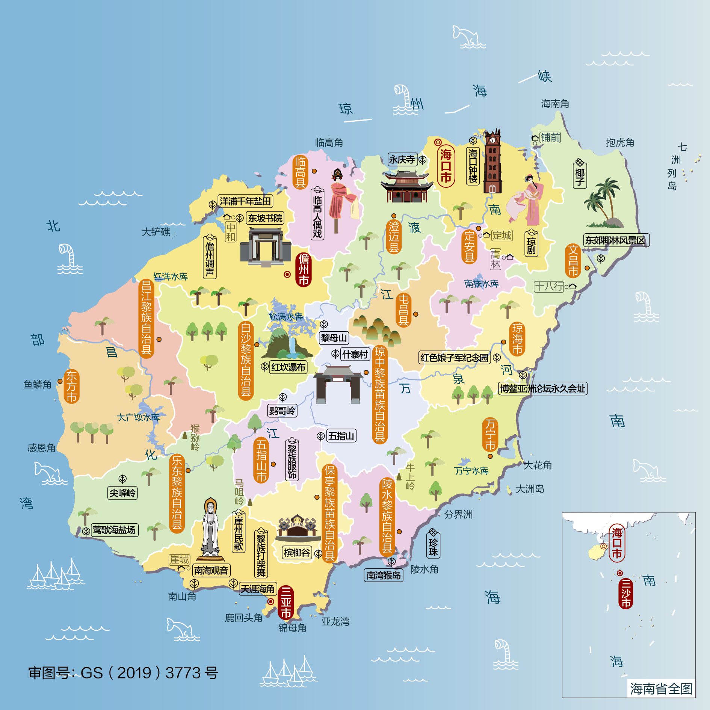
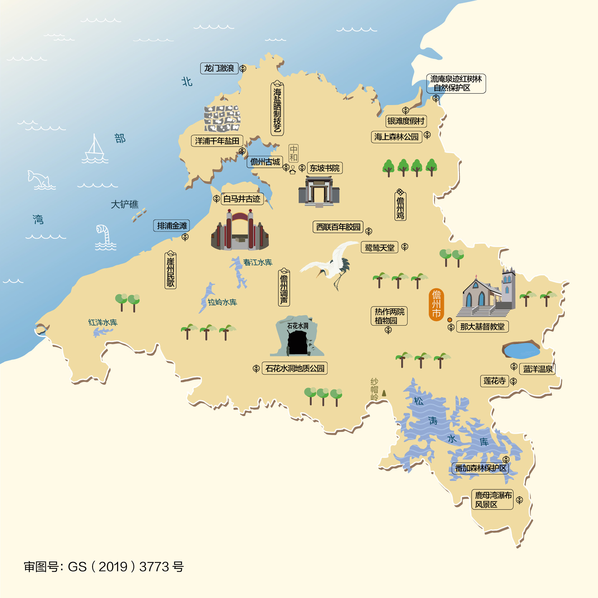
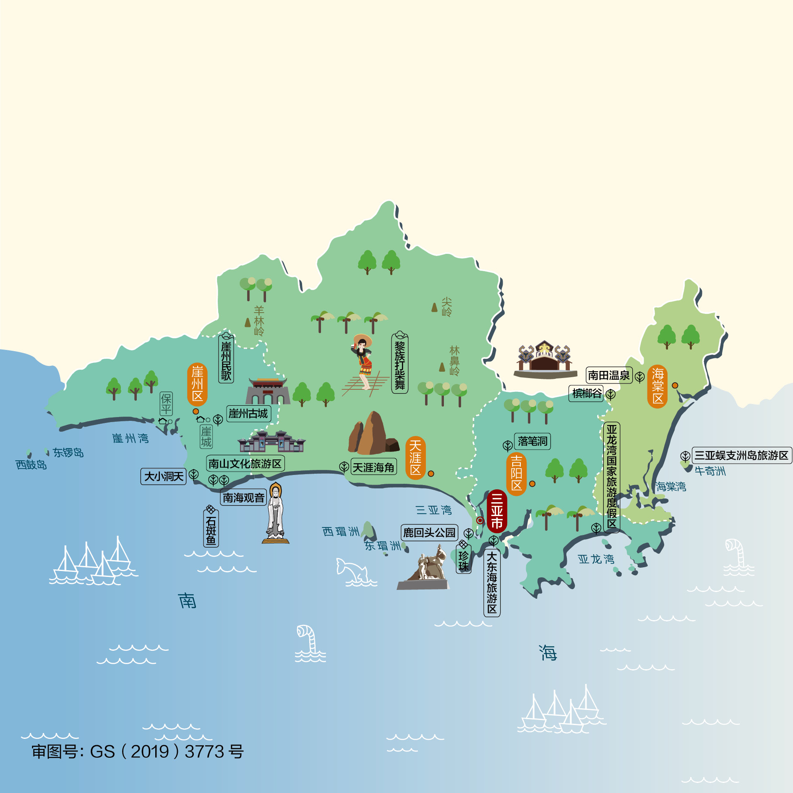
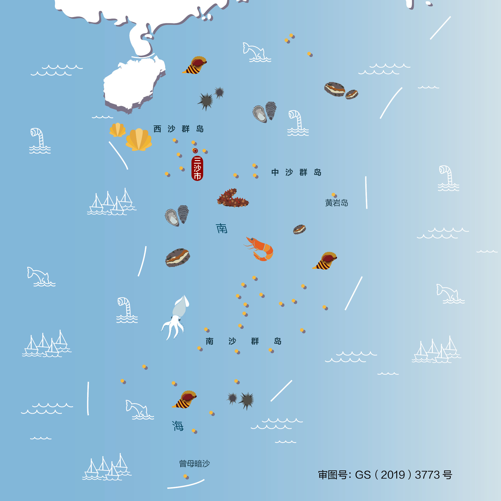
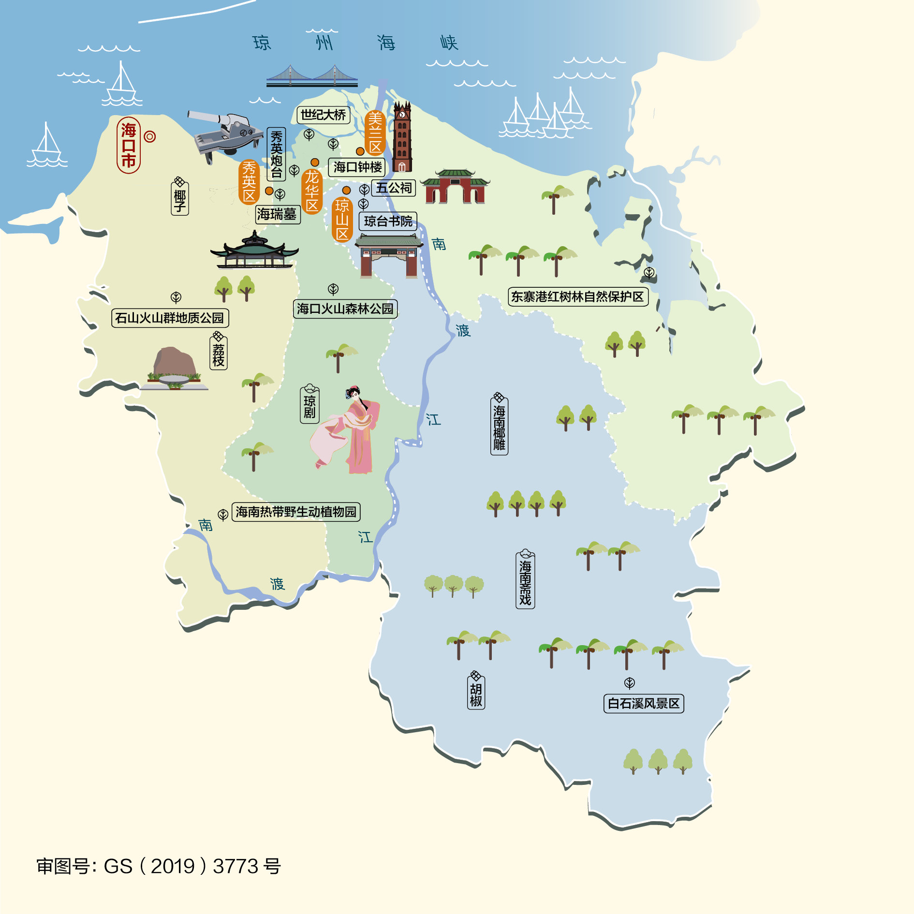

# Chapter 31 - 海南自驾游与人文地图指南

## 海南人文地图

### 经典旅游路线与自驾路线

#### 路线一：海南环岛海风旅游公路黄金自驾线
* **特点**：沿着热带海岛的碧海蓝天一路奔驰，体验最前沿的冲浪、潜水与热带雨林探秘。
* **行车路线**：海口市 → 文昌（东郊椰林/航天科普中心） → 琼海（博鳌亚洲论坛/潭门渔港） → 万宁（石梅湾/日月湾冲浪/最美滨海公路） → 陵水（分界洲岛/南湾猴岛） → 三亚（亚龙湾/大东海/天涯海角/蜈支洲岛） → 乐东（尖峰岭国家热带雨林） → 东方市 → 昌江（棋子湾） → 儋州（东坡书院/火山石村落） → 澄迈 → 返回海口。

## 沿途城市人文地图
本章节特别附带以下城市的详细人文地图，方便您在自驾游途中进行地市深度探索：

### 儋州人文地图

### 三亚人文地图

### 三沙人文地图

### 海口人文地图

