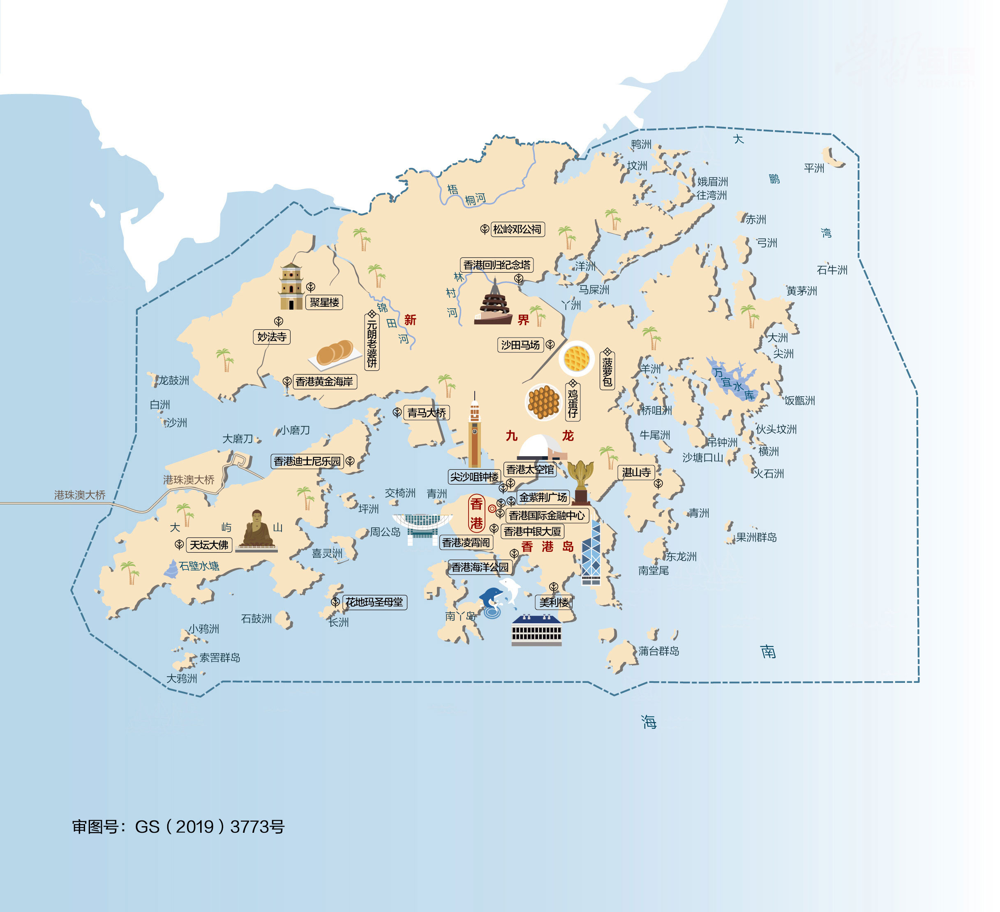
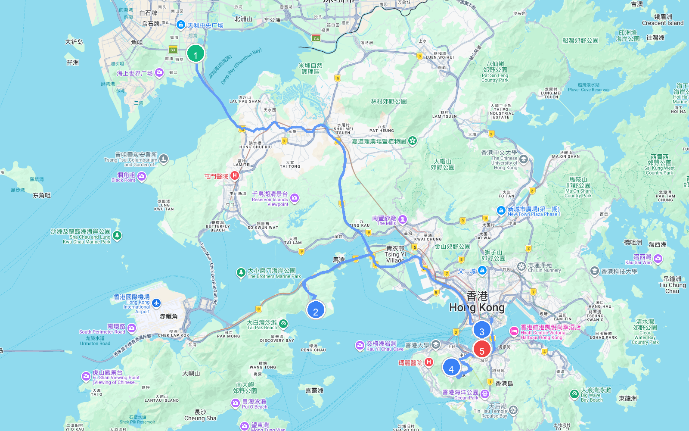

# 章节32 - 香港自驾游与人文地图指南

## 香港人文地图

## **香港自驾旅行经典线路推荐**

#### 香港一日游

* **自驾线路**：深圳湾口岸→香港迪士尼乐园→尖沙咀→太平山顶→金紫荆广场  
* **路线路段距离与地图**
  | 起点 | 终点 | 距离 |
  | :--- | :--- | :--- |
  | (1) 深圳湾口岸 | (2) 香港迪士尼乐园 | 37.3 公里 |
  | (2) 香港迪士尼乐园 | (3) 尖沙咀 | 22.9 公里 |
  | (3) 尖沙咀 | (4) 太平山顶 | 12.6 公里 |
  | (4) 太平山顶 | (5) 金紫荆广场 | 7.6 公里 |
  | **总里程** | | **80.4 公里** |
  
  
  
  
  
  
  
* **特点**：这是一条经典的香港一日游自驾路线。从深圳湾口岸出发，驱车前往香港迪士尼乐园体验奇妙的童话世界，随后自驾至尖沙咀饱览维多利亚港两岸的繁华都市盛景，接着登上太平山顶鸟瞰港岛摩天大楼与海湾全景，最终抵达金紫荆广场，在盛开的紫荆花雕塑前，感受香港的历史脉搏与东方之珠的独特魅力。
