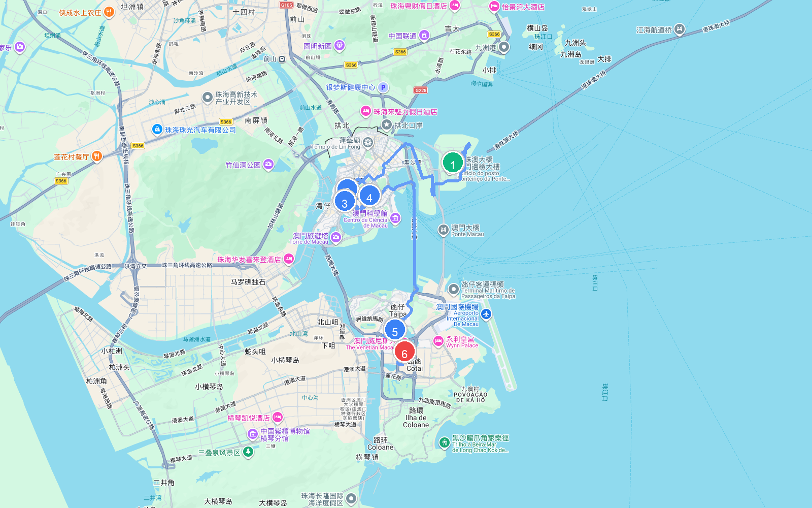

# 章节33 - 澳门自驾游与人文地图指南

## 澳门人文地图

## **澳门自驾旅行经典线路推荐**

#### 澳门一日游

* **自驾线路**：港珠澳大桥珠海公路口岸→大三巴牌坊→议事亭前地→澳门塔→官也街→威尼斯人度假城  
* **路线路段距离与地图**
  | 起点 | 终点 | 距离 |
  | :--- | :--- | :--- |
  | (1) 港珠澳大桥 | (2) 大三巴牌坊 | 9.3 公里 |
  | (2) 大三巴牌坊 | (3) 议事亭前地 | 3.2 公里 |
  | (3) 议事亭前地 | (4) 澳门塔 | 1.2 公里 |
  | (4) 澳门塔 | (5) 官也街 | 8.8 公里 |
  | (5) 官也街 | (6) 澳门威尼斯人 | 2.7 公里 |
  | **总里程** | | **25.2 公里** |
  
  
  
  
  
  
  
* **特点**：这是一条经典的澳门一日游自驾路线。从港珠澳大桥珠海公路口岸通关出发，首先游览标志性的大三巴牌坊，感受巴洛克与东方雕刻艺术的完美结合；接着漫步历史悠久的议事亭前地，欣赏葡式碎石路与彩色老建筑；随后前往澳门塔，俯瞰三岛与珠海市区的全景；紧接着驱车来到官也街，品尝正宗的蛋挞与澳门特色小吃；最终在威尼斯人度假城结束行程，体验华丽的水乡风情与繁华景象。
