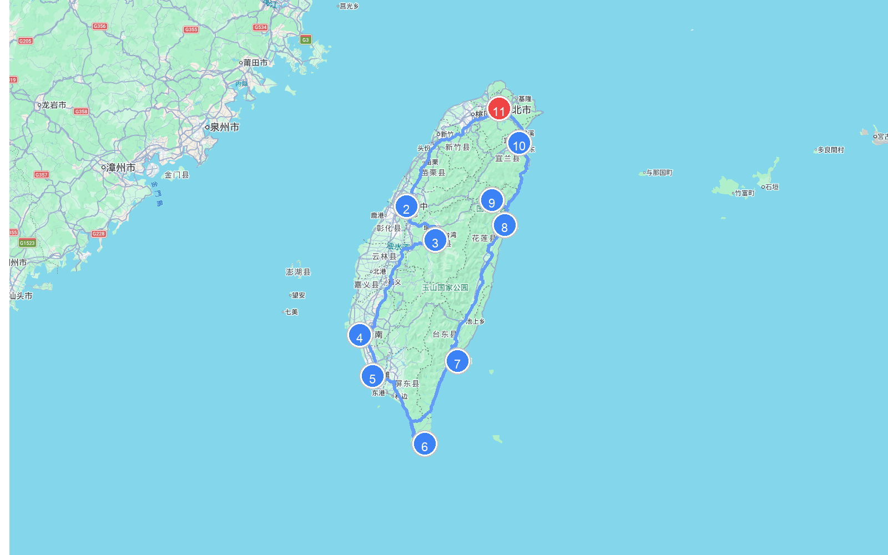

# 章节34 - 台湾自驾游与人文地图指南

## 台湾人文地图

### **台湾自驾旅行经典线路推荐**

* **台湾环岛自驾游**  
  * **自驾线路**：台北市→台中市→日月潭→台南市→高雄市→垦丁国家公园→台东县→花莲县→太鲁阁国家公园→宜兰县→台北市  
  * **路线路段距离与地图**
    | 起点 | 终点 | 距离 |
    | :--- | :--- | :--- |
    | (1) 台北市 | (2) 台中市 | 157.7 公里 |
    | (2) 台中市 | (3) 日月潭 | 72.8 公里 |
    | (3) 日月潭 | (4) 台南市 | 166.1 公里 |
    | (4) 台南市 | (5) 高雄市 | 50.8 公里 |
    | (5) 高雄市 | (6) 垦丁国家公园 | 108.7 公里 |
    | (6) 垦丁国家公园 | (7) 台东县 | 124.2 公里 |
    | (7) 台东县 | (8) 花莲县 | 178.3 公里 |
    | (8) 花莲县 | (9) 太鲁阁国家公园 | 44.0 公里 |
    | (9) 太鲁阁国家公园 | (10) 宜兰县 | 109.1 公里 |
    | (10) 宜兰县 | (11) 台北市 | 52.6 公里 |
    | **总里程** | | **1064.3 公里** |
    
    
    
    
    
    
    
  * **特点**：这是一条经典的台湾环岛自驾旅游线路。从台北出发，一路向南途经现代都市台中，游览碧波荡漾的日月潭；随后在历史古城台南感受古迹韵味，在高雄欣赏港湾都市之美；接着驱车抵达台湾最南端的垦丁国家公园，在湛蓝的太平洋海风中感受热带风情；沿东部海岸线北上，穿过台东，在花莲探秘鬼斧神工的太鲁阁大峡谷；最终经宜兰返回台北，饱览台湾宝岛的多样地貌与人文温情。
