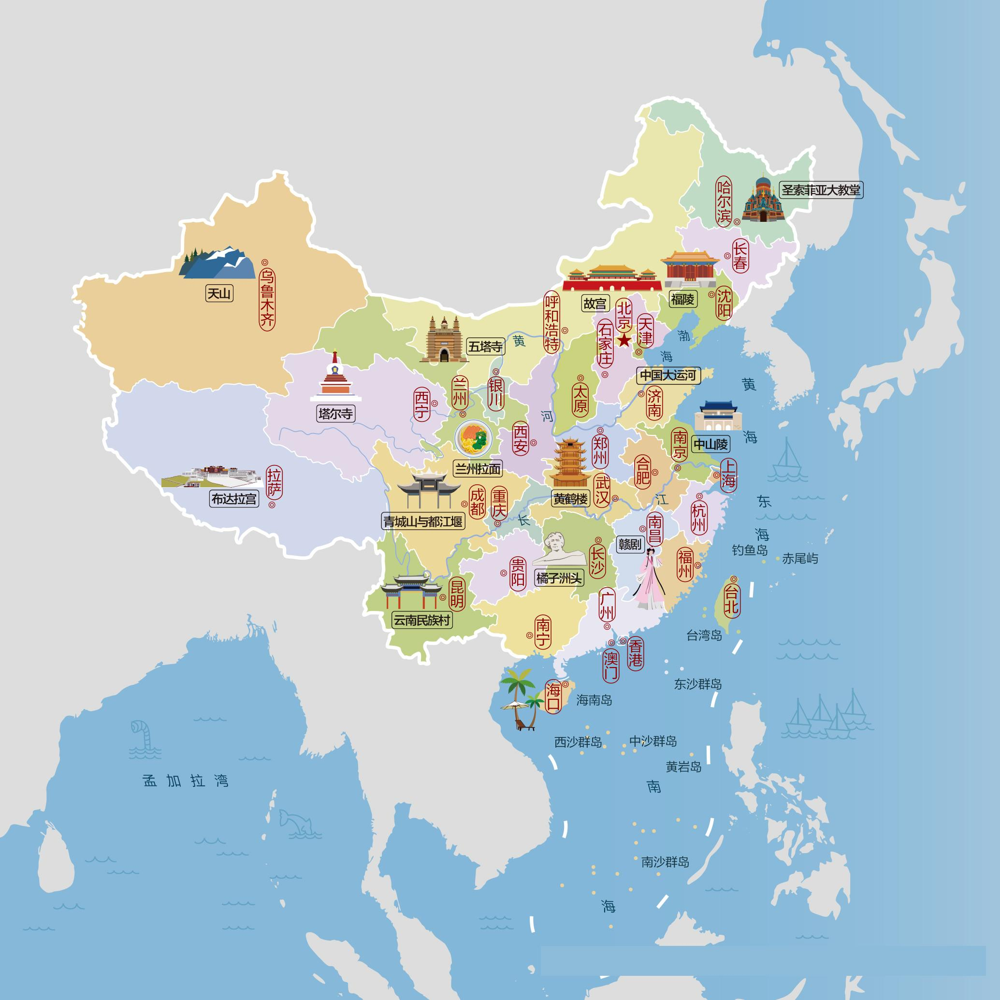

# 《追光而行》：中国绝美自驾路线规划指南

本自驾游指南专为国内自驾游爱好者和地理文化探索者打造。我们整合了国内31个省市的经典自驾与旅游路线，并为所有34个省级行政区配备了精美详细的人文与地市地图。助您读万卷书，行万里路，用轮迹丈量华夏大地。

## 卷首语：纵横神州，追光而行

华夏之大，江山如画。这片广袤的土地上，孕育着世界上最丰富多样的自然奇观与最深厚的人文底蕴。

从北国银装素裹的兴安雪原，到南国椰风海韵的碧海银沙；从东部惊涛拍岸的万里海疆，到西部巍峨高耸的雪域高原。这里有独库公路的“一日历四季，十里不同天”，有川西高原的雪山、海子与秋林，有江南水乡的黛瓦白墙，亦有大西北大漠孤烟的雄浑苍凉。山河无言，却用最波澜壮阔的画卷，迎接着每一位心怀远方的行者。

自驾，是一场关于光与速度的朝圣。用车轮丈量土地，用双眼记录壮丽。当我们手握方向盘，越过高山与深谷，跨过江河与荒漠，在追寻光的旅途中，我们终将与这片古老而生机盎然的土地融为一体。

## 目录

- [北京市自驾游指南](01_北京市.md)
- [天津市自驾游指南](02_天津市.md)
- [上海市自驾游指南](03_上海市.md)
- [重庆市自驾游指南](04_重庆市.md)
- [黑龙江自驾游指南](05_黑龙江.md)
- [吉林自驾游指南](06_吉林.md)
- [辽宁自驾游指南](07_辽宁.md)
- [内蒙古自驾游指南](08_内蒙古.md)
- [宁夏自驾游指南](09_宁夏.md)
- [甘肃自驾游指南](10_甘肃.md)
- [青海自驾游指南](11_青海.md)
- [新疆自驾游指南](12_新疆.md)
- [西藏自驾游指南](13_西藏.md)
- [四川自驾游指南](14_四川.md)
- [云南自驾游指南](15_云南.md)
- [贵州自驾游指南](16_贵州.md)
- [陕西自驾游指南](17_陕西.md)
- [山西自驾游指南](18_山西.md)
- [河北自驾游指南](19_河北.md)
- [河南自驾游指南](20_河南.md)
- [山东自驾游指南](21_山东.md)
- [安徽自驾游指南](22_安徽.md)
- [湖北自驾游指南](23_湖北.md)
- [湖南自驾游指南](24_湖南.md)
- [江西自驾游指南](25_江西.md)
- [江苏自驾游指南](26_江苏.md)
- [浙江自驾游指南](27_浙江.md)
- [福建自驾游指南](28_福建.md)
- [广东自驾游指南](29_广东.md)
- [广西自驾游指南](30_广西.md)
- [海南自驾游指南](31_海南.md)
- [香港自驾游指南](32_香港.md)
- [澳门自驾游指南](33_澳门.md)
- [台湾自驾游指南](34_台湾.md)
